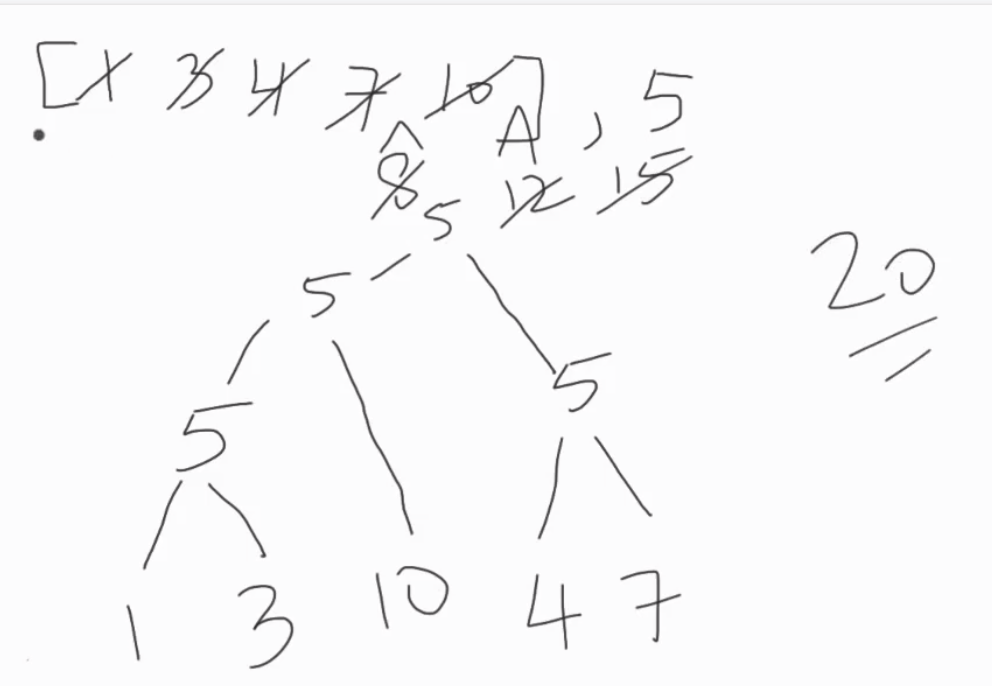

1199. Minimum Time to Build Blocks

You are given a list of blocks, where `blocks[i] = t` means that the `i`-th block needs `t` units of time to be built. A block can only be built by exactly one worker.

A worker can either split into two workers (number of workers increases by one) or build a block then go home. Both decisions cost some time.

The time cost of spliting one worker into two workers is given as an integer `split`. Note that if two workers split at the same time, they split in parallel so the cost would be `split`.

Output the minimum time needed to build all blocks.

Initially, there is only **one** worker.

**Example 1:**
```
Input: blocks = [1], split = 1
Output: 1
Explanation: We use 1 worker to build 1 block in 1 time unit.
```
**Example 2:**
```
Input: blocks = [1,2], split = 5
Output: 7
Explanation: We split the worker into 2 workers in 5 time units then assign each of them to a block so the cost is 5 + max(1, 2) = 7.
```
**Example 3:**
```
Input: blocks = [1,2,3], split = 1
Output: 4
Explanation: Split 1 worker into 2, then assign the first worker to the last block and split the second worker into 2.
Then, use the two unassigned workers to build the first two blocks.
The cost is 1 + max(3, 1 + max(1, 2)) = 4.
```

**Constraints:**

1 <= blocks.length <= 1000
1 <= blocks[i] <= 10^5
1 <= split <= 100

# Submissions
---
**Solution 1: (Heap)**



[reference](https://www.youtube.com/watch?v=pSW8wxvcEcM)
```
Runtime: 84 ms
Memory Usage: 13.9 MB
```
```python
class Solution:
    def minBuildTime(self, blocks: List[int], split: int) -> int:
        pq = []
        for block in blocks:
            heapq.heappush(pq, block)
        while len(pq) > 1:
            heapq.heappop(pq)
            heapq.heappush(pq, heapq.heappop(pq)+split)
        
        return heapq.heappop(pq)
```
