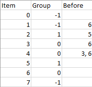

1203. Sort Items by Groups Respecting Dependencies

There are `n` items each belonging to zero or one of `m` groups where `group[i]` is the group that the `i`-th item belongs to and it's equal to `-1` if the `i`-th item belongs to no group. The items and the groups are zero indexed. A group can have no item belonging to it.

Return a sorted list of the items such that:

* The items that belong to the same group are next to each other in the sorted list.
* There are some relations between these items where `beforeItems[i]` is a list containing all the items that should come before the `i`-th item in the sorted array (to the left of the `i`-th item).

Return any solution if there is more than one solution and return an empty list if there is no solution.

 

**Example 1:**


```
Input: n = 8, m = 2, group = [-1,-1,1,0,0,1,0,-1], beforeItems = [[],[6],[5],[6],[3,6],[],[],[]]
Output: [6,3,4,1,5,2,0,7]
```

**Example 2:**
```
Input: n = 8, m = 2, group = [-1,-1,1,0,0,1,0,-1], beforeItems = [[],[6],[5],[6],[3],[],[4],[]]
Output: []
Explanation: This is the same as example 1 except that 4 needs to be before 6 in the sorted list.
``` 

**Constraints:**

* `1 <= m <= n <= 3*10^4`
* `group.length == beforeItems.length == n`
* `-1 <= group[i] <= m-1`
* `0 <= beforeItems[i].length <= n-1`
* `0 <= beforeItems[i][j] <= n-1`
* `i != beforeItems[i][j]`
* `beforeItems[i]` does not contain duplicates elements.

# Submissions
---
**Solution 1: (Topological Sort)**
```
Runtime: 464 ms
Memory Usage: 28.9 MB
```
```python
class Solution:
    def sortItems(self, n: int, m: int, group: List[int], beforeItems: List[List[int]]) -> List[int]:
        # DFS For Topological Sort
        def dfs(x, pre_list, visit_state, order):
            if visit_state[x] == -1:
                return False
            if visit_state[x] == 1:
                return True
            visit_state[x] = -1
            no_cycles = True
            for p in pre_list[x]:
                no_cycles &= dfs(p, pre_list, visit_state, order)
            visit_state[x] = 1
            order.append(x)
            return no_cycles
        
        # First make items that are on their own to group[item] = item
        # and make the items that are in the same group to have a group[item] of their leader,
        # where the leader is the item of the group that has min index
        group_translation = {}
        group_table = collections.defaultdict(list)
        for i in range(n):
            if group[i] == -1:
                group[i] = i
            else:
                if not group[i] in group_translation:
                    group_translation[group[i]] = i
                group[i] = group_translation[group[i]]
            group_table[group[i]].append(i)
        
        # Go through beforeItems, if the item is in the same group, add to inner_pre
        # if the item is in another group, add a pre to the outer_pre
        outer_pre = collections.defaultdict(list)
        inner_pre = collections.defaultdict(list)
        for i in range(n):
            current_group = group[i]
            for b in beforeItems[i]:
                b_group = group[b]
                if b_group == current_group:
                    inner_pre[i].append(b)
                else:
                    outer_pre[current_group].append(b_group)
        
        # Do topological sort on groups and get a group_order
        group_order = []
        visit_state = collections.defaultdict(int)
        no_group_cycles = True
        for g in group_table:
            if not no_group_cycles:
                return []
            no_group_cycles &= dfs(g, outer_pre, visit_state, group_order)
        
        # Finally we iterate through each group and do topological sort on the items in the same group
        # and add to result
        result = []
        for g in group_order:
            inner_order = []
            visit_state = collections.defaultdict(int)
            no_inner_cycles = True
            for item in group_table[g]:
                if not no_inner_cycles:
                    return []
                no_inner_cycles &= dfs(item, inner_pre, visit_state, inner_order)
            result += inner_order
        return result
```

**Solution 2: (Topological Sort, 2 level, group then item)**
```
Runtime: 43 ms, Beats 91.94%
Memory: 49.20 MB, Beats 89.05%
```
```c++
class Solution {
    vector<int> topo_sort(vector<vector<int>> &g, vector<int> &deg) {
        int i;
        queue<int> q;
        for (i = 0; i < deg.size(); i++) {
            if (deg[i] == 0) {
                q.push(i);
            }
        }
        vector<int> rst;
        while (!q.empty()) {
            auto u = q.front();
            q.pop();
            rst.push_back(u);
            for (auto v: g[u]) {
                deg[v] -= 1;
                if (deg[v] == 0) {
                    q.push(v);
                }
            }
        }
        for (i = 0; i < deg.size(); i++) {
            if (deg[i] > 0) {
                return {};
            }
        }
        return rst;
    }

public:
    vector<int> sortItems(int n, int m, vector<int>& group, vector<vector<int>>& beforeItems) {
        int i, to_grp, from_grp;
        // isolated item is a group by itself
        for (i = 0; i < n; i ++) {
            if (group[i] == -1) {
                group[i] = m++;
            }
        }
        vector<vector<int>> g_group(m), g_item(n);
        vector<int> deg_group(m), deg_item(n);
        for (i = 0; i < n; i ++){
            to_grp = group[i];
            for (auto j: beforeItems[i]){
                from_grp = group[j];
                if (to_grp != from_grp) {
                    g_group[from_grp].push_back(to_grp);
                    deg_group[to_grp]++;
                }
                g_item[j].push_back(i);
                deg_item[i]++;
            }
        }
        vector<int> sort_group = topo_sort(g_group, deg_group);
        vector<int> sort_item = topo_sort(g_item, deg_item); 
        if (sort_group.empty() || sort_item.empty()) {
            return {};
        }
        vector<vector<int>> item_grp(m);
        for (auto j: sort_item) {
            item_grp[group[j]].push_back(j);
        }
        vector<int> ans;
        for (auto grp: sort_group) {
            for (auto v: item_grp[grp]) {
                ans.push_back(v);
            }
        }
        return ans;
    }
};
```
