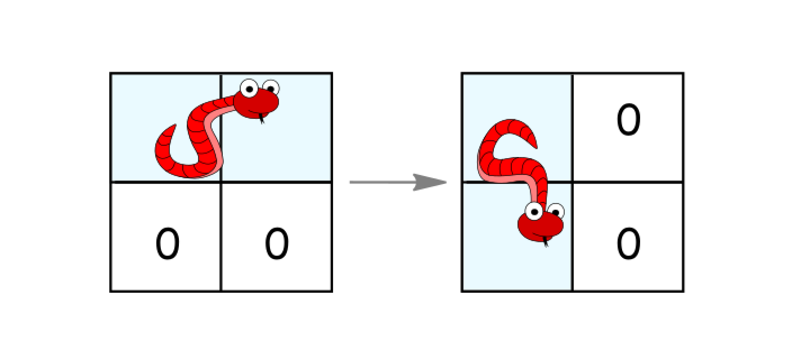
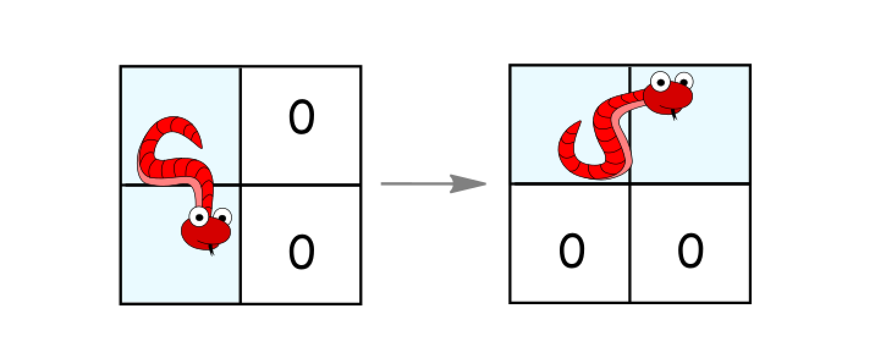
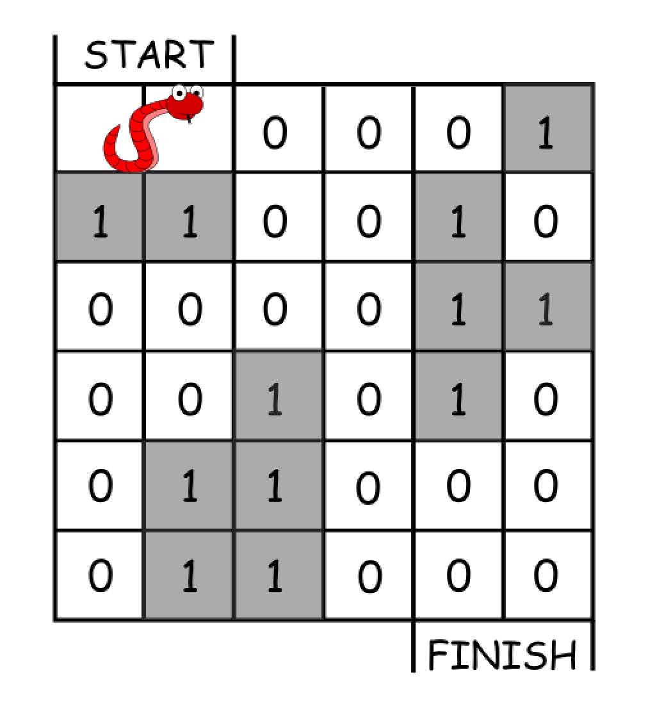

1210. Minimum Moves to Reach Target with Rotations

In an n*n grid, there is a snake that spans 2 cells and starts moving from the top left corner at `(0, 0)` and `(0, 1)`. The grid has empty cells represented by zeros and blocked cells represented by ones. The snake wants to reach the lower right corner at `(n-1, n-2)` and `(n-1, n-1)`.

In one move the snake can:

* Move one cell to the right if there are no blocked cells there. This move keeps the horizontal/vertical position of the snake as it is.
* Move down one cell if there are no blocked cells there. This move keeps the horizontal/vertical position of the snake as it is.
* Rotate clockwise if it's in a horizontal position and the two cells under it are both empty. In that case the snake moves from `(r, c)` and `(r, c+1)` to `(r, c)` and `(r+1, c)`.



* Rotate counterclockwise if it's in a vertical position and the two cells to its right are both empty. In that case the snake moves from `(r, c)` and `(r+1, c)` to `(r, c)` and `(r, c+1)`.



Return the minimum number of moves to reach the target.

If there is no way to reach the target, return `-1`.

**Example 1:**



```
Input: grid = [[0,0,0,0,0,1],
               [1,1,0,0,1,0],
               [0,0,0,0,1,1],
               [0,0,1,0,1,0],
               [0,1,1,0,0,0],
               [0,1,1,0,0,0]]
Output: 11
Explanation:
One possible solution is [right, right, rotate clockwise, right, down, down, down, down, rotate counterclockwise, right, down].
```

**Example 2:**
```
Input: grid = [[0,0,1,1,1,1],
               [0,0,0,0,1,1],
               [1,1,0,0,0,1],
               [1,1,1,0,0,1],
               [1,1,1,0,0,1],
               [1,1,1,0,0,0]]
Output: 9
```

**Constraints:**

* `2 <= n <= 100`
* `0 <= grid[i][j] <= 1`
* It is guaranteed that the snake starts at empty cells.

# Submissions
---
**Solution:**
```
Runtime: 324 ms
Memory Usage: 15.9 MB
```
```python
class Solution:
    def minimumMoves(self, grid: List[List[int]]) -> int:
        n = len(grid)
        start = (0, 0, 0, 1)
        end = (n - 1, n - 2, n - 1, n - 1)
        curr_level = {start}
        moves = 0
        visited = set()
        while curr_level:
            next_level = set()
            for pos in curr_level:
                visited.add(pos)
                r1, c1, r2, c2 = pos
                # move right
                if c1 + 1 < n and grid[r1][c1+1] == 0 and c2 + 1 < n and grid[r2][c2+1] == 0:
                    if (r1, c1 + 1, r2, c2 + 1) not in visited:
                        next_level.add((r1, c1 + 1, r2, c2 + 1))
                # move down
                if r1 + 1 < n and grid[r1+1][c1] == 0 and r2 + 1 < n and grid[r2+1][c2] == 0:
                    if (r1 + 1, c1, r2 + 1, c1) not in visited:
                        next_level.add((r1 + 1, c1, r2 + 1, c2))
                # move clockwise
                if r1 == r2 and c2 == c1 + 1 and r1 + 1 < n and grid[r1+1][c1] + grid[r1+1][c1+1] == 0 :
                    if (r1, c1, r1 + 1, c1) not in visited:
                        next_level.add((r1, c1, r1 + 1, c1))
                # move counterclockwise
                if c1 == c2 and r2 == r1 + 1 and c1 + 1 < n and grid[r1][c1+1] + grid[r1+1][c1+1] == 0:
                    if (r1, c1, r1, c1 + 1) not in visited:
                        next_level.add((r1, c1, r1, c1 + 1))
            if end in next_level:
                return moves + 1
            curr_level = next_level
            moves += 1
        return -1
```