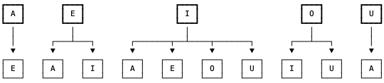

1220. Count Vowels Permutation

Given an integer `n`, your task is to count how many strings of length `n` can be formed under the following rules:

* Each character is a lower case vowel (`'a'`, `'e'`, `'i'`, `'o'`, `'u'`)
* Each vowel `'a'` may only be followed by an `'e'`.
* Each vowel `'e'` may only be followed by an `'a'` or an `'i'`.
* Each vowel `'i'` may not be followed by another `'i'`.
* Each vowel `'o'` may only be followed by an `'i'` or a `'u'`.
* Each vowel `'u'` may only be followed by an `'a'`.
Since the answer may be too large, return it modulo `10^9 + 7`.

**Example 1:**
```
Input: n = 1
Output: 5
Explanation: All possible strings are: "a", "e", "i" , "o" and "u".
```

**Example 2:**
```
Input: n = 2
Output: 10
Explanation: All possible strings are: "ae", "ea", "ei", "ia", "ie", "io", "iu", "oi", "ou" and "ua".
```

**Example 3:** 
```
Input: n = 5
Output: 68
```

**Constraints:**

* `1 <= n <= 2 * 10^4`

# Solution
---
**Solution 1: (DP Bottom-Up)**

Each vowel allows some number of subsequent characters. These transitions are like a tree. This problem is asking, "what's the width of the tree with height n?"



My solution keeps track of the number of each vowel at a level in this tree. To calculate say 'A', we calculate how many nodes in the previous level produce 'A'. This is the number of 'E', 'I', and 'U' nodes.
```
Runtime: 216 ms
Memory Usage: 14 MB
```
```python
class Solution:
    def countVowelPermutation(self, n: int) -> int:
        a, e, i, o, u = 1, 1, 1, 1, 1
        for _ in range(n - 1):
            a, e, i, o, u = e + i + u, a + i, e + o, i, i + o
        return (a + e + i + o + u) % (10**9 + 7)
```

**Solution 2: (DP Top-Down)**
```
Runtime: 840 ms
Memory Usage: 611.6 MB
```
```python
class Solution:
    def countVowelPermutation(self, n: int) -> int:
        MOD = 10**9 + 7
        
        @functools.lru_cache(None)
        def dp(i, c):
            if i == n-1:
                return 1
            if c == 'a':
                return dp(i+1, 'e')
            elif c == 'e':
                return dp(i+1, 'a') + dp(i+1, 'i')
            elif c == 'i':
                return dp(i+1, 'a') + dp(i+1, 'e') + dp(i+1, 'o') + dp(i+1, 'u')
            elif c == 'o':
                return dp(i+1, 'i') + dp(i+1, 'u')
            else:
                return dp(i+1, 'a')
            
        return sum([dp(0, _) for _ in ['a', 'e', 'i', 'o', 'u']]) % MOD
```

**Solution 3: (DP Top-Down)**
```
Runtime: 1568 ms
Memory Usage: 199.8 MB
```
```python
class Solution:
    def countVowelPermutation(self, n: int) -> int:
        MOD = 10**9 + 7
        d = {
            'a': ['e'],
            'e': ['a', 'i'],
            'i': ['a', 'e', 'o', 'u'],
            'o': ['i', 'u'],
            'u': ['a']
        }
        
        @functools.lru_cache(None)
        def dp(i, c):
            if i == n-1:
                return 1
            return sum([dp(i+1, _) for _ in d[c]])
            
        return sum([dp(0, _) for _ in list(d.keys())]) % MOD
```