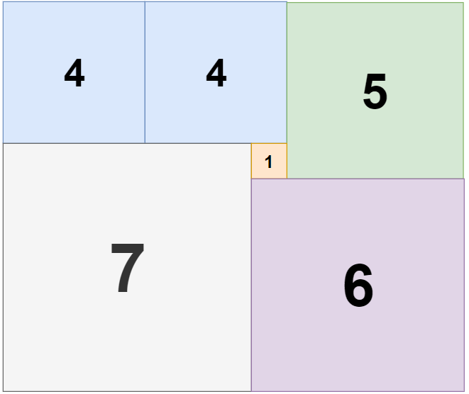

1240. Tiling a Rectangle with the Fewest Squares

Given a rectangle of size `n` x `m`, find the minimum number of integer-sided squares that tile the rectangle.

**Example 1:**


```
Input: n = 2, m = 3
Output: 3
Explanation: 3 squares are necessary to cover the rectangle.
2 (squares of 1x1)
1 (square of 2x2)
```

**Example 2:**


```
Input: n = 5, m = 8
Output: 5
```

**Example 3:**



```
Input: n = 11, m = 13
Output: 6
```

**Constraints:**

* `1 <= n <= 13`
* `1 <= m <= 13`

# Submissions
---
**Solution 1: (DP Bottom-Up)**
```
Runtime: 44 ms
Memory Usage: 13.7 MB
```
```python
class Solution:
    def tilingRectangle(self, n: int, m: int) -> int:
        if (n == 11 and m == 13) or (n == 13 and m == 11):
            return 6
        
        cache = [[0 for _ in range(m+1)] for _ in range(n+1)]
        for i in range(1, n+1):
            for j in range(1, m+1):
                cache[i][j] = float('inf')
                for k in range(1, min(i, j) + 1):
                    cache[i][j] = min(cache[i][j], 1 + min(cache[i-k][j] + cache[k][j-k],  # upright -> bottomleft
                                                           cache[i-k][k] + cache[i][j-k]))  # bottomleft -> upright
        return cache[n][m]
```

**Solution 2: (DP Top-Down)**
```
Runtime: 36 ms
Memory Usage: 13.9 MB
```
```python
class Solution:
    def tilingRectangle(self, n: int, m: int) -> int:
        if (n == 11 and m == 13) or (n == 13 and m == 11):
            return 6

        @functools.lru_cache(None)
        def dp(i, j):
            if i <= 0 or j <= 0:
                return 0
            rst = float('inf')
            for k in range(1, min(i, j) + 1):
                rst = min(rst, 1 + min(dp(i-k, j) + dp(k, j-k), 
                                       dp(i-k, k) + dp(i, j-k)))
            return rst
                
        return dp(n, m)
```

**Solution 3: (Backtracking)**

Place square from bottom->top. For each square, try to scan and find the current lowest point, add square there.
What if there is one big square that shadows one small square under it? Then that small square must be placed first because it has lower height. So this way of placement is always valid.

```
Runtime: 116 ms
Memory Usage: 12.9 MB
```
```python
class Solution:
    def tilingRectangle(self, n: int, m: int) -> int:
        res = n*m
        def dfs(height,moves):
            nonlocal res
            if all(h == n for h in height):
                res = min(res,moves)
                return
            if moves >= res:
                return
            idx = height.index(min(height))
            idx2 = idx
            while idx2 < m and height[idx] == height[idx2]:
                idx2 += 1
            maxl = min(idx2-idx, n-height[idx])
            for l in range(maxl, 0, -1):
                height2 = list(height)
                for j in range(l):
                    height2[idx+j] += l
                dfs(height2, moves+1)
        dfs([0]*m,0)
        
        return res
```