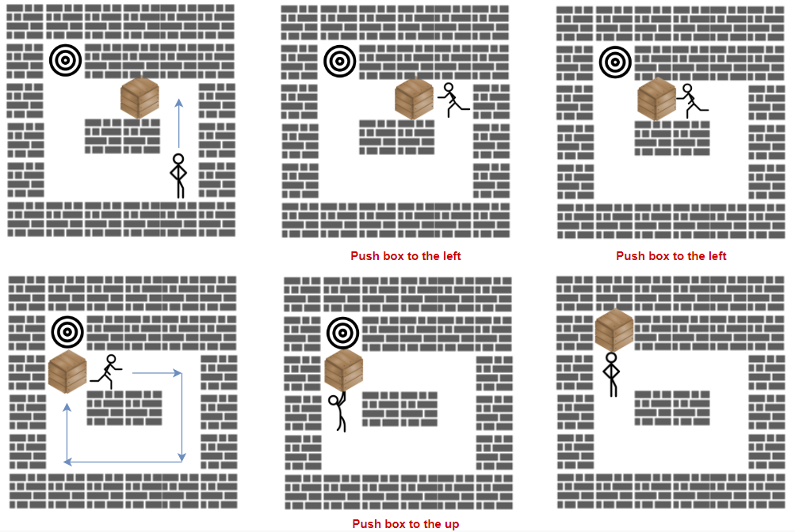

1263. Minimum Moves to Move a Box to Their Target Location

Storekeeper is a game, in which the player pushes boxes around in a warehouse, trying to get them to target locations.

The game is represented by a `grid` of size `n*m`, where each element is a wall, floor or a box.

Your task is move the box `'B'` to the target position `'T'` under the following rules:

* Player is represented by character `'S'` and can move up, down, left, right in the grid if its a floor (empy cell).
* Floor is represented by character `'.'` that means free cell to walk.
* Wall is represented by character `'#'` that means obstacle  (impossible to walk there). 
* There is only one box `'B'` and one target cell `'T'` in the grid.
* The box can be moved to an adjacent free cell by standing next to the box and then moving in the direction of the box. This is a push.
* The player cannot walk through the box.

Return the minimum number of **pushes** to move the box to the target. If there is no way to reach the target, return `-1`.

 

**Example 1:**



```
Input: grid = [["#","#","#","#","#","#"],
               ["#","T","#","#","#","#"],
               ["#",".",".","B",".","#"],
               ["#",".","#","#",".","#"],
               ["#",".",".",".","S","#"],
               ["#","#","#","#","#","#"]]
Output: 3
Explanation: We return only the number of times the box is pushed.
```

**Example 2:**

```
Input: grid = [["#","#","#","#","#","#"],
               ["#","T","#","#","#","#"],
               ["#",".",".","B",".","#"],
               ["#","#","#","#",".","#"],
               ["#",".",".",".","S","#"],
               ["#","#","#","#","#","#"]]
Output: -1
```

**Example 3:**

```
Input: grid = [["#","#","#","#","#","#"],
               ["#","T",".",".","#","#"],
               ["#",".","#","B",".","#"],
               ["#",".",".",".",".","#"],
               ["#",".",".",".","S","#"],
               ["#","#","#","#","#","#"]]
Output: 5
Explanation:  push the box down, left, left, up and up.
```

**Example 4:**

```
Input: grid = [["#","#","#","#","#","#","#"],
               ["#","S","#",".","B","T","#"],
               ["#","#","#","#","#","#","#"]]
Output: -1
```

**Constraints:**

* `1 <= grid.length <= 20`
* `1 <= grid[i].length <= 20`
* grid contains only characters `'.'`, `'#'`, `'S'` , `'T'`, or `'B'`.
* There is only one character `'S'`, `'B'` and `'T'` in the grid.

# Submissions
---
**Solution 1: (BFS)**

First define a function to check from current state, what are the possible neighbouring states (use BFS to check if we can move the player to required location). Notice that the state includes both the location of the box and the player.
Second BFS to see if we can reach the target location.

```
Runtime: 736 ms
Memory Usage: 12.9 MB
```
```python
class Solution:
    def minPushBox(self, grid: List[List[str]]) -> int:
        dire = [(1,0),(0,1),(-1,0),(0,-1)]

        def can_get(cur_b,cur_p,tar):
            seen,cur = set([cur_p]),set([cur_p])
            while cur:
                tmp = []
                for loc in cur:
                    for x,y in dire:
                        if 0 <= loc[0]+x < len(grid) and 0 <= loc[1]+y < len(grid[0]) and (loc[0]+x, loc[1]+y) != cur_b and grid[loc[0]+x][loc[1]+y] != '#' and (loc[0]+x, loc[1] +y) not in seen:
                            tmp += [(loc[0]+x, loc[1]+y)]
                cur = set(tmp)
                seen |= cur
                if tar in seen:
                    return True
            return False

        for i in range(len(grid)):
            for j in range(len(grid[0])):
                if grid[i][j] == 'B': box = (i,j)
                if grid[i][j] == 'S': player = (i,j)
                if grid[i][j] == 'T': target = (i,j)

        seen, cur, res = set([(box, player)]), set([(box, player)]), 0
        while cur:
            tmp = []
            res += 1
            for b, p in cur:
                for x, y in dire:
                    if 0 <= b[0]+x < len(grid) and 0 <= b[1]+y < len(grid[0]) and grid[b[0]+x][b[1]+y] != '#' and can_get(b, p, (b[0]-x, b[1]-y)) and ((b[0]+x, b[1]+y), b) not in seen:
                        tmp += [((b[0]+x, b[1]+y), b)]
            cur = set(tmp)
            seen |= cur
            for x, y in dire:
                if (target, (target[0]+x, target[1]+y)) in seen:
                    return res
        return -1
```

**Solution 2: (BFS, 2 BFS)**
```
Runtime: 47 ms. Beats 57.80%
Memory: 40.70 MB, Beats 20.18%
```
```c++
class Solution {
    int dd[5] = {0, 1, 0, -1, 0};
    bool check(int tx, int ty, int sx, int sy, int bx, int by, vector<vector<char>> &grid) {
            int m = grid.size(), n = grid[0].size(), nx, ny, d;
            vector<vector<int>> visited(m, vector<int>(n));
            queue<array<int,2>> q;
            q.push({sx, sy});
            visited[sx][sy] = 1;
            while (q.size()) {
                auto [x, y] = q.front();
                q.pop();
                if (x == tx && y == ty) {
                    return true;
                }
                for (d = 0; d < 4; d ++) {
                    nx = x + dd[d];
                    ny = y + dd[d+1];
                    if (0 <= nx && nx < m && 0 <= ny && ny < n && grid[nx][ny] != '#' && !visited[nx][ny] && !(nx == bx && ny == by)) {
                        q.push({nx, ny});
                        visited[nx][ny] = 1;
                    }
                }
            }
            return false;
        };
public:
    int minPushBox(vector<vector<char>>& grid) {
        int m = grid.size(), n = grid[0].size(), i, j, d, nbx, nby, pbx, pby, nx, ny, ans = 0;
        array<int,2> player, box, target;
        queue<array<int,5>> q;
        int visited[20][20][20][20] = {0};
        for (i = 0; i < m; i ++) {
            for (j = 0; j < n; j ++) {
                if (grid[i][j] == 'S') {
                    player = {i, j};
                } else if (grid[i][j] == 'B') {
                    box = {i, j};
                } else if (grid[i][j] == 'T') {
                    target = {i, j};
                }
            }
        }
        q.push({box[0], box[1], player[0], player[1], 0});
        visited[box[0]][box[1]][player[0]][player[1]] = 1;
        while (q.size()) {
            auto [bx, by, sx, sy, s] = q.front();
            q.pop();
            if (bx == target[0] && by == target[1]) {
                return s;
            }
            for (d = 0; d < 4; d ++) {
                nbx = bx + dd[d];
                nby = by + dd[d+1];
                pbx = bx - dd[d];
                pby = by - dd[d+1];
                if (0 <= nbx && nbx < m && 0 <= nby && nby < n && 0 <= pbx && pbx < m && 0 <= pby && pby < n && grid[nbx][nby] != '#' && grid[pbx][pby] != '#' && check(pbx, pby, sx, sy, bx, by, grid) && visited[nbx][nby][bx][by] == 0) {
                    q.push({nbx, nby, bx, by, s+1});
                    visited[nbx][nby][bx][by] = 1;
                }
            }
        }
        return -1;
    }
};
```
