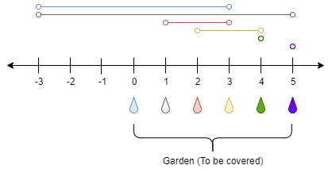

1326. Minimum Number of Taps to Open to Water a Garden

There is a one-dimensional garden on the x-axis. The garden starts at the point `0` and ends at the point `n`. (i.e The length of the garden is `n`).

There are `n + 1` taps located at points `[0, 1, ..., n]` in the garden.

Given an integer `n` and an integer array `ranges` of length `n + 1` where `ranges[i]` (`0`-indexed) means the `i`-th tap can water the area `[i - ranges[i], i + ranges[i]]` if it was open.

Return the minimum number of taps that should be open to water the whole garden, If the garden cannot be watered return `-1`.

 

**Example 1:**


```
Input: n = 5, ranges = [3,4,1,1,0,0]
Output: 1
Explanation: The tap at point 0 can cover the interval [-3,3]
The tap at point 1 can cover the interval [-3,5]
The tap at point 2 can cover the interval [1,3]
The tap at point 3 can cover the interval [2,4]
The tap at point 4 can cover the interval [4,4]
The tap at point 5 can cover the interval [5,5]
Opening Only the second tap will water the whole garden [0,5]
```

**Example 2:**
```
Input: n = 3, ranges = [0,0,0,0]
Output: -1
Explanation: Even if you activate all the four taps you cannot water the whole garden.
```

**Example 3:**
```
Input: n = 7, ranges = [1,2,1,0,2,1,0,1]
Output: 3
```

**Example 4:**
```
Input: n = 8, ranges = [4,0,0,0,0,0,0,0,4]
Output: 2
```

**Example 5:**
```
Input: n = 8, ranges = [4,0,0,0,4,0,0,0,4]
Output: 1
```

**Constraints:**

* `1 <= n <= 10^4`
* `ranges.length == n + 1`
* `0 <= ranges[i] <= 100`

# Submissions
---
**Solution 1: (DP Bottom-Up)**

**Intuition**
Example 2 did confuse me.  
We actually need to water the whole segment, instead of n + 1 point.  
The taps with value 0 can water nothing.


**Solution 1: Brute Force DP**

* dp[i] is the minimum number of taps to water [0, i].
* Initialize dp[i] with max = n + 2
* xdp[0] = [0] as we need no tap to water nothing.

* Find the leftmost point of garden to water with tap i.
* Find the rightmost point of garden to water with tap i.
* We can water [left, right] with onr tap,
and water [0, left - 1] with dp[left - 1] taps.


**Complexity**

* Time O(NR), where R = ranges[i] <= 100
* Space O(N)

**Similar:**

* 1024. Video Stitching
```
Runtime: 936 ms
Memory Usage: 12.9 MB
```
```python
class Solution:
    def minTaps(self, n: int, ranges: List[int]) -> int:
        dp = [0] + [n + 2] * n  # max: n+1
        for i, x in enumerate(ranges):
            for j in range(max(i - x + 1, 0), min(i + x, n) + 1):
                dp[j] = min(dp[j], dp[max(0, i - x)] + 1)
        return dp[n] if dp[n] < n + 2 else -1
```

**Solution 2: (DP Bottom-Up)**
```
Runtime: 39 ms
Memory: 14.7 MB
```
```c++
class Solution {
public:
    int minTaps(int n, vector<int>& ranges) {
        vector<int> dp(n+1, n+2);
        dp[0] = 0;
        for (int i = 0; i <= n; i ++) {
            if (ranges[i]) {
                for (int j = max(0, i-ranges[i]); j <= min(n, i+ranges[i]); j ++) {
                    dp[j] = min(dp[j], dp[max(0, i-ranges[i])] + 1);
                }
            }
        }
        return dp[n] != n+2 ? dp[n] : -1;
    }
};
```
