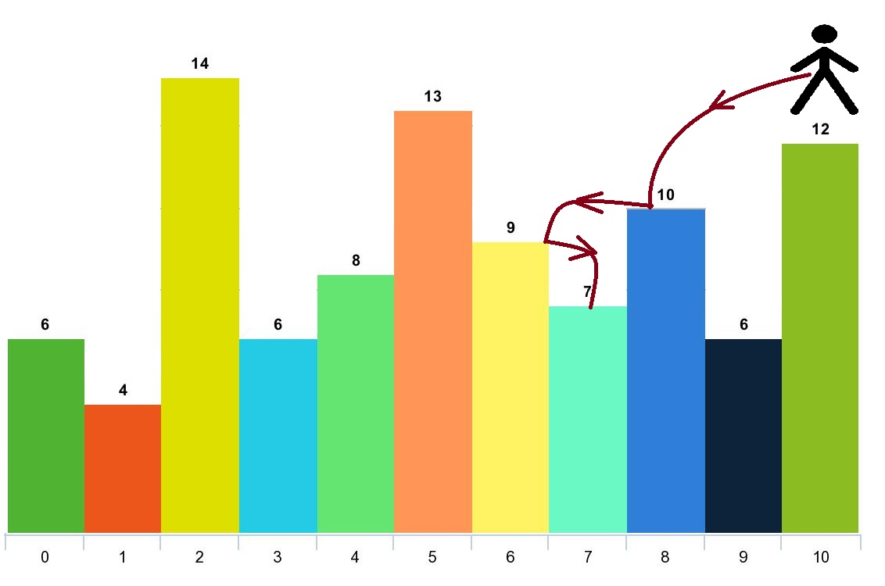

1340. Jump Game V

Given an array of integers `arr` and an integer `d`. In one step you can jump from index `i` to index:

* `i + x` where: `i + x < arr.length` and `0 < x <= d`.
* `i - x` where: `i - x >= 0` and `0 < x <= d`.

In addition, you can only jump from index `i` to index `j` if `arr[i] > arr[j]` and `arr[i] > arr[k]` for all indices `k` between `i` and `j` (More formally `min(i, j) < k < max(i, j)`).

You can choose any index of the array and start jumping. Return the maximum number of indices you can visit.

Notice that you can not jump outside of the array at any time.

 

**Example 1:**


```
Input: arr = [6,4,14,6,8,13,9,7,10,6,12], d = 2
Output: 4
Explanation: You can start at index 10. You can jump 10 --> 8 --> 6 --> 7 as shown.
Note that if you start at index 6 you can only jump to index 7. You cannot jump to index 5 because 13 > 9. You cannot jump to index 4 because index 5 is between index 4 and 6 and 13 > 9.
Similarly You cannot jump from index 3 to index 2 or index 1.
```

**Example 2:**
```
Input: arr = [3,3,3,3,3], d = 3
Output: 1
Explanation: You can start at any index. You always cannot jump to any index.
```

**Example 3:**
```
Input: arr = [7,6,5,4,3,2,1], d = 1
Output: 7
Explanation: Start at index 0. You can visit all the indicies. 
```

**Example 4:**
```
Input: arr = [7,1,7,1,7,1], d = 2
Output: 2
```

**Example 5:**
```
Input: arr = [66], d = 1
Output: 1
```

**Constraints:**

* `1 <= arr.length <= 1000`
* `1 <= arr[i] <= 10^5`
* `1 <= d <= arr.length`

# Submissios
---
**Solution 1: (DP, TOP-down)**

For each step `A[i]`,
check `A[j]` on its left and right,
until it meet the bound or meet the bigger step.

* Time complexity O(ND)
* Space complexity O(N) for dp

```
Runtime: 720 ms
Memory Usage: 17.2 MB
```
```python
class Solution:
    def maxJumps(self, arr: List[int], d: int) -> int:
        N = len(arr)
        res = [0] * N

        @functools.lru_cache(None)
        def dp(i):
            res[i] = 1
            for di in [-1, 1]:
                for j in range(i + di, i + d*di + di, di):
                    if not (0 <= j < N and arr[j] < arr[i]): break
                    res[i] = max(res[i], dp(j) + 1)
            return res[i]

        return max(map(dp, range(N)))
```

**Solution 2: (DP, Bottom-up)**

We can only jump lower, and one step needs the result from its lower step.
So we sort `A[i]` do the dp starting from the smallest.

For each `A[i]`, we check the lower step on the left and right.
This process is O(D) on both side.

* Time complexity O(NlogN + ND), where we are given D <= N
* Space complexity O(N) for dp

```
Runtime: 664 ms
Memory Usage: 12.9 MB
```
```python
class Solution:
    def maxJumps(self, arr: List[int], d: int) -> int:
        N = len(arr)
        dp = [1] * N
        for a, i in sorted([a, i] for i, a in enumerate(arr)):
            for di in [-1, 1]:
                for j in range(i + di, i + d*di + di, di):
                    if not (0 <= j < N and arr[j] < arr[i]): break
                    dp[i] = max(dp[i], dp[j] + 1)
        return max(dp)
```