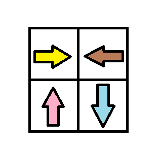

1368. Minimum Cost to Make at Least One Valid Path in a Grid

Given a m x n grid. Each cell of the `grid` has a sign pointing to the next cell you should visit if you are currently in this cell. The sign of `grid[i][j]` can be:
* `1` which means go to the cell to the right. (i.e go from `grid[i][j]` to `grid[i][j + 1]`)
* `2` which means go to the cell to the left. (i.e go from `grid[i][j]` to `grid[i][j - 1]`)
* `3` which means go to the lower cell. (i.e go from `grid[i][j]` to `grid[i + 1][j]`)
* `4` which means go to the upper cell. (i.e go from `grid[i][j]` to `grid[i - 1][j]`)

Notice that there could be some invalid signs on the cells of the grid which points outside the grid.

You will initially start at the upper left cell `(0,0)`. A valid path in the grid is a path which starts from the upper left cell `(0,0)` and ends at the bottom-right cell `(m - 1, n - 1)` following the signs on the grid. The valid path doesn't have to be the shortest.

You can modify the sign on a cell with `cost = 1`. You can modify the sign on a cell one time only.

Return the minimum cost to make the grid have at least one valid path.

 

**Example 1:**


```
Input: grid = [[1,1,1,1],[2,2,2,2],[1,1,1,1],[2,2,2,2]]
Output: 3
Explanation: You will start at point (0, 0).
The path to (3, 3) is as follows. (0, 0) --> (0, 1) --> (0, 2) --> (0, 3) change the arrow to down with cost = 1 --> (1, 3) --> (1, 2) --> (1, 1) --> (1, 0) change the arrow to down with cost = 1 --> (2, 0) --> (2, 1) --> (2, 2) --> (2, 3) change the arrow to down with cost = 1 --> (3, 3)
The total cost = 3.
```

**Example 2:**


```
Input: grid = [[1,1,3],[3,2,2],[1,1,4]]
Output: 0
Explanation: You can follow the path from (0, 0) to (2, 2).
```

**Example 3:**


```
Input: grid = [[1,2],[4,3]]
Output: 1
```

**Example 4:**
```
Input: grid = [[2,2,2],[2,2,2]]
Output: 3
```

**Example 5:**
```
Input: grid = [[4]]
Output: 0
```

**Constraints:**

* `m == grid.length`
* `n == grid[i].length`
* `1 <= m, n <= 100`

# Submissions
---
**Solution 1: (DFS, BFS)**

**Intuition**

One observation is that, (not sure if it's obvious)  
we can greedily explore the grid.  
We will never detour the path to a node that we can already reach.

In the view of graph,  
the fleche indicates a directed edge of weight = 0.  
The distance between all neighbours are at most 1.  
Now we want to find out the minimum distance between top-left and bottom-right.


**Explanation**

1. Find out all reachable nodes without changing anything.
1. Save all new visited nodes to a queue bfs.
1. Now iterate the queue
    3.1 For each node, try changing it to all 3 other direction
    3.2 Save the new reachable and not visited nodes to the queue.
    3.3 repeat step 3

**Complexity**

Time `O(NM)`  
Space `O(NM)`
```
Runtime: 404 ms
Memory Usage: 25.7 MB
```
```python
class Solution:
    def minCost(self, grid: List[List[int]]) -> int:
        R, C, k = len(grid), len(grid[0]), 0
        dp = [[float('inf')] * C for i in range(R)]
        dirt = [[0, 1], [0, -1], [1, 0], [-1, 0]]
        bfs = []

        def dfs(r, c):
            if not (0 <= r < R and 0 <= c < C and dp[r][c] == float('inf')): 
                return
            dp[r][c] = k
            bfs.append([r, c])
            dfs(r + dirt[grid[r][c] - 1][0], c + dirt[grid[r][c] - 1][1])

        dfs(0, 0)
        while bfs:
            k += 1
            bfs, bfs2 = [], bfs
            [dfs(x + dx, y + dy) for x, y in bfs2 for dx, dy in dirt]
        return dp[-1][-1]
```

**Solution 2: (DP, Bottom-Up)**
```
Runtime: 58 ms
Memory: 29.63 MB
```
```c++
class Solution {
public:
    int minCost(vector<vector<int>>& grid) {
        int numRows = grid.size(), numCols = grid[0].size();
        vector<vector<int>> minChanges(numRows, vector<int>(numCols, INT_MAX));

        // Initialize all cells with max value
        minChanges[0][0] = 0;

        while (true) {
            // Store previous state to check for convergence
            vector<vector<int>> prevState = minChanges;

            // Forward pass: check cells coming from left and top
            for (int row = 0; row < numRows; row++) {
                for (int col = 0; col < numCols; col++) {
                    // Check cell above
                    if (row > 0) {
                        minChanges[row][col] =
                            min(minChanges[row][col],
                                minChanges[row - 1][col] +
                                    (grid[row - 1][col] == 3 ? 0 : 1));
                    }
                    // Check cell to the left
                    if (col > 0) {
                        minChanges[row][col] =
                            min(minChanges[row][col],
                                minChanges[row][col - 1] +
                                    (grid[row][col - 1] == 1 ? 0 : 1));
                    }
                }
            }

            // Backward pass: check cells coming from right and bottom
            for (int row = numRows - 1; row >= 0; row--) {
                for (int col = numCols - 1; col >= 0; col--) {
                    // Check cell below
                    if (row < numRows - 1) {
                        minChanges[row][col] =
                            min(minChanges[row][col],
                                minChanges[row + 1][col] +
                                    (grid[row + 1][col] == 4 ? 0 : 1));
                    }
                    // Check cell to the right
                    if (col < numCols - 1) {
                        minChanges[row][col] =
                            min(minChanges[row][col],
                                minChanges[row][col + 1] +
                                    (grid[row][col + 1] == 2 ? 0 : 1));
                    }
                }
            }

            // If no changes were made in this iteration, we've found optimal
            // solution
            if (prevState == minChanges) {
                break;
            }
        }

        return minChanges[numRows - 1][numCols - 1];
    }
};
```

**Solution 3: (Dijkstra)**
```
Runtime: 91 ms
Memory: 30.78 MB
```
```c++
class Solution {
    // Direction vectors: right, left, down, up (matching grid values 1, 2, 3,
    // 4)
    vector<vector<int>> dirs = {{0, 1}, {0, -1}, {1, 0}, {-1, 0}};
public:
    int minCost(vector<vector<int>>& grid) {
        int numRows = grid.size(), numCols = grid[0].size();

        // Min-heap ordered by cost. Each element is {cost, row, col}
        priority_queue<vector<int>, vector<vector<int>>, greater<>> pq;
        pq.push({0, 0, 0});

        // Track minimum cost to reach each cell
        vector<vector<int>> minCost(numRows, vector<int>(numCols, INT_MAX));
        minCost[0][0] = 0;

        while (!pq.empty()) {
            auto curr = pq.top();
            pq.pop();
            int cost = curr[0], row = curr[1], col = curr[2];

            // Skip if we've found a better path to this cell
            if (minCost[row][col] != cost) continue;

            // Try all four directions
            for (int dir = 0; dir < 4; dir++) {
                int newRow = row + dirs[dir][0];
                int newCol = col + dirs[dir][1];

                // Check if new position is valid
                if (newRow >= 0 && newRow < numRows && newCol >= 0 &&
                    newCol < numCols) {
                    // Add cost=1 if we need to change direction
                    int newCost = cost + (dir != (grid[row][col] - 1) ? 1 : 0);

                    // Update if we found a better path
                    if (minCost[newRow][newCol] > newCost) {
                        minCost[newRow][newCol] = newCost;
                        pq.push({newCost, newRow, newCol});
                    }
                }
            }
        }

        return minCost[numRows - 1][numCols - 1];
    }
};
```

**Solution 4: (0-1 Breadth-First Search)**
```
Runtime: 11 ms
Memory: 26.26 MB
```
```c++
class Solution {
    // Direction vectors: right, left, down, up (matching grid values 1, 2, 3,
    // 4)
    vector<vector<int>> dirs = {{0, 1}, {0, -1}, {1, 0}, {-1, 0}};
    // Check if coordinates are within grid bounds
    bool isValid(int row, int col, int numRows, int numCols) {
        return row >= 0 && row < numRows && col >= 0 && col < numCols;
    }
public:
    int minCost(vector<vector<int>>& grid) {
        int numRows = grid.size(), numCols = grid[0].size();

        // Track minimum cost to reach each cell
        vector<vector<int>> minCost(numRows, vector<int>(numCols, INT_MAX));

        // Use deque for 0-1 BFS - add zero cost moves to front, cost=1 to back
        deque<pair<int, int>> deque;
        deque.push_front({0, 0});
        minCost[0][0] = 0;

        while (!deque.empty()) {
            auto [row, col] = deque.front();
            deque.pop_front();

            // Try all four directions
            for (int dir = 0; dir < 4; dir++) {
                int newRow = row + dirs[dir][0];
                int newCol = col + dirs[dir][1];
                int cost = (grid[row][col] != (dir + 1)) ? 1 : 0;

                // If position is valid and we found a better path
                if (isValid(newRow, newCol, numRows, numCols) &&
                    minCost[row][col] + cost < minCost[newRow][newCol]) {
                    minCost[newRow][newCol] = minCost[row][col] + cost;

                    // Add to back if cost=1, front if cost=0
                    if (cost == 1) {
                        deque.push_back({newRow, newCol});
                    } else {
                        deque.push_front({newRow, newCol});
                    }
                }
            }
        }

        return minCost[numRows - 1][numCols - 1];
    }
};
```

**Solution 5: (DFS, BFS)**
```
Runtime: 11 ms
Memory: 19.99 MB
```
```c++
class Solution {
    // Direction vectors: right, left, down, up (matching grid values 1, 2, 3,
    // 4)
    vector<vector<int>> dirs = {{0, 1}, {0, -1}, {1, 0}, {-1, 0}};
     // DFS to explore all reachable cells with current cost
    void dfs(vector<vector<int>>& grid, int row, int col,
             vector<vector<int>>& minCost, int cost,
             queue<pair<int, int>>& queue) {
        if (!isUnvisited(minCost, row, col)) return;

        minCost[row][col] = cost;
        queue.push({row, col});

        // Follow the arrow direction without cost increase
        int nextDir = grid[row][col] - 1;
        dfs(grid, row + dirs[nextDir][0], col + dirs[nextDir][1], minCost, cost,
            queue);
    }

    // Check if cell is within bounds and unvisited
    bool isUnvisited(vector<vector<int>>& minCost, int row, int col) {
        return row >= 0 && col >= 0 && row < minCost.size() &&
               col < minCost[0].size() && minCost[row][col] == INT_MAX;
    }
public:
    int minCost(vector<vector<int>>& grid) {
        int numRows = grid.size(), numCols = grid[0].size(), cost = 0;

        // Track minimum cost to reach each cell
        vector<vector<int>> minCost(numRows, vector<int>(numCols, INT_MAX));

        // Queue for BFS part - stores cells that need cost increment
        queue<pair<int, int>> queue;

        // Start DFS from origin with cost 0
        dfs(grid, 0, 0, minCost, cost, queue);

        // BFS part - process cells level by level with increasing cost
        while (!queue.empty()) {
            cost++;
            int levelSize = queue.size();

            while (levelSize-- > 0) {
                auto [row, col] = queue.front();
                queue.pop();

                // Try all 4 directions for next level
                for (int dir = 0; dir < 4; dir++) {
                    dfs(grid, row + dirs[dir][0], col + dirs[dir][1], minCost,
                        cost, queue);
                }
            }
        }

        return minCost[numRows - 1][numCols - 1];
    }
};
```

**Solution 6: (DFS, BFS)**
```
Runtime: 0 ms
Memory: 18.80 MB
```
```c++
class Solution {
    int dd[5][2] = {{-1,-1},{0,1}, {0,-1}, {1,0},{-1,0}};
public:
    int minCost(vector<vector<int>>& grid) {
        int m = grid.size(), n = grid[0].size(), nr, nc, i, ans = 0;
        vector<vector<bool>> visited(m, vector<bool>(n));
        stack<pair<int,int>> stk;
        queue<pair<int,int>> q;
        stk.push({0, 0});
        while (1) {
            while (stk.size()) {
                auto [r, c] = stk.top();
                if (r == m-1 && c == n-1) {
                    return ans;
                }
                stk.pop();
                nr = r + dd[grid[r][c]][0];
                nc = c + dd[grid[r][c]][1];
                if (0 <= nr && nr < m && 0 <= nc && nc < n && !visited[nr][nc]) {
                    visited[nr][nc] = true;
                    stk.push({nr,nc});
                }
                for (i = 1; i <= 4; i ++) {
                    if (i != grid[r][c]) {
                        nr = r + dd[i][0];
                        nc = c + dd[i][1];
                        if (0 <= nr && nr < m && 0 <= nc && nc < n && !visited[nr][nc]) {
                            q.push({nr,nc});
                        }
                    }
                }
            }
            while (q.size()) {
                auto [r, c] = q.front();
                q.pop();
                if (!visited[r][c]) {
                    visited[r][c] = true;
                    stk.push({r,c});
                }
            }
            ans += 1;
        }
        return -1;
    }
};
```

**Solution 2: (BFS, next level buffered)**
```
Runtime: 14 ms, Beats 78.15%
Memory: 21.80 MB, Beats 55.78%
```
```c++
class Solution {
    int dd[4][2] = {{0, 1}, {0, -1}, {1, 0}, {-1, 0}};
public:
    int minCost(vector<vector<int>>& grid) {
        int m = grid.size(), n = grid[0].size(), d, ni, nj;
        queue<array<int,3>> q, q2;
        vector<vector<int>> visited(m, vector<int>(n));
        q.push({0, 0, 0});
        visited[0][0] = 1;
        while (q.size()) {
            auto [i, j, s] = q.front();
            q.pop();
            if (i == m-1 && j == n-1) {
                return s;
            }
            for (d = 0; d < 4; d ++) {
                ni = i + dd[d][0];
                nj = j + dd[d][1];
                if (0 <= ni && ni < m && 0 <= nj && nj < n && !visited[ni][nj]) {
                    if (d+1 == grid[i][j]) {
                        q.push({ni, nj, s});
                        visited[ni][nj] = 1;
                    } else {
                        q2.push({ni, nj, s+1});
                    }
                }
                
            }
            if (q.size() == 0) {
                while (q2.size()) {
                    auto [i, j, s] = q2.front();
                    q2.pop();
                    if (!visited[i][j]) {
                        q.push({i, j, s});
                        visited[i][j] = 1;
                    }
                }
            }
        }
        return -1;
    }
};
```
