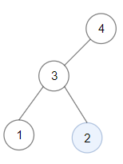

1373. Maximum Sum BST in Binary Tree

Given a **binary tree** `root`, the task is to return the maximum sum of all keys of **any** sub-tree which is also a Binary Search Tree (BST).

Assume a BST is defined as follows:

* The left subtree of a node contains only nodes with keys less than the node's key.
* The right subtree of a node contains only nodes with keys greater than the node's key.
* Both the left and right subtrees must also be binary search trees.
 

**Example 1:**


```
Input: root = [1,4,3,2,4,2,5,null,null,null,null,null,null,4,6]
Output: 20
Explanation: Maximum sum in a valid Binary search tree is obtained in root node with key equal to 3.
```

**Example 2:**


```
Input: root = [4,3,null,1,2]
Output: 2
Explanation: Maximum sum in a valid Binary search tree is obtained in a single root node with key equal to 2.
```

**Example 3:**
```
Input: root = [-4,-2,-5]
Output: 0
Explanation: All values are negatives. Return an empty BST.
```

**Example 4:**
```
Input: root = [2,1,3]
Output: 6
```

**Example 5:**
```
Input: root = [5,4,8,3,null,6,3]
Output: 7
``` 

**Constraints:**

* Each tree has at most 40000 nodes..
* Each node's value is between `[-4 * 10^4 , 4 * 10^4]`.

# Submissions
---
**Solution 1: (Post-Order, DFS, Binary Search Tree)**

**Idea**

For each subtree, we return 4 elements.

1. the status of this subtree, 1 means it's empty, 2 means it's a BST, 0 means it's not a BST
1. size of this subtree (we only care about size of BST though)
1. the minimal value in this subtree
1. the maximal value in this subtree

Then we only need to make sure for every BST
* both of its children are BST
* the right bound of its left child is smaller than root.val
* the left bound of its right child is larger than root.val

**Complexity**

* Time: O(N)
* Space: O(logN) for function calls, worst case O(N) if the given tree is not balanced

```
Runtime: 396 ms
Memory Usage: 70.4 MB
```
```python
# Definition for a binary tree node.
# class TreeNode:
#     def __init__(self, x):
#         self.val = x
#         self.left = None
#         self.right = None

class Solution:
    def maxSumBST(self, root: TreeNode) -> int:
        res = 0
        def traverse(root):
            '''return status_of_bst, size_of_bst, left_bound, right_bound'''
            nonlocal res
            if not root: return 1, 0, None, None # this subtree is empty
            
            ls, l, ll, lr = traverse(root.left)
            rs, r, rl, rr = traverse(root.right)
            
            if ((ls == 2 and lr < root.val) or ls == 1) and ((rs == 2 and rl > root.val) or rs == 1):
            # this subtree is a BST
                size = root.val + l + r
                res = max(res, size)
                return 2, size, (ll if ll is not None else root.val), (rr if rr is not None else root.val)
            return 0, None, None, None # this subtree is not a BST
        
        traverse(root)
        return res
```