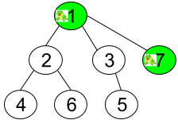

1377. Frog Position After T Seconds

Given an undirected tree consisting of `n` vertices numbered from 1 to `n`. A frog starts jumping from the **vertex 1**. In one second, the frog jumps from its current vertex to another **unvisited** vertex if they are directly connected. The frog can not jump back to a visited vertex. In case the frog can jump to several vertices it jumps randomly to one of them with the same probability, otherwise, when the frog can not jump to any unvisited vertex it jumps forever on the same vertex. 

The edges of the undirected tree are given in the array edges, where `edges[i] = [fromi, toi]` means that exists an edge connecting directly the vertices `fromi` and `toi`.

Return the probability that after `t` seconds the frog is on the vertex target.

 

**Example 1:**


```
Input: n = 7, edges = [[1,2],[1,3],[1,7],[2,4],[2,6],[3,5]], t = 2, target = 4
Output: 0.16666666666666666 
Explanation: The figure above shows the given graph. The frog starts at vertex 1, jumping with 1/3 probability to the vertex 2 after second 1 and then jumping with 1/2 probability to vertex 4 after second 2. Thus the probability for the frog is on the vertex 4 after 2 seconds is 1/3 * 1/2 = 1/6 = 0.16666666666666666. 
```

**Example 2:**


```
Input: n = 7, edges = [[1,2],[1,3],[1,7],[2,4],[2,6],[3,5]], t = 1, target = 7
Output: 0.3333333333333333
Explanation: The figure above shows the given graph. The frog starts at vertex 1, jumping with 1/3 = 0.3333333333333333 probability to the vertex 7 after second 1.
```

**Example 3:**
```
Input: n = 7, edges = [[1,2],[1,3],[1,7],[2,4],[2,6],[3,5]], t = 20, target = 6
Output: 0.16666666666666666
``` 

**Constraints:**

* `1 <= n <= 100`
* `edges.length == n-1`
* `edges[i].length == 2`
* `1 <= edges[i][0], edges[i][1] <= n`
* `1 <= t <= 50`
* `1 <= target <= n`
* Answers within `10^-5` of the actual value will be accepted as correct.

# Submissions
---
**Solution 1: (BFS)**
```
Runtime: 152 ms
Memory Usage: 12.6 MB
```
```python
class Solution:
    def frogPosition(self, n: int, edges: List[List[int]], t: int, target: int) -> float:
        g = collections.defaultdict(set)
        for a, b in edges:
            g[a].add(b)
            g[b].add(a)
            
        q = collections.deque([(1, 1, 0)]) # state: leaf_id, possibility, timestamp
        visited = set()
        
        while q:
            u, p, curr = q.popleft()
            visited.add(u)
            
            if curr >= t:
                if u == target: return p
                continue
            
            neighbors = g[u] - visited
            for v in neighbors or [u]:
                q += (v, p / (len(neighbors) or 1), curr + 1),
        return .0
```

**Solution 2: (DFS)**
```
Runtime: 308 ms
Memory Usage: 12.8 MB
```
```python
class Solution:
    def frogPosition(self, n: int, edges: List[List[int]], t: int, target: int) -> float:
        g = collections.defaultdict(set)
        for a, b in edges:
            g[a].add(b)
            g[b].add(a)
        visited, res = set(), .0
        
        def dfs(u, p, time):
            nonlocal res
            if time >= t:
                if u == target: res = p
                return
            visited.add(u)
            neighbors = g[u] - visited
            for v in neighbors or [u]:
                dfs(v, p / (len(neighbors) or 1), time + 1)
        
        dfs(1, 1, 0)
        
        return res
```

**Solution 3: (DFS)**
```
Runtime: 4 ms, Beats 77.66%
Memory: 19.96 MB, Beats 68.85%
```
```c++
class Solution {
    bool dfs(int u, int a, double p, double &ans, int t, int target, vector<int> &visited, vector<vector<int>> &g) {
        if (t == 0) {
            if (u == target) {
                ans = p;
                return true;
            }
            return false;
        } else if (u == target && all_of(g[u].begin(), g[u].end(), [&](int &i){return visited[i];})) {
            ans = p;
            return true;
        }
        visited[u] = 1;
        t -= 1;
        if (a == -1) {
            p /= g[u].size();
        } else {
            p /= (g[u].size()-1);
        }
        for (auto v: g[u]) {
            if (!visited[v]) {
                if (dfs(v, u, p, ans, t, target, visited, g)) {
                    return true;
                }
            }
        }
        return false;
    }
public:
    double frogPosition(int n, vector<vector<int>>& edges, int t, int target) {
        vector<vector<int>> g(n+1);
        vector<int> visited(n+1);
        double ans;
        for (auto &e: edges) {
            g[e[0]].push_back(e[1]);
            g[e[1]].push_back(e[0]);
        }
        dfs(1, -1, 1, ans, t, target, visited, g);
        return ans;
    }
};
```
