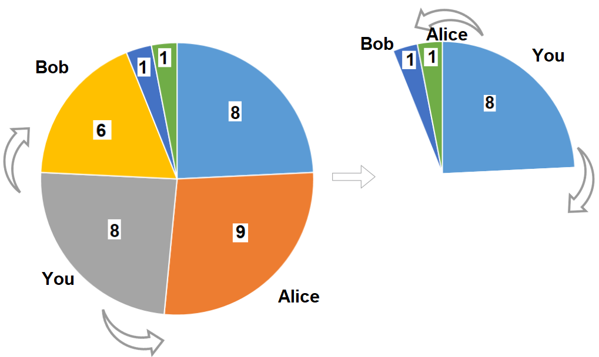

1388. Pizza With 3n Slices

There is a pizza with 3n slices of varying size, you and your friends will take slices of pizza as follows:

* You will pick **any** pizza slice.
* Your friend Alice will pick next slice in anti clockwise direction of your pick. 
* Your friend Bob will pick next slice in clockwise direction of your pick.
* Repeat until there are no more slices of pizzas.

Sizes of Pizza slices is represented by circular array slices in clockwise direction.

Return the maximum possible sum of slice sizes which you can have.

 

**Example 1:**


```
Input: slices = [1,2,3,4,5,6]
Output: 10
Explanation: Pick pizza slice of size 4, Alice and Bob will pick slices with size 3 and 5 respectively. Then Pick slices with size 6, finally Alice and Bob will pick slice of size 2 and 1 respectively. Total = 4 + 6.
```

**Example 2:**


```
Input: slices = [8,9,8,6,1,1]
Output: 16
Output: Pick pizza slice of size 8 in each turn. If you pick slice with size 9 your partners will pick slices of size 8.
```

**Example 3:**
```
Input: slices = [4,1,2,5,8,3,1,9,7]
Output: 21
```

**Example 4:**
```
Input: slices = [3,1,2]
Output: 3
```

**Constraints:**

* `1 <= slices.length <= 500`
* `slices.length % 3 == 0`
* `1 <= slices[i] <= 1000`

# Submissions
---
**Solution 1: (DP Bottom-Up)**

**Idea**

We first divide the problem into 2 sub-problem. (since we cannot have slice 0 and slice n at the same time)

1. we choose from pizza [0, ..., n-1] as a linear pizza instead of a circular pizza
1. we choose from pizza [1, ..., n] as a linear pizza instead of a circular pizza

We then track the maximum amount we ate after eating the ith pizza we have in eat. There are only 2 possibilities as follows.

1. largest value when encountering the previous slice
1. current slice + largest value when encountering last second slice

**Similar Questoins**

188. Best Time to Buy and Sell Stock IV
213. House Robber II

**Complexity**

Time: O(n^2)
Space: O(n)

```
Runtime: 296 ms
Memory Usage: 12.9 MB
```
```python
class Solution:
    def maxSizeSlices(self, slices: List[int]) -> int:
        n = len(slices) // 3
        def linear(arr):
            eat = collections.deque([[0] + [float('-inf')]*n] * 2)
            res = 0
            for x in arr:
                eat += [i and max(eat[-1][i], eat[-2][i-1]+x) for i in range(n+1)],
                eat.popleft()
                res = max(res, eat[-1][n])
            return res
        return max(linear(slices[1:]), linear(slices[:-1]))
```

**Solution 2: (DP Top-Down)**
```
Runtime: 236 ms
Memory Usage: 39.3 MB
```
```python
class Solution:
    def maxSizeSlices(self, slices: List[int]) -> int:
        N = len(slices)
        
        @functools.lru_cache(None)
        def dp(i, j, k):
            if k == 1: return max(slices[i:j + 1])
            if j - i + 1 < k * 2 - 1: return float('-inf')  # can't pick k times
            return max(dp(i, j - 2, k - 1) + slices[j], dp(i, j - 1, k))  # pick or not pick j slice
        
        return max(dp(0, N-2, N // 3), dp(1, N-1, N // 3))
```