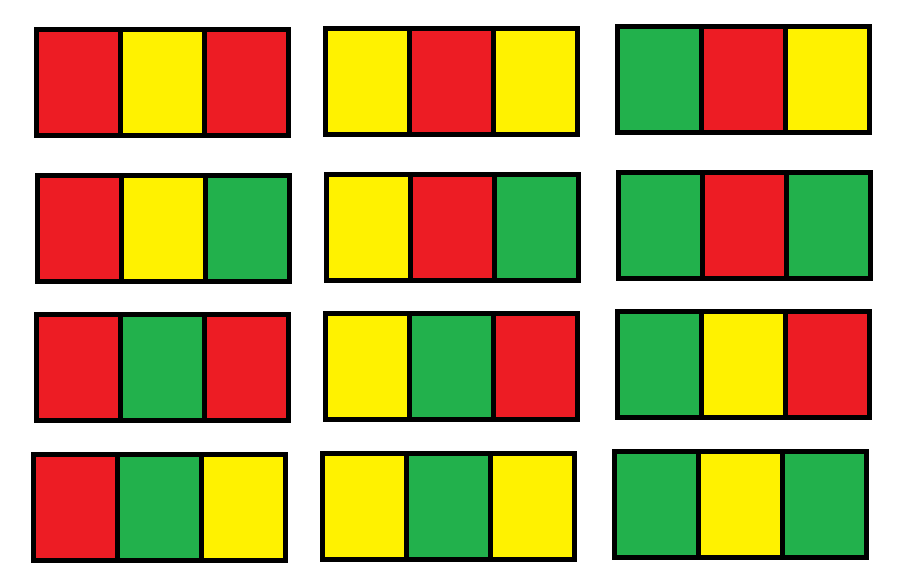
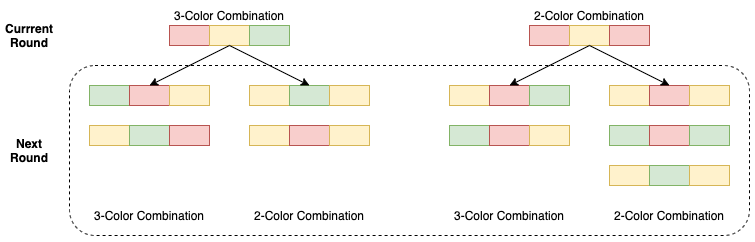

1411. Number of Ways to Paint N × 3 Grid

You have a `grid of` size `n x 3` and you want to paint each cell of the grid with exactly one of the three colours: **Red**, **Yellow** or **Green** while making sure that no two adjacent cells have the same colour (i.e no two cells that share vertical or horizontal sides have the same colour).

You are given `n` the number of rows of the grid.

Return the number of ways you can paint this `grid`. As the answer may grow large, the answer **must be** computed modulo `10^9 + 7`.

 

**Example 1:**
```
Input: n = 1
Output: 12
Explanation: There are 12 possible way to paint the grid as shown:
```


**Example 2:**
```
Input: n = 2
Output: 54
```

**Example 3:**
```
Input: n = 3
Output: 246
```

**Example 4:**
```
Input: n = 7
Output: 106494
```

**Example 5:**
```
Input: n = 5000
Output: 30228214
```

**Constraints:**

* `n == grid.length`
* `grid[i].length == 3`
* `1 <= n <= 5000`

# Submissions
---
**Solution 1: (DP Bottom-Up)**

**Key Note:**

* There are only two possibilities to form a non-adjacent row: **3 colors combination** (use all three colors, e.g., RYG) and **2 color combination** (use only two of three colors, e.g., RYR).
* We add the new row one by one. Apart from its inner adjacent relation, **every new added row only relies on the previous one row** (new added row is only adjacent with the row above it).
* **Every color combination follows the same pattern indicated below**. 3-color combination can generate **two** 3-color combination, and **two** 2-color combination for the next round. 2-color combination can generate **two** 3-color combination, and **three** 2-color combination for the next round.



* Let's try to have a math eqution to show the change above.
* The number of 3-color combination for round n is: **S(n)**. The number of 2-color combination for round n is **T(n)**.
* Thus, we can have two simple math equations reflecting the relation between current round (n) with next round (n + 1) for both 3-color-combination and 2-color-combination.

**S(n + 1) = 2 * S(n) + 2 * T(n)** 
**T(n + 1) = 2 * S(n) + 3 * T(n)**

```
Runtime: 80 ms
Memory Usage: 14 MB
```
```python
class Solution:
    def numOfWays(self, n: int) -> int:
        MOD = 10**9 + 7
        # init: for the single row, there are 6 3-color combinations, and 6 2-color combinations.
        color3 = 6
        color2 = 6
        for i in range(2, n+1):
            tempColor3 = color3
            color3 = (2 * color3 + 2 * color2) % MOD
            color2 = (2 * tempColor3 + 3 * color2) % MOD

        return (color3 + color2) % MOD
```

**Solution 2: (DP Top-Down)**
```
Runtime: 296 ms
Memory Usage: 54.4 MB
```
```python
class Solution:
    def numOfWays(self, n: int) -> int:
        MOD = 10**9 + 7
        
        @functools.lru_cache(None)
        def dp(i, isTwoColor):
            if i == 1:
                return 6
            if isTwoColor:
                return 2 * dp(i-1, False) + 3 * dp(i-1, True)
            else:
                return 2 * dp(i-1, False) + 2 * dp(i-1, True)
        
        return (dp(n, True) + dp(n, False)) % MOD
```