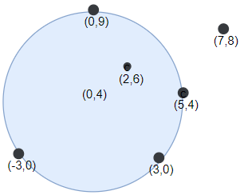

1453. Maximum Number of Darts Inside of a Circular Dartboard

You have a very large square wall and a circular dartboard placed on the wall. You have been challenged to throw darts into the board blindfolded. Darts thrown at the wall are represented as an array of `points` on a 2D plane. 

Return the maximum number of points that are within or lie on **any** circular dartboard of radius `r`.

 

**Example 1:**


```
Input: points = [[-2,0],[2,0],[0,2],[0,-2]], r = 2
Output: 4
Explanation: Circle dartboard with center in (0,0) and radius = 2 contain all points.
```

**Example 2:**


```
Input: points = [[-3,0],[3,0],[2,6],[5,4],[0,9],[7,8]], r = 5
Output: 5
Explanation: Circle dartboard with center in (0,4) and radius = 5 contain all points except the point (7,8).
```

**Example 3:**
```
Input: points = [[-2,0],[2,0],[0,2],[0,-2]], r = 1
Output: 1
```

**Example 4:**
```
Input: points = [[1,2],[3,5],[1,-1],[2,3],[4,1],[1,3]], r = 2
Output: 4
```

**Constraints:**

* `1 <= points.length <= 100`
* `points[i].length == 2`
* `-10^4 <= points[i][0], points[i][1] <= 10^4`
* `1 <= r <= 5000`

# Submissions
---
**Solution 1: (Geometry, angular sweep)**

**Algo**

Pick a point, say P, from the set, and rotate a circle with fixed-radius r. During the rotation P lies on the circumference of the circle (note P is not the center) and maintain a count of the number of points in the circle at an angle Θ (between PC and x-axis, where C is the center of the circle).

For every other point Q within 2*r distance to P, compute the angle Θ when Q enters the circle and the angle Θ when Q exits the circle with math. Sort the angles and scan through it to check the maximum points in the circle.

Perform the above operation for all points to find the maximum.

**Complexity**

* time complexity O(N^2 logN) 
* pace complexity O(N)

```
Runtime: 280 ms
Memory Usage: 14 MB
```
```python
class Solution:
    def numPoints(self, points: List[List[int]], r: int) -> int:
        ans = 1
        for x, y in points: 
            angles = []
            for x1, y1 in points: 
                if (x1 != x or y1 != y) and (d:=sqrt((x1-x)**2 + (y1-y)**2)) <= 2*r: 
                    angle = atan2(y1-y, x1-x)
                    delta = acos(d/(2*r))
                    angles.append((angle-delta, +1)) #entry
                    angles.append((angle+delta, -1)) #exit
            angles.sort(key=lambda x: (x[0], -x[1]))
            val = 1
            for _, entry in angles: 
                ans = max(ans, val := val+entry)
        return ans
```