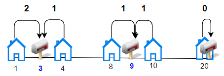
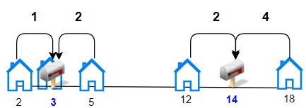
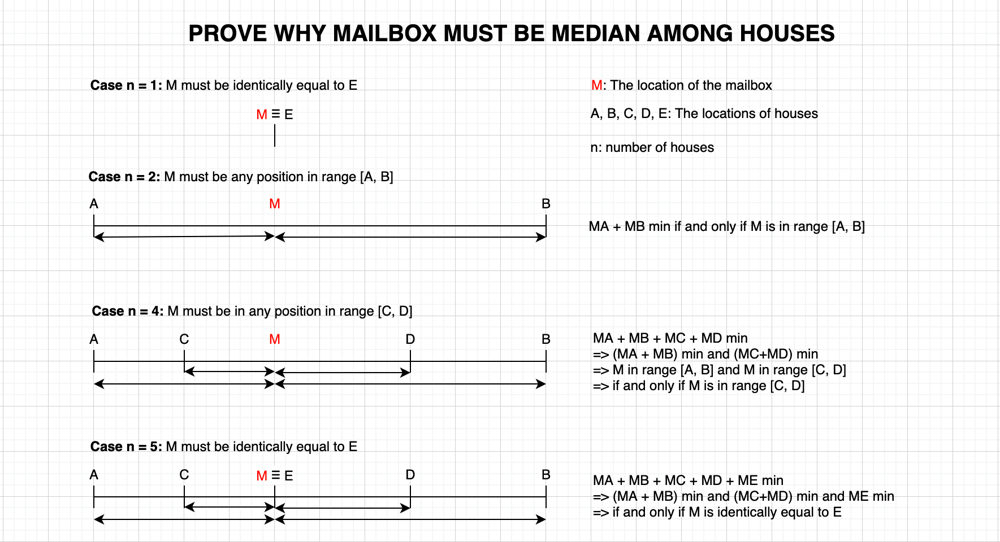

1478. Allocate Mailboxes

Given the array `houses` and an integer `k`. where `houses[i]` is the location of the `i`th house along a street, your task is to allocate `k` mailboxes in the street.

Return the **minimum** total distance between each house and its nearest mailbox.

The answer is guaranteed to fit in a 32-bit signed integer.

 

**Example 1:**


```
Input: houses = [1,4,8,10,20], k = 3
Output: 5
Explanation: Allocate mailboxes in position 3, 9 and 20.
Minimum total distance from each houses to nearest mailboxes is |3-1| + |4-3| + |9-8| + |10-9| + |20-20| = 5 
```

**Example 2:**


```
Input: houses = [2,3,5,12,18], k = 2
Output: 9
Explanation: Allocate mailboxes in position 3 and 14.
Minimum total distance from each houses to nearest mailboxes is |2-3| + |3-3| + |5-3| + |12-14| + |18-14| = 9.
```

**Example 3:**
```
Input: houses = [7,4,6,1], k = 1
Output: 8
```

**Example 4:**
```
Input: houses = [3,6,14,10], k = 4
Output: 0
```

**Constraints:**

* `n == houses.length`
* `1 <= n <= 100`
* `1 <= houses[i] <= 10^4`
* `1 <= k <= n`
* Array `houses` contain unique integers.

# Submissions
---
**Solution 1: (DP Top-Down)**

**Idea**

The idea is we try to allocate each mailbox to k group of the consecutive houses `houses[i:j]`. We found a solution if we can distribute total `k` mailboxes to n houses devided into `k` groups `[0..i], [i+1..j], ..., [m..n-1]`.
After all, we choose the minimum cost among our solutions.


(Attached image from Leetcode for easy to understand the idea)

`costs[i][j]` is the cost to put a mailbox among houses[i:j], the best way is put the mail box at median position among houses[i:j]



**Complexity**

* Time: O(n^3)

    costs takes O(n^3)
    dp takes O(k*n*n), because dp(k, i) has total k*n states, each state need a for loop up to n elements.
* Space: O(n^2)

```
Runtime: 660 ms
Memory Usage: 16.2 MB
```
```python
class Solution:
    def minDistance(self, houses: List[int], k: int) -> int:
        n = len(houses)
        houses = sorted(houses)
        costs = [[0] * n for _ in range(n)]
        for i in range(n):
            for j in range(n):
                median = houses[(i + j) // 2]
                for t in range(i, j + 1):
                    costs[i][j] += abs(median - houses[t])

        @lru_cache(None)
        def dp(k, i):
            if k == 0 and i == n: return 0
            if k == 0 or i == n: return math.inf
            ans = float('inf')
            for j in range(i, n):
                cost = costs[i][j]  # Try to put a mailbox among house[i:j]
                ans = min(ans, cost + dp(k - 1, j + 1))
            return ans

        return dp(k, 0)                              
```

**Solution 2: (DP Top-Down)**
```
Runtime: 728 ms
Memory Usage: 15.1 MB`
```
```python
class Solution:
    def minDistance(self, houses: List[int], k: int) -> int:
        houses.sort()

        @lru_cache(None)
        def dp(i, r):
            if i < 0:
                return 0
            if r == 0:
                return float('inf')

            res = dp(i-1, r-1) # install the mailbox at the last house
            dist = 0
            for j in reversed(range(i)):
                dist = dist + houses[(i + j + 1) // 2] - houses[j]
                res = min(res, dp(j-1, r-1) + dist)
            return res
        
        return dp(len(houses) - 1, k)
                                         
```