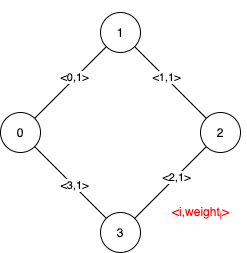

1489. Find Critical and Pseudo-Critical Edges in Minimum Spanning Tree

Given a weighted undirected connected graph with `n` vertices numbered from `0` to `n-1`, and an array `edges` where `edges[i] = [fromi, toi, weighti]` represents a bidirectional and weighted edge between nodes `fromi` and `toi`. A minimum spanning tree (MST) is a subset of the edges of the graph that connects all vertices without cycles and with the minimum possible total edge weight.

Find all the critical and pseudo-critical edges in the minimum spanning tree (MST) of the given graph. An MST edge whose deletion from the graph would cause the MST weight to increase is called a critical edge. A pseudo-critical edge, on the other hand, is that which can appear in some MSTs but not all.

Note that you can return the indices of the edges in any order.

 

**Example 1:**


```
Input: n = 5, edges = [[0,1,1],[1,2,1],[2,3,2],[0,3,2],[0,4,3],[3,4,3],[1,4,6]]
Output: [[0,1],[2,3,4,5]]
Explanation: The figure above describes the graph.
The following figure shows all the possible MSTs:
```


```
Notice that the two edges 0 and 1 appear in all MSTs, therefore they are critical edges, so we return them in the first list of the output.
The edges 2, 3, 4, and 5 are only part of some MSTs, therefore they are considered pseudo-critical edges. We add them to the second list of the output.
```

**Example 2:**


```
Input: n = 4, edges = [[0,1,1],[1,2,1],[2,3,1],[0,3,1]]
Output: [[],[0,1,2,3]]
Explanation: We can observe that since all 4 edges have equal weight, choosing any 3 edges from the given 4 will yield an MST. Therefore all 4 edges are pseudo-critical.
```

**Constraints:**

* `2 <= n <= 100`
* `1 <= edges.length <= min(200, n * (n - 1) / 2)`
* `edges[i].length == 3`
* `0 <= fromi < toi < n`
* `1 <= weighti <= 1000`
* All pairs `(fromi, toi)` are distinct.

# Submissions
---
**Solution 1: (Union Find, Kruskal)**

Imagine getting all MSTs. That is very huge.
So change the problem. If we have to use or don't use a edge, can we make a MST?

If we do not use a edge and MST value is incresed, that edge is critical edge.
Because we cannot create good MST without this edge.
It means all good MST use this edge.
So this edge is critical edge.

If we always use a edge and MST value is not changed, that edge is presudo-criticla edge.
Because we can create good MST including this edge.
It means at least one MST use this edge. So this edge is presudo-critical edge.

The time complextiy is O(ElogE + E^2 + E^2).
Union-Find time complexity is almost O(N).

```
Runtime: 2072 ms
Memory Usage: 13.9 MB
```
```python
class UnionFind:
    def __init__(self, n):
        self.par = [i for i in range(n)]

    def find(self, a):
        if self.par[a] == a:
            return a
        self.par[a] = self.find(self.par[a])
        return self.par[a]

    def union(self, a, b):
        a, b = self.find(a), self.find(b)
        if a > b:
            a, b = b, a
        if a == b:
            return False
        self.par[b] = a
        return True

class Solution:
    def findCriticalAndPseudoCriticalEdges(self, n: int, edges: List[List[int]]) -> List[List[int]]:
        # save the edge id
        edges = [(u, v, w, i) for i, (u, v, w) in enumerate(edges)]
        edges.sort(key=lambda x: x[2])

        # Do not use this edge
        def find_mst_not_use_this_edge(not_use):
            unionFind = UnionFind(n)
            res = 0
            for i, (u, v, w, _) in enumerate(edges):
                # do not use this edge
                if i == not_use:
                    continue
                if unionFind.union(u, v) == True:
                    res += w

            return res if all(unionFind.find(i) == 0 for i in range(n)) else inf

        # Need to use this edge
        def find_mst_need_use_this_edge(need_use):
            # use this edge first
            unionFind = UnionFind(n)
            res = edges[need_use][2]
            unionFind.union(edges[need_use][0], edges[need_use][1])
            # And then create mst
            for i, (u, v, w, _) in enumerate(edges):
                # alread use this edge
                if i == need_use:
                    continue
                if unionFind.union(u, v) == True:
                    res += w

            return res if all(unionFind.find(i) == 0 for i in range(n)) else inf
        # Normal MST value
        base = find_mst_not_use_this_edge(-1)
        cri = []
        p_cri = []
        for i in range(len(edges)):
            v = find_mst_not_use_this_edge(i)
            # If MST value is increased, it means all MST use this edge.
            if v != base:
                cri.append(edges[i][3])
            else:
                v = find_mst_need_use_this_edge(i)
                # If MST value is not changed, it means at least one MST which use this edge exists
                if v == base:
                    p_cri.append(edges[i][3])

        return [cri, p_cri]
```

**Solution 2: (Union Find)**

We use the standard MST algorithm as a baseline, and denote the total MST weight as origin_mst.
To generate critical and pseudo-critical lists, we enumerate each edge:

1. If deleting the edge and re-calculating the mst again makes mst total weight increase (or can't form mst), then the edge goes into critical list.
1. If we force adding the edge to the mst (by first adding the edge to the mst edge set and run the standard MST algorithm for the rest of the edges), and find that the mst doesn't change, then the edge goes into pseudo-critical list. (This is because if an edge can be in any mst, we can always add it to the edge set first, without changing the final mst total weight).

```
Runtime: 120 ms
Memory: 19.3 MB
```
```c++
class UnionFind {
private:
    vector<int> par, rank;
public:
    UnionFind(int n) {
        rank = vector<int>(n, 1);
        par.resize(n);
        for (int i = 0; i < n; ++i) {
            par[i] = i;
        }
    }
    
    int Find(int x) {
        if (x == par[x]) return x;
        else return par[x] = Find(par[x]);
    }
    
    void Union(int x, int y) {
        int xr = Find(x), yr = Find(y);
        if (xr == yr) return;
        if (rank[xr] > rank[yr]) swap(xr, yr);
        par[xr] = yr;
        if (rank[xr] == rank[yr]) rank[yr]++;
    }
};


class Solution {
private:
    int GetMST(const int n, const vector<vector<int>>& edges, int blockedge, int pre_edge = -1) {
        UnionFind uf(n);
        int weight = 0;
        if (pre_edge != -1) {
            weight += edges[pre_edge][2];
            uf.Union(edges[pre_edge][0], edges[pre_edge][1]);
        }
        for (int i = 0; i < edges.size(); ++i) {
            if (i == blockedge) continue;
            const auto& edge = edges[i];
            if (uf.Find(edge[0]) == uf.Find(edge[1])) continue;
            uf.Union(edge[0], edge[1]);
            weight += edge[2];
        }
        for (int i = 0; i < n; ++i) {
            if (uf.Find(i) != uf.Find(0)) return 1e9+7;
        }
        return weight;
    }

public:
    vector<vector<int>> findCriticalAndPseudoCriticalEdges(int n, vector<vector<int>>& edges) {
        for (int i = 0; i < edges.size(); ++i) {
            edges[i].push_back(i);
        }
        sort(edges.begin(), edges.end(), [](const vector<int>& a, const vector<int>& b) {
            return a[2] < b[2];
        });
        int origin_mst = GetMST(n, edges, -1);
        vector<int> critical, non_critical;
        for (int i = 0; i < edges.size(); ++i) {
            if (origin_mst < GetMST(n, edges, i)) {
                critical.push_back(edges[i][3]);
            } else if (origin_mst == GetMST(n, edges, -1, i)) {
                non_critical.push_back(edges[i][3]);
            }
        }
        return {critical, non_critical};
    }
};
```
```c++
```
