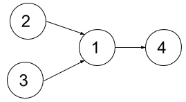

1494. Parallel Courses II

Given the integer `n` representing the number of courses at some university labeled from `1` to `n`, and the array dependencies where `dependencies[i] = [xi, yi]`  represents a prerequisite relationship, that is, the course `xi` must be taken before the course `yi`.  Also, you are given the integer `k`.

In one semester you can take **at most** `k` courses as long as you have taken all the prerequisites for the courses you are taking.

Return the minimum number of semesters to take all courses. It is guaranteed that you can take all courses in some way.

 

**Example 1:**


```
Input: n = 4, dependencies = [[2,1],[3,1],[1,4]], k = 2
Output: 3 
Explanation: The figure above represents the given graph. In this case we can take courses 2 and 3 in the first semester, then take course 1 in the second semester and finally take course 4 in the third semester.
```

**Example 2:**


```
Input: n = 5, dependencies = [[2,1],[3,1],[4,1],[1,5]], k = 2
Output: 4 
Explanation: The figure above represents the given graph. In this case one optimal way to take all courses is: take courses 2 and 3 in the first semester and take course 4 in the second semester, then take course 1 in the third semester and finally take course 5 in the fourth semester.
```

**Example 3:**
```
Input: n = 11, dependencies = [], k = 2
Output: 6
```

**Constraints:**

* `1 <= n <= 15`
* `1 <= k <= n`
* `0 <= dependencies.length <= n * (n-1) / 2`
* `dependencies[i].length == 2`
* `1 <= xi, yi <= n`
* `xi != yi`
* All prerequisite relationships are distinct, that is, `dependencies[i] != dependencies[j]`.
* The given graph is a directed acyclic graph.

# Submissions
---
**Solution 1: (BFS)**
```
Runtime: 36 ms
Memory Usage: 13.9 MB
```
```python
class Solution:
    def minNumberOfSemesters(self, n: int, dependencies: List[List[int]], k: int) -> int:
        # visited not required, as question says it has no cycles, plain dfs works
        def find_depth(node, d):
            if node in depth: return depth[node]
            res = 0
            for nei in graph[node]:
                res = max(res, find_depth(nei, d + 1))
            return res + 1
        
        graph, in_degree, depth = collections.defaultdict(list), collections.defaultdict(int), collections.defaultdict(int)
        for u,v in dependencies:
            graph[u].append(v)
            in_degree[v] += 1
        
        # find number of dependenths for each node
        for i in range(1, n + 1):
            depth[i] = find_depth(i, 0)
        
        # init queue with indegree 0 nodes
        queue = [ u for u in range(1, n+1) if u not in in_degree]
        
        # each level indicates one semester.
        semester = 0
        while(queue):
            size = min(len(queue), k)
            queue.sort(key = lambda x: -depth[x])       # GIST, sort node by their number of dependents
            semester += 1                               # new semester start
            # print(queue)
            for _ in range(size):
                node = queue.pop(0)
                for nei in graph[node]:
                    in_degree[nei] -= 1
                    if in_degree[nei] == 0:
                        queue.append( nei )
        return semester
```

**Solution 2: (BFS)**
```
Runtime: 4 ms
Memory Usage: 7.7 MB
```
```c++
class Solution {
public:
    int minNumberOfSemesters(int n, vector<vector<int>>& dependencies, int k) {
        vector<int> indeg(n+1,0);
        vector<vector<int>> g(n+1,vector<int>());
        for(auto x : dependencies){
            g[x[0]].push_back(x[1]);
            indeg[x[1]]++;
        }
        int sem = 0;
        priority_queue<pair<int,int>> q;
        for(int i=1;i<=n;i++){
            if(indeg[i]==0){
                int count = 0;
                for(auto x: g[i]) if(indeg[x]) count++;
                q.push({count,i});   
            }
        } 
        while(!q.empty()){
            int temp = min((int)q.size(),k);    
            sem++;
            vector<int> tops;
            while(temp--){
                auto [_,x] = q.top();
                q.pop();
                tops.push_back(x);
            }
            for(auto x: tops){
                for(auto neigh: g[x]){
                    indeg[neigh]--;
                    if(indeg[neigh]==0){
                        int count = 0;
                        for(auto x: g[neigh]) if(indeg[x]) count++;
                        q.push({count,neigh});   
                    }
                }    
            }
        }
        return sem;
    }
};
```