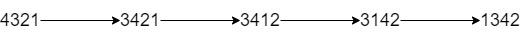

1505. Minimum Possible Integer After at Most K Adjacent Swaps On Digits

Given a string `num` representing **the digits** of a very large integer and an integer `k`.

You are allowed to swap any two adjacent digits of the integer **at most** `k` times.

Return the minimum integer you can obtain also as a string.

 

**Example 1:**


```
Input: num = "4321", k = 4
Output: "1342"
Explanation: The steps to obtain the minimum integer from 4321 with 4 adjacent swaps are shown.
```

**Example 2:**
```
Input: num = "100", k = 1
Output: "010"
Explanation: It's ok for the output to have leading zeros, but the input is guaranteed not to have any leading zeros.
```

**Example 3:**
```
Input: num = "36789", k = 1000
Output: "36789"
Explanation: We can keep the number without any swaps.
```

**Example 4:**
```
Input: num = "22", k = 22
Output: "22"
```

**Example 5:**
```
Input: num = "9438957234785635408", k = 23
Output: "0345989723478563548"
```

**Constraints:**

* `1 <= num.length <= 30000`
* `num` contains **digits** only and doesn't have **leading zeros**.
* `1 <= k <= 10^9`

# Submissions
---
**Solution 1: (Greedy)**

**Idea**

Greedily select the smallest number we can reach, and push it all the way to the front.

**Complexity**

time: O(n^2)
space: O(n)

```
Runtime: 7608 ms
Memory Usage: 18.8 MB
```
```python
class Solution:
    def minInteger(self, num: str, k: int) -> str:
        num = list(map(int, num))
        if k >= (len(num) ** 2) // 2:
            return ''.join(map(str, sorted(num)))
        
        res = []
        q = [(v, i) for i, v in enumerate(num)]
        while k and q:
            idx, (v, i) = min(enumerate(q[:k + 1]), key=lambda p:p[1])
            k -= idx
            del q[idx]
            res += v,
            
        res += [v for v, _ in q]
        return ''.join(map(str, res))
```

**Solution 2: (Preprocess)**

The first function is just a greedy brute-force algorithm that checks for the minimal character within K, and bubbles it up.

It's O(n * n) so you will get TLE. I saw folks solved it using logarithmic structures, but all I got is this silly idea.

I think that we first need to reduce K. Obviously, if K is large, we would move all zeros, ones, and so on to the front. We can get positions of a given number in one scan, and we do it for each digit '0' - '9'. Note that we need to quit as soon as the next smallest character cannot be moved to the front, and do brute-force for reduced K.

```
Runtime: 156 ms
Memory Usage: 20.2 MB
```
```c++
class Solution {
public:
    string minInteger(string num, int k) {
        string pre;
        preprocess(pre, num, k);
        while (k > 0 && !num.empty()) {
            auto pos = 0;
            for (auto i = 1; i < num.size() && i <= k; ++i)
                if (num[i] < num[pos]) 
                    pos = i;
            pre += num[pos];
            k -= pos;
            num = num.substr(0, pos) + num.substr(pos + 1);
        }
        return pre + num;
    }
    void preprocess(string &pre, string &num, int &k) {
        for (auto n = '0'; n < '9'; ++n) {
            vector<int> pos;
            for (auto i = 0; i < num.size(); ++i)
                if (num[i] == n)
                    pos.push_back(i);
            if (!pos.empty() && k < pos[0])
                break;
            int cnt = 0;            
            for (auto i = 0; i < pos.size() && pos[i] <= k + cnt; ++i) {
                k -= pos[i] - cnt;
                ++cnt;   
            }
            pre += string(cnt, n);
            string num1;
            for (auto ch : num) {
                if (ch == n && cnt > 0)
                    --cnt;
                else
                    num1 += ch;
            }
            swap(num, num1);
        }
    }
};
```