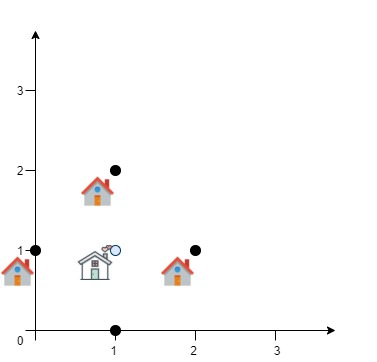

1515. Best Position for a Service Centre

A delivery company wants to build a new service centre in a new city. The company knows the positions of all the customers in this city on a 2D-Map and wants to build the new centre in a position such that **the sum of the euclidean distances to all customers is minimum**.

Given an array `positions` where `positions[i] = [xi, yi]` is the position of the `i`th customer on the map, return the minimum sum of the euclidean distances to all customers.

In other words, you need to choose the position of the service centre `[xcentre, ycentre]` such that the following formula is minimized:


Answers within `10^-5` of the actual value will be accepted.

 

**Example 1:**


```
Input: positions = [[0,1],[1,0],[1,2],[2,1]]
Output: 4.00000
Explanation: As shown, you can see that choosing [xcentre, ycentre] = [1, 1] will make the distance to each customer = 1, the sum of all distances is 4 which is the minimum possible we can achieve.
```

**Example 2:**


```
Input: positions = [[1,1],[3,3]]
Output: 2.82843
Explanation: The minimum possible sum of distances = sqrt(2) + sqrt(2) = 2.82843
```

**Example 3:**
```
Input: positions = [[1,1]]
Output: 0.00000
```

**Example 4:**
```
Input: positions = [[1,1],[0,0],[2,0]]
Output: 2.73205
Explanation: At the first glance, you may think that locating the centre at [1, 0] will achieve the minimum sum, but locating it at [1, 0] will make the sum of distances = 3.
Try to locate the centre at [1.0, 0.5773502711] you will see that the sum of distances is 2.73205.
Be careful with the precision!
```

**Example 5:**
```
Input: positions = [[0,1],[3,2],[4,5],[7,6],[8,9],[11,1],[2,12]]
Output: 32.94036
Explanation: You can use [4.3460852395, 4.9813795505] as the position of the centre.
```

**Constraints:**

* `1 <= positions.length <= 50`
* `positions[i].length == 2`
* `0 <= positions[i][0], positions[i][1] <= 100`

# Submissions
---
**Solution 1: (Math)**

This problem is to compute a quantity called "geometric median". There are algorithms dedicated to solve such problems such as Weiszfeld's algorithm. But those algorithms leverages on statistical routines such as weighted least squares.

Since this is a 2d toy problem, we could use some "brute force" grid searching method to find an approximation. Suppose you think x, y is a candidate. Then, you could perturb the point along x and y by a small amount (chg in the implementation) and check if the new point provides a smaller distance. If so, the new point becomes the new candidate.

The trick is to progressively decrease chg to a satisfying precision (1e-5 in this setting). One could reduce it by half or any chosen factor. In the meantime, centroid is a good starting point.

```
Runtime: 124 ms
Memory Usage: 13.9 MB
```
```python
class Solution:
    def getMinDistSum(self, positions: List[List[int]]) -> float:
        #euclidean distance 
        fn = lambda x, y: sum(sqrt((x-xx)**2 + (y-yy)**2) for xx, yy in positions)
        #centroid as starting point
        x = sum(x for x, _ in positions)/len(positions)
        y = sum(y for _, y in positions)/len(positions)
        
        ans = fn(x, y)
        chg = 100 #change since 0 <= positions[i][0], positions[i][1] <= 100
        while chg > 1e-6: #accuracy within 1e-5
            zoom = True
            for dx, dy in (-1, 0), (0, -1), (0, 1), (1, 0):
                xx = x + chg * dx
                yy = y + chg * dy
                dd = fn(xx, yy)
                if dd < ans: 
                    ans = dd 
                    x, y = xx, yy
                    zoom = False 
                    break 
            if zoom: chg /= 2
        return ans 
```

**Solution 2: (Math)**
```
Runtime: 24 ms
Memory Usage: 8.3 MB
```
```c++
class Solution {
    double dist(vector<int> &a, vector<double> &b) {
        return sqrt(pow(a[0] - b[0], 2) + pow(a[1] - b[1], 2));
    }
    double all(vector<vector<int>> &A, vector<double> &p) {
        double ans = 0;
        for (auto &a : A) ans += dist(a, p);
        return ans;
    }
    const int dirs[4][2] = {{0,1},{0,-1},{-1,0},{1,0}};
public:
    double getMinDistSum(vector<vector<int>>& positions) {
        double ans = DBL_MAX;
        vector<double> p(2, 0);
        double step = 100, eps = 1e-6;
        while (step > eps) {
            bool found = false;
            for (auto &dir : dirs) {
                vector<double> next = {p[0] + step * dir[0], p[1] + step * dir[1]};
                double d = all(positions, next);
                if (d < ans) {
                    ans = d;
                    p = next;
                    found = true;
                    break;
                }
            }
            if (!found) step /= 2;
        }
        return ans;
    }
};
```