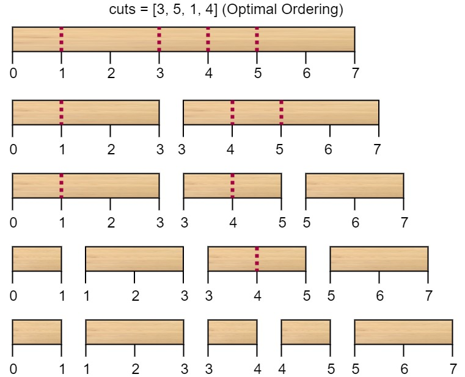

1547. Minimum Cost to Cut a Stick

Given a wooden stick of length `n` units. The stick is labelled from `0` to `n`. For example, a stick of length 6 is labelled as follows:


Given an integer array `cuts` where `cuts[i]` denotes a position you should perform a cut at.

You should perform the cuts in order, you can change the order of the cuts as you wish.

The cost of one cut is the length of the stick to be cut, the total cost is the sum of costs of all cuts. When you cut a stick, it will be split into two smaller sticks (i.e. the sum of their lengths is the length of the stick before the cut). Please refer to the first example for a better explanation.

Return the minimum total cost of the cuts.

 

**Example 1:**


```
Input: n = 7, cuts = [1,3,4,5]
Output: 16
Explanation: Using cuts order = [1, 3, 4, 5] as in the input leads to the following scenario:
```

```
The first cut is done to a rod of length 7 so the cost is 7. The second cut is done to a rod of length 6 (i.e. the second part of the first cut), the third is done to a rod of length 4 and the last cut is to a rod of length 3. The total cost is 7 + 6 + 4 + 3 = 20.
Rearranging the cuts to be [3, 5, 1, 4] for example will lead to a scenario with total cost = 16 (as shown in the example photo 7 + 4 + 3 + 2 = 16).
```

**Example 2:**
```
Input: n = 9, cuts = [5,6,1,4,2]
Output: 22
Explanation: If you try the given cuts ordering the cost will be 25.
There are much ordering with total cost <= 25, for example, the order [4, 6, 5, 2, 1] has total cost = 22 which is the minimum possible.
```

**Constraints:**

* `2 <= n <= 10^6`
* `1 <= cuts.length <= min(n - 1, 100)`
* `1 <= cuts[i] <= n - 1`
* All the integers in cuts array are **distinct**.

# Submissions
---
**Solution 1: (DP Top-Down)**
```
Runtime: 8432 ms
Memory Usage: 28.4 MB
```
```python
class Solution:
    def minCost(self, n: int, cuts: List[int]) -> int:
        cuts.sort()
        
        @functools.lru_cache(None)
        def dfs(n, cuts):
            if len(cuts)==0:
                return 0
            return n + min(dfs(c, cuts[:i]) + dfs(n-c, tuple(map(lambda x:x-c, cuts[i+1:]))) for i, c in enumerate(cuts))
        
        return dfs(n,tuple(cuts))
```

**Solution 2: (DP Top-Down)**
```
Runtime: 68 ms
Memory Usage: 8.6 MB
```
```c++
class Solution {
public:
    int dp[102][102] = {};
    int dfs(vector<int>& cuts, int i, int j) {
        if (j - i <= 1)
            return 0;
        if (!dp[i][j]) {
            dp[i][j] = INT_MAX;
            for (auto k = i + 1; k < j; ++k)
                dp[i][j] = min(dp[i][j], 
                    cuts[j] - cuts[i] + dfs(cuts, i, k) + dfs(cuts, k, j));
        }
        return dp[i][j];
    }
    int minCost(int n, vector<int>& cuts) {
        cuts.push_back(0);
        cuts.push_back(n);
        sort(begin(cuts), end(cuts));
        return dfs(cuts, 0, cuts.size() - 1);
    }
};
```

**Solution 3: (DP Bottom-Up)**

**Intuition**

Similar to the problem 1000. Minimum Cost to Merge Stones.

Instead of considering the cost to cut,
we can transform the problem to the cost to stick all sticks.

Then we have the problem "merge stones".
Though in the format of dp, they are exatly the same.


**Explanation**

* Add the "cut" index 0 and n, then sort all stick position.
* dp[i][j] means the minimum cost to stick all sticks between A[i] and A[j]


**Complexity**

* Time O(N^3)
* Space O(N^2), can be imporved to O(N)

```
Runtime: 552 ms
Memory Usage: 13.8 MB
```
```python
class Solution:
    def minCost(self, n: int, cuts: List[int]) -> int:
        cuts = sorted(cuts + [0, n])
        k = len(cuts)
        dp = [[0] * k for _ in range(k)]
        for d in range(2, k):
            for i in range(k - d):
                dp[i][i + d] = min(dp[i][m] + dp[m][i + d] for m in range(i + 1, i + d)) + cuts[i + d] - cuts[i]
        return dp[0][k - 1]
```

**Solution 4: (DP Bottom-Up)**
```
Runtime: 84 ms
Memory Usage: 10.6 MB
```
```c++
class Solution {
public:
    int minCost(int n, vector<int>& cuts) {
        cuts.push_back(0);
        cuts.push_back(n);
        sort(cuts.begin(), cuts.end());
        int k = cuts.size();
        vector<vector<int>> dp(k, vector<int>(k));
        for (int d = 2; d < k; ++d) {
            for (int i = 0; i < k - d; ++i) {
                dp[i][i + d] = 1e9;
                for (int m = i + 1; m < i + d; ++m) {
                    dp[i][i + d] = min(dp[i][i + d], dp[i][m] + dp[m][i + d] + cuts[i + d] - cuts[i]);
                }
            }
        }
        return dp[0][k - 1];
    }
};
```