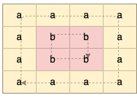

1559. Detect Cycles in 2D Grid

Given a 2D array of characters `grid` of size `m x n`, you need to find if there exists any cycle consisting of the same value in `grid`.

A cycle is a path of **length 4 or more** in the grid that starts and ends at the same cell. From a given cell, you can move to one of the cells adjacent to it - in one of the four directions (up, down, left, or right), if it has the **same value** of the current cell.

Also, you cannot move to the cell that you visited in your last move. For example, the cycle `(1, 1) -> (1, 2) -> (1, 1)` is invalid because from `(1, 2)` we visited `(1, 1)` which was the last visited cell.

Return `true` if any cycle of the same value exists in `grid`, otherwise, return `false`.

 

**Example 1:**


```
Input: grid = [["a","a","a","a"],["a","b","b","a"],["a","b","b","a"],["a","a","a","a"]]
Output: true
Explanation: There are two valid cycles shown in different colors in the image below:
```


**Example 2:**


```
Input: grid = [["c","c","c","a"],["c","d","c","c"],["c","c","e","c"],["f","c","c","c"]]
Output: true
Explanation: There is only one valid cycle highlighted in the image below:
```


**Example 3:**


```
Input: grid = [["a","b","b"],["b","z","b"],["b","b","a"]]
Output: false
```

**Constraints:**

* `m == grid.length`
* `n == grid[i].length`
* `1 <= m <= 500`
* `1 <= n <= 500`
* `grid` consists only of lowercase English letters.

# Submissions
---
**Solution 1: (DFS)**
```
Runtime: 3252 ms
Memory Usage: 239 MB
```
```python
class Solution:
    def containsCycle(self, grid: List[List[str]]) -> bool:
        def dfs(node, parent):
            if node in visited: return True
            visited.add(node)
            r, c = node
            for nr, nc in [(r+1, c), (r-1, c), (r, c+1), (r, c-1)]:
                if 0 <= nr < R and 0 <= nc < C and grid[nr][nc] == grid[r][c] and (nr, nc) != parent:
                    if dfs((nr, nc), node): return True 
            return False  
    
        R, C = len(grid), len(grid[0])
        visited = set()
        for i in range(R):
            for j in range(C):
                if (i,j) in visited: continue 
                if dfs((i,j), None): return True
        return False
```

**Solution 2: (DFS)**
```
Runtime: 760 ms
Memory Usage: 89.4 MB
```
```c++
class Solution {
public:
    vector<int> dir = { 0, 1, 0, -1, 0 }; 
    bool isCyclic(vector<vector<char>>& grid, vector<vector<bool>>& visited, int i, int j, int x, int y)
    {
        visited[i][j] = true;
        for(int d = 0; d < 4; ++d)
        {
            int a = i+dir[d];
            int b = j+dir[d+1];
            if(a >= 0 && a < grid.size() && b >= 0 && b < grid[0].size() && grid[a][b] == grid[i][j] && !(x == a && y == b))
                if(visited[a][b] || isCyclic(grid, visited, a,b,i,j))
                    return true;
        }
        return false;
    }
    bool containsCycle(vector<vector<char>>& grid) {
        int n = grid.size(), m = grid[0].size();
        vector<vector<bool>> visited(n, vector<bool>(m, false));
        for(int i = 0; i < n; ++i)
            for(int j = 0; j < m; ++j)
                if(!visited[i][j] && isCyclic(grid, visited, i, j, -1, -1))
                    return true;
        return false;
    }
};
```

**Solution 3: (Union and Find)**
```
Runtime: 3516 ms
Memory Usage: 131.2 MB
```
```python
class Solution:
    def containsCycle(self, grid: List[List[str]]) -> bool:
        def find(pos):
            if parents[pos] != pos:
                parents[pos] = find(parents[pos])
            return parents[pos]

        def union(pos1, pos2):
            parent1, parent2 = find(pos1), find(pos2)
            if parent1 != parent2:
                if ranks[parent2] > ranks[parent1]:
                    parents[parent1] = parent2
                else:
                    parents[parent2] = parent1
                    if ranks[parent1] == ranks[parent2]:
                        ranks[parent1] += 1

        rows, cols = len(grid), len(grid[0])
        parents = {(i, j): (i, j) for i in range(rows) for j in range(cols)}
        ranks = collections.Counter()
        for i, row in enumerate(grid):
            for j, letter in enumerate(row):
                if i > 0 and j > 0 and grid[i-1][j] == grid[i][j-1] == letter and find((i-1, j)) == find((i, j-1)):
                    return True
                for r, c in (i - 1, j), (i, j - 1):
                    if 0 <= r < rows and 0 <= c < cols and grid[r][c] == letter:
                        union((i, j), (r, c))
        return False
```