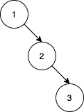

1569. Number of Ways to Reorder Array to Get Same BST

Given an array `nums` that represents a permutation of integers from `1` to `n`. We are going to construct a binary search tree (BST) by inserting the elements of nums in order into an initially empty BST. Find the number of different ways to reorder `nums` so that the constructed BST is identical to that formed from the original array nums.

For example, given `nums = [2,1,3]`, we will have `2` as the root, `1` as a left child, and `3` as a right child. The array `[2,3,1]` also yields the same BST but `[3,2,1]` yields a different BST.

Return the number of ways to reorder `nums` such that the BST formed is identical to the original BST formed from `nums`.

Since the answer may be very large, **return it modulo** `10^9 + 7`.

 

**Example 1:**


```
Input: nums = [2,1,3]
Output: 1
Explanation: We can reorder nums to be [2,3,1] which will yield the same BST. There are no other ways to reorder nums which will yield the same BST.
```

**Example 2:**


```
Input: nums = [3,4,5,1,2]
Output: 5
Explanation: The following 5 arrays will yield the same BST: 
[3,1,2,4,5]
[3,1,4,2,5]
[3,1,4,5,2]
[3,4,1,2,5]
[3,4,1,5,2]
```

**Example 3:**


```
Input: nums = [1,2,3]
Output: 0
Explanation: There are no other orderings of nums that will yield the same BST.
```

**Example 4:**


```
Input: nums = [3,1,2,5,4,6]
Output: 19
```

**Example 5:**
```
Input: nums = [9,4,2,1,3,6,5,7,8,14,11,10,12,13,16,15,17,18]
Output: 216212978
Explanation: The number of ways to reorder nums to get the same BST is 3216212999. Taking this number modulo 10^9 + 7 gives 216212978.
```

**Constraints:**

* `1 <= nums.length <= 1000`
* `1 <= nums[i] <= nums.length`
* All integers in nums are **distinct**.

# Submissions
---
**Solution 1: (Math)**

We separate all the elements into two lists, depending on whether they are less than or more than the root. Then we recurse on those left and right sublists. The combination is for the macro ordering between left and right, and the recursive factors are for the internal ordering of left and right themselves. I minus 1 from the result because we don't count the original ordering.

```
Runtime: 200 ms
Memory Usage: 19.1 MB
```
```python
class Solution:
    def numOfWays(self, nums: List[int]) -> int:
        def f(nums):
            if len(nums) <= 2: return 1
            left = [v for v in nums if v < nums[0]]
            right = [v for v in nums if v > nums[0]]
            return math.comb(len(left)+len(right), len(right)) * f(left) * f(right)
        return (f(nums)-1) % (10**9+7)
```

**Solution 2: (DFS, Math, combination, pascal triangle)**
```
Runtime: 373 ms
Memory: 163.3 MB
```
```c++
class Solution {
    vector<vector<long long>> pascal;   
    int mod = 1e9 + 7;
    long long dfs(vector<int> &nums){
        int n = nums.size();
        if(n <= 2) return 1;
        vector<int> left,right;
        for(int i = 1;i < n;i++){
            if(nums[i] > nums[0]) left.push_back(nums[i]);
            else right.push_back(nums[i]);
        }
        long long left_res = dfs(left);
        long long right_res = dfs(right);
        int left_size = left.size() , right_size = right.size();
        return ((pascal[n - 1][left_size] * left_res)  % mod *right_res) % mod;
    }
public:
    int numOfWays(vector<int>& nums) {
        int n = nums.size();
        pascal.resize(n+1);
        // creating the pascal triangle
        for(int i = 0;i <= n;i++){
            pascal[i] = vector<long long>(i + 1,1);
            for(int j = 1 ;j < i; j++){
                pascal[i][j] = (pascal[i - 1][j - 1] + pascal[i - 1][j]) % mod;
            }
        }
       return dfs(nums) - 1;
    }
```
