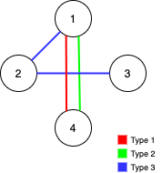

1579. Remove Max Number of Edges to Keep Graph Fully Traversable

Alice and Bob have an undirected graph of `n` nodes and 3 types of edges:

* Type 1: Can be traversed by Alice only.
* Type 2: Can be traversed by Bob only.
* Type 3: Can by traversed by both Alice and Bob.

Given an array `edges` where `edges[i] = [typei, ui, vi]` represents a bidirectional edge of type `typei` between nodes `ui` and `vi`, find the maximum number of edges you can remove so that after removing the edges, the graph can still be fully traversed by both Alice and Bob. The graph is fully traversed by Alice and Bob if starting from any node, they can reach all other nodes.

Return the maximum number of edges you can remove, or return `-1` if it's impossible for the graph to be fully traversed by Alice and Bob.

 

**Example 1:**


```
Input: n = 4, edges = [[3,1,2],[3,2,3],[1,1,3],[1,2,4],[1,1,2],[2,3,4]]
Output: 2
Explanation: If we remove the 2 edges [1,1,2] and [1,1,3]. The graph will still be fully traversable by Alice and Bob. Removing any additional edge will not make it so. So the maximum number of edges we can remove is 2.
```

**Example 2:**


```
Input: n = 4, edges = [[3,1,2],[3,2,3],[1,1,4],[2,1,4]]
Output: 0
Explanation: Notice that removing any edge will not make the graph fully traversable by Alice and Bob.
```

**Example 3:**


```
Input: n = 4, edges = [[3,2,3],[1,1,2],[2,3,4]]
Output: -1
Explanation: In the current graph, Alice cannot reach node 4 from the other nodes. Likewise, Bob cannot reach 1. Therefore it's impossible to make the graph fully traversable.
```

 

**Constraints:**

* `1 <= n <= 10^5`
* `1 <= edges.length <= min(10^5, 3 * n * (n-1) / 2)`
* `edges[i].length == 3`
* `1 <= edges[i][0] <= 3`
* `1 <= edges[i][1] < edges[i][2] <= n`
* All tuples `(typei, ui, vi)` are distinct.


# Submissions
---
**Solution 1: (Union-Find)**

**Intuition**

Add Type3 first, then check Type 1 and Type 2.


**Explanation**

Go through all edges of type 3 (Alice and Bob)
If not necessary to add, increment res.
Otherwith increment e1 and e2.

Go through all edges of type 1 (Alice)
If not necessary to add, increment res.
Otherwith increment e1.

Go through all edges of type 2 (Bob)
If not necessary to add, increment res.
Otherwith increment e2.

If Alice's'graph is connected, e1 == n - 1 should valid.
If Bob's graph is connected, e2 == n - 1 should valid.
In this case we return res,
otherwise return -1.


**Complexity**

* Time O(E), if union find with compression and rank
* Space O(E)

```
Runtime: 2336 ms
Memory Usage: 53.7 MB
```
```python
class Solution:
    def maxNumEdgesToRemove(self, n: int, edges: List[List[int]]) -> int:
        
        # Union find
        def find(i):
            if i != root[i]:
                root[i] = find(root[i])
            return root[i]

        def uni(x, y):
            x, y = find(x), find(y)
            if x == y: return 0
            root[x] = y
            return 1

        res = e1 = e2 = 0

        # Alice and Bob
        root = list(range(n + 1))
        for t, i, j in edges:
            if t == 3:
                if uni(i, j):
                    e1 += 1
                    e2 += 1
                else:
                    res += 1
        root0 = root[:]

        # only Alice
        for t, i, j in edges:
            if t == 1:
                if uni(i, j):
                    e1 += 1
                else:
                    res += 1

        # only Bob
        root = root0
        for t, i, j in edges:
            if t == 2:
                if uni(i, j):
                    e2 += 1
                else:
                    res += 1

        return res if e1 == e2 == n - 1 else -1
```