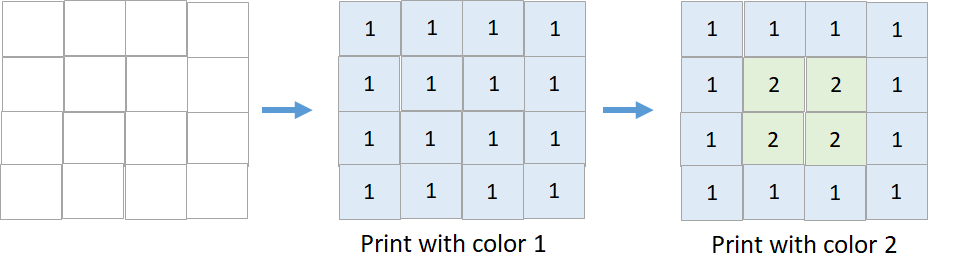
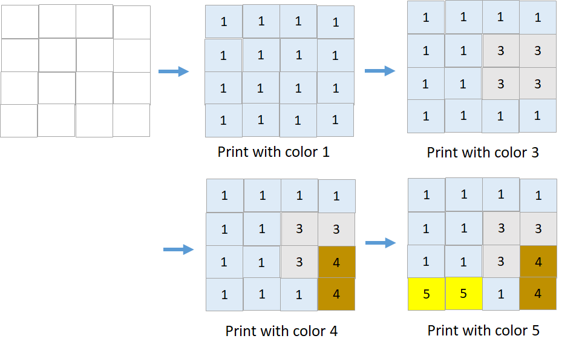

1591. Strange Printer II

There is a strange printer with the following two special requirements:

* On each turn, the printer will print a solid rectangular pattern of a single color on the grid. This will cover up the existing colors in the rectangle.
* Once the printer has used a color for the above operation, **the same color cannot be used again**.

You are given a `m x n` matrix `targetGrid`, where `targetGrid[row][col]` is the color in the position `(row, col)` of the grid.

Return `true` if it is possible to print the matrix targetGrid, otherwise, return `false`.

 

**Example 1:**


```
Input: targetGrid = [[1,1,1,1],[1,2,2,1],[1,2,2,1],[1,1,1,1]]
Output: true
```

**Example 2:**


```
Input: targetGrid = [[1,1,1,1],[1,1,3,3],[1,1,3,4],[5,5,1,4]]
Output: true
```

**Example 3:**
```
Input: targetGrid = [[1,2,1],[2,1,2],[1,2,1]]
Output: false
Explanation: It is impossible to form targetGrid because it is not allowed to print the same color in different turns.
```

**Example 4:**
```
Input: targetGrid = [[1,1,1],[3,1,3]]
Output: false
```

**Constraints:**

* `m == targetGrid.length`
* `n == targetGrid[i].length`
* `1 <= m, n <= 60`
* `1 <= targetGrid[row][col] <= 60`

# Submissions
---
**Solution 1: (Brute Force)**

**Explanation**

For each color, find its edge most index.
Then we need to paint this color from [top, left] to [bottom, right].

If in the rectangle, all the colors are either the same or 0,
we mark all of them to 0.

If we can mark the whole grid to 0, it means the target is printable.


**Complexity**

* Time O(CCMN)
* Space O(4N)

```
Runtime: 312 ms
Memory Usage: 13.9 MB
```
```python
class Solution:
    def isPrintable(self, targetGrid: List[List[int]]) -> bool:
        m, n = len(targetGrid), len(targetGrid[0])
        pos = [[m, n, 0, 0] for i in range(61)]
        colors = set()
        
        # For each color, find its edge most index.
        for i in range(m):
            for j in range(n):
                c = targetGrid[i][j]
                colors.add(c)
                pos[c][0] = min(pos[c][0], i)
                pos[c][1] = min(pos[c][1], j)
                pos[c][2] = max(pos[c][2], i)
                pos[c][3] = max(pos[c][3], j)

        # If in the rectangle, all the colors are either the same or 0,
we mark all of them to 0.
        def test(c):
            for i in range(pos[c][0], pos[c][2] + 1):
                for j in range(pos[c][1], pos[c][3] + 1):
                    if targetGrid[i][j] > 0 and targetGrid[i][j] != c:
                        return False
            for i in range(pos[c][0], pos[c][2] + 1):
                for j in range(pos[c][1], pos[c][3] + 1):
                    targetGrid[i][j] = 0
            return True

        while colors:
            colors2 = set()
            for c in colors:
                if not test(c):
                    colors2.add(c)
            if len(colors2) == len(colors):
                return False
            colors = colors2
        return True
```