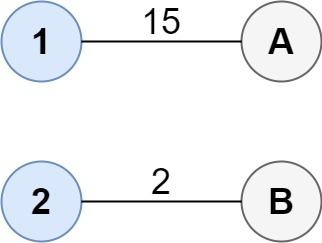
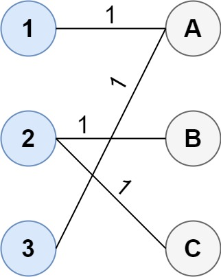

1595. Minimum Cost to Connect Two Groups of Points

You are given two groups of points where the first group has `size1` points, the second group has `size2` points, and `size1 >= size2`.

The cost of the connection between any two points are given in an `size1 x size2` matrix where `cost[i][j]` is the cost of connecting point `i` of the first group and point `j` of the second group. The groups are connected if each point in both groups is connected to one or more points in the opposite group. In other words, each point in the first group must be connected to at least one point in the second group, and each point in the second group must be connected to at least one point in the first group.

Return the minimum cost it takes to connect the two groups.

 

**Example 1:**


```
Input: cost = [[15, 96], [36, 2]]
Output: 17
Explanation: The optimal way of connecting the groups is:
1--A
2--B
This results in a total cost of 17.
```

**Example 2:**


```
Input: cost = [[1, 3, 5], [4, 1, 1], [1, 5, 3]]
Output: 4
Explanation: The optimal way of connecting the groups is:
1--A
2--B
2--C
3--A
This results in a total cost of 4.
Note that there are multiple points connected to point 2 in the first group and point A in the second group. This does not matter as there is no limit to the number of points that can be connected. We only care about the minimum total cost.
```

**Example 3:**
```
Input: cost = [[2, 5, 1], [3, 4, 7], [8, 1, 2], [6, 2, 4], [3, 8, 8]]
Output: 10
```

**Constraints:**

* `size1 == cost.length`
* `size2 == cost[i].length`
* `1 <= size1, size2 <= 12`
* `size1 >= size2`
* `0 <= cost[i][j] <= 100`

# Submissions
---
**Solution 1: (DP Top-Down)**

**Intuition**

As usual, it pays to analyze at the problem constraints. Since we only have up to 12 points, we can track which ones are connected using a bit mask.

**Solution**

Staightforward top-down DP for the first group. At the same time, we track which elements from the second group were connected in mask.

After finishing with the first group, we detect elements in group 2 that are still disconnected, and connect them with the "cheapest" node in the first group.

```
Runtime: 432 ms
Memory Usage: 20.9 MB
```
```python
class Solution:
    def connectTwoGroups(self, cost: List[List[int]]) -> int:
        sz1, sz2 = len(cost), len(cost[0])
        min_sz2 = [min([cost[i][j] for i in range(sz1)]) for j in range(sz2)]
        
        @lru_cache(None)
        def dfs(i: int, mask: int):
            res = 0 if i >= sz1 else float('inf')
            if i >= sz1:
                for j in range(sz2):
                    if mask & (1 << j) == 0:
                        res += min_sz2[j]
            else:
                for j in range(sz2):
                    res = min(res, cost[i][j] + dfs(i + 1, mask | (1 << j)))
            return res
        
        return dfs(0, 0)
```