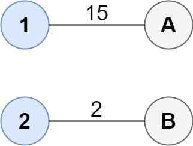
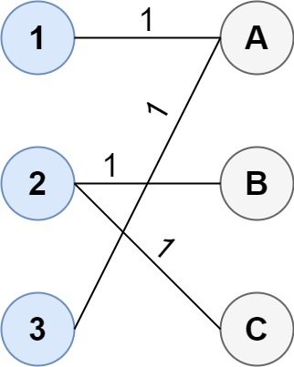

1595. Minimum Cost to Connect Two Groups of Points

You are given two groups of points where the first group has `size1` points, the second group has `size2` points, and `size1 >= size2`.

The cost of the connection between any two points are given in an `size1 x size2` matrix where `cost[i][j]` is the cost of connecting point `i` of the first group and point `j` of the second group. The groups are connected if each point in both groups is connected to one or more points in the opposite group. In other words, each point in the first group must be connected to at least one point in the second group, and each point in the second group must be connected to at least one point in the first group.

Return the minimum cost it takes to connect the two groups.

 

**Example 1:**


```
Input: cost = [[15, 96], [36, 2]]
Output: 17
Explanation: The optimal way of connecting the groups is:
1--A
2--B
This results in a total cost of 17.
```

**Example 2:**


```
Input: cost = [[1, 3, 5], [4, 1, 1], [1, 5, 3]]
Output: 4
Explanation: The optimal way of connecting the groups is:
1--A
2--B
2--C
3--A
This results in a total cost of 4.
Note that there are multiple points connected to point 2 in the first group and point A in the second group. This does not matter as there is no limit to the number of points that can be connected. We only care about the minimum total cost.
```

**Example 3:**
```
Input: cost = [[2, 5, 1], [3, 4, 7], [8, 1, 2], [6, 2, 4], [3, 8, 8]]
Output: 10
```

**Constraints:**

* `size1 == cost.length`
* `size2 == cost[i].length`
* `1 <= size1, size2 <= 12`
* `size1 >= size2`
* `0 <= cost[i][j] <= 100`

# Submissions
---
**Solution 1: (DP Top-Down)**

**Intuition**

As usual, it pays to analyze at the problem constraints. Since we only have up to 12 points, we can track which ones are connected using a bit mask.

**Solution**

Staightforward top-down DP for the first group. At the same time, we track which elements from the second group were connected in mask.

After finishing with the first group, we detect elements in group 2 that are still disconnected, and connect them with the "cheapest" node in the first group.

```
Runtime: 432 ms
Memory Usage: 20.9 MB
```
```python
class Solution:
    def connectTwoGroups(self, cost: List[List[int]]) -> int:
        sz1, sz2 = len(cost), len(cost[0])
        min_sz2 = [min([cost[i][j] for i in range(sz1)]) for j in range(sz2)]
        
        @lru_cache(None)
        def dfs(i: int, mask: int):
            res = 0 if i >= sz1 else float('inf')
            if i >= sz1:
                for j in range(sz2):
                    if mask & (1 << j) == 0:
                        res += min_sz2[j]
            else:
                for j in range(sz2):
                    res = min(res, cost[i][j] + dfs(i + 1, mask | (1 << j)))
            return res
        
        return dfs(0, 0)
```

**Solution 2: (DP Bottom-Up, bipartite, one group1 node can connect to one or MULTIPLE group2 nodes)**

dp[i][mask]
> minimum cost after processing first i nodes in group1, 
> where connected group2 set = mask


dp[i + 1][mask | (1 << j)] 
= min(dp[i + 1][...], dp[i][mask] + cost[i][j])
> group1 node i, try connecting to any group2 node j.

```
Runtime: 23 ms, Beats 55.06%
Memory: 13.28 MB, Beats 36.08%
```
```c++
class Solution {
public:
    int connectTwoGroups(vector<vector<int>>& cost) {
        int m = cost.size();
        int n = cost[0].size();
        const int INF = 1e9;
        vector<vector<int>> dp(m + 1, vector<int>(1 << n, INF));
        dp[0][0] = 0;
        for (int i = 0; i < m; i ++) {
            for (int pmask = 0; pmask < (1 << n); pmask ++) {
                for (int j = 0; j < n; j ++) {
                    int mask = pmask | (1 << j)

                    // group1 node i
                    // connects to group2 node j
                    // AND we FINISH processing i
                    //
                    // done with this group1 node
                    dp[i + 1][mask] = min(
                        dp[i + 1][mask],
                        dp[i][pmask] + cost[i][j]
                    );

                    // group1 node i
                    // connects to group2 node j
                    // BUT we KEEP processing same i
                    // 
                    // one group1 node
                    // to connect multiple group2 nodes
                    //
                    // keep adding edges for same group1 node
                    dp[i][mask] = min(
                        dp[i][mask],
                        dp[i][pmask] + cost[i][j]
                    );
                }
            }
        }
        return dp[m][(1 << n) - 1];
    }
};
```
