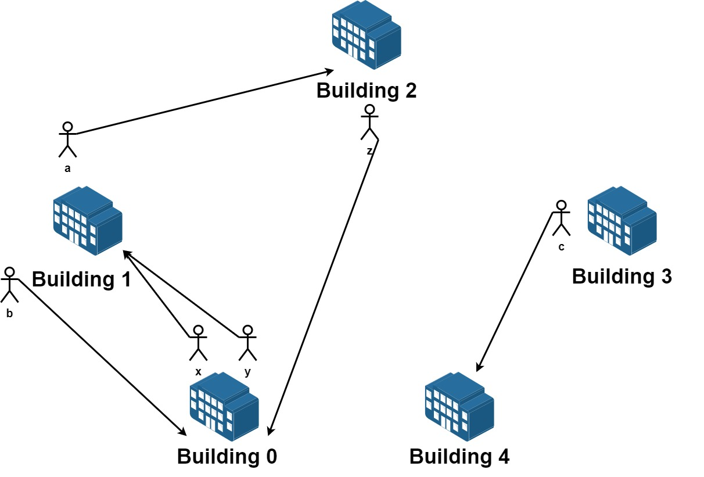
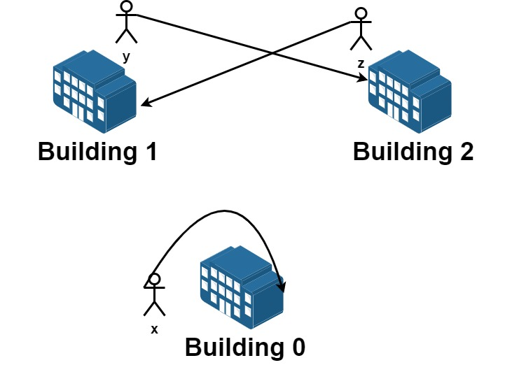

1601. Maximum Number of Achievable Transfer Requests

We have `n` buildings numbered from `0` to `n - 1`. Each building has a number of employees. It's transfer season, and some employees want to change the building they reside in.

You are given an array `requests` where `requests[i] = [fromi, toi]` represents an employee's request to transfer from building `fromi` to building `toi`.

**All buildings are full**, so a list of `requests` is achievable only if for each building, the **net change in employee transfers is zero**. This means the number of employees **leaving** is **equal** to the number of employees **moving in**. For example if `n = 3` and two employees are leaving building `0`, one is leaving building `1`, and one is leaving building `2`, there should be two employees moving to building `0`, one employee moving to building `1`, and one employee moving to building `2`.

Return the maximum number of achievable requests.

 

**Example 1:**


```
Input: n = 5, requests = [[0,1],[1,0],[0,1],[1,2],[2,0],[3,4]]
Output: 5
Explantion: Let's see the requests:
From building 0 we have employees x and y and both want to move to building 1.
From building 1 we have employees a and b and they want to move to buildings 2 and 0 respectively.
From building 2 we have employee z and they want to move to building 0.
From building 3 we have employee c and they want to move to building 4.
From building 4 we don't have any requests.
We can achieve the requests of users x and b by swapping their places.
We can achieve the requests of users y, a and z by swapping the places in the 3 buildings.
```

**Example 2:**


```
Input: n = 3, requests = [[0,0],[1,2],[2,1]]
Output: 3
Explantion: Let's see the requests:
From building 0 we have employee x and they want to stay in the same building 0.
From building 1 we have employee y and they want to move to building 2.
From building 2 we have employee z and they want to move to building 1.
We can achieve all the requests.
```

**Example 3:**

```
Input: n = 4, requests = [[0,3],[3,1],[1,2],[2,0]]
Output: 4
```

**Constraints:**

* `1 <= n <= 20`
* `1 <= requests.length <= 16`
* `requests[i].length == 2`
* `0 <= fromi, toi < n`

# Submissions
---
**Solution 1: (Backtracking)**
```
Runtime: 1644 ms
Memory Usage: 14.1 MB
```
```python
class Solution:
    def maximumRequests(self, n: int, requests: List[List[int]]) -> int:
        N = len(requests)
        
        def dfs(buildings, currentIndex):
            if currentIndex == N:
                return 0 if min(buildings) == 0 and max(buildings) == 0  else -999999
            source, destination = requests[currentIndex]
            buildings[source] -= 1
            buildings[destination] += 1
            taken = 1 + dfs(buildings, currentIndex+1)
            buildings[source] += 1
            buildings[destination] -= 1
            not_taken = dfs(buildings, currentIndex+1)
            result = max(taken, not_taken)
            return result

        buildings = [0 for _ in range(n)]
        return dfs(buildings, 0)
```

**Solution 2: (Backtrackng)**
```
Runtime: 114 ms
Memory: 8.6 MB
```
```c++
class Solution {
    void bt(int i, vector<int> &dp, vector<vector<int>> &requests, int cur, int &ans) {
        if (i == requests.size()) {
            if (all_of(dp.begin(), dp.end(), [](int v){return v == 0;})) {
                ans = max(ans, cur);
            }
            return;
        }
        dp[requests[i][0]] -= 1;
        dp[requests[i][1]] += 1;
        bt(i+1, dp, requests, cur+1, ans);
        dp[requests[i][0]] += 1;
        dp[requests[i][1]] -= 1;
        bt(i+1, dp, requests, cur, ans);
    }
public:
    int maximumRequests(int n, vector<vector<int>>& requests) {
        int ans = 0;
        vector<int> dp(n);
        bt(0, dp, requests, 0, ans);
        return ans;
```
