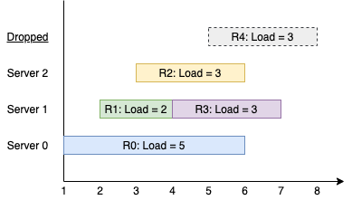

1606. Find Servers That Handled Most Number of Requests

You have `k` servers numbered from `0` to `k-1` that are being used to handle multiple requests simultaneously. Each server has infinite computational capacity but cannot handle more than one request at a time. The requests are assigned to servers according to a specific algorithm:

* The `i`th (`0`-indexed) request arrives.
* If all servers are busy, the request is dropped (not handled at all).
* If the `(i % k)`th server is available, assign the request to that server.
* Otherwise, assign the request to the next available server (wrapping around the list of servers and starting from `0` if necessary). For example, if the ith server is busy, try to assign the request to the `(i+1)`th server, then the `(i+2)`th server, and so on.

You are given a **strictly increasing** array `arrival` of positive integers, where `arrival[i]` represents the arrival time of the `i`th request, and another array `load`, where `load[i]` represents the load of the `i`th request (the time it takes to complete). Your goal is to find the **busiest server(s)**. A server is considered **busiest** if it handled the most number of requests successfully among all the servers.

Return a list containing the IDs (`0`-indexed) of the **busiest server(s)**. You may return the IDs in any order.

 

**Example 1:**


```
Input: k = 3, arrival = [1,2,3,4,5], load = [5,2,3,3,3] 
Output: [1] 
Explanation:
All of the servers start out available.
The first 3 requests are handled by the first 3 servers in order.
Request 3 comes in. Server 0 is busy, so it's assigned to the next available server, which is 1.
Request 4 comes in. It cannot be handled since all servers are busy, so it is dropped.
Servers 0 and 2 handled one request each, while server 1 handled two requests. Hence server 1 is the busiest server.
```

**Example 2:**

```
Input: k = 3, arrival = [1,2,3,4], load = [1,2,1,2]
Output: [0]
Explanation:
The first 3 requests are handled by first 3 servers.
Request 3 comes in. It is handled by server 0 since the server is available.
Server 0 handled two requests, while servers 1 and 2 handled one request each. Hence server 0 is the busiest server.
```

**Example 3:**

```
Input: k = 3, arrival = [1,2,3], load = [10,12,11]
Output: [0,1,2]
Explanation: Each server handles a single request, so they are all considered the busiest.
```

**Example 4:**

```
Input: k = 3, arrival = [1,2,3,4,8,9,10], load = [5,2,10,3,1,2,2]
Output: [1]
```

**Example 5:**

```
Input: k = 1, arrival = [1], load = [1]
Output: [0]
```

**Constraints:**

* `1 <= k <= 105`
* `1 <= arrival.length, load.length <= 105`
* `arrival.length == load.length`
* `1 <= arrival[i], load[i] <= 109`
* `arrival` is strictly increasing.

# Submissions
---
**Solution 1: (3 Heap, busy -> available -> busy heap)**

Solution using three heaps. First heap is used to quickly free up the nodes. Then we split the servers to those that come after the server_id which is current server and those that come before, for loopback.
```
Runtime: 1496 ms
Memory Usage: 34.7 MB
```
```python
class Solution:
    def busiestServers(self, k: int, arrival: List[int], load: List[int]) -> List[int]:
        busy_jobs = []  # heap (job_end_time, node) to free up the nodes quickly
        after = [] # heap (nodes) free after current server
        before = list(range(k))  # heap (nodes) to use for loopback
        requests_handled = [0] * k

        for i, (arrvl, ld) in enumerate(zip(arrival, load)):
            server_id = i % k
            if server_id == 0:  # loopback
                after = before
                before = []

            while busy_jobs and busy_jobs[0][0] <= arrvl:
                freed_node = heapq.heappop(busy_jobs)[1]
                if freed_node < server_id: heapq.heappush(before, freed_node)
                else: heapq.heappush(after, freed_node)

            use_queue = after if after else before
            if not use_queue: continue  # request dropped
            using_node = heapq.heappop(use_queue)
            requests_handled[using_node] += 1
            heapq.heappush(busy_jobs, (arrvl + ld, using_node))

        maxreqs = max(requests_handled)
        return [i for i, handled in enumerate(requests_handled) if handled == maxreqs]
```

**Solution 2: (Heap, Set)**

drop             xxxxxxxxx
s2         ---------
s1      ----- ---------       <
s0   ----------------
     1  2  3  4  5  6  7  8
st               ^
     0,1,2
     x x x
         ^
pq
                    0
              1
                    2
cnt
0    1
1       1     2
2          1

s2         ---
s1      ------   
s0   ---      ------          <
     1  2  3  4  5  6  7  8
              ^
st
    (0,1,2)
     x  
pq
        0     1    0
              2

cnt
s2         1
s1      1
s0   1        2

s2         -------------------------------------        <
s1      ----------------------------------------        <
s0   -------------------------------                    <
     1  2  3  4  5  6  7  8  9  10  11  12  13  14
           ^
st
   0,1,2
       ^
pq
                                    0
                                                 1
                                                 2

```
Runtime: 128 ms, Beats 83.80%
Memory: 123.32 MB, Beats 35.73%
```
```c++
class Solution {
public:
    vector<int> busiestServers(int k, vector<int>& arrival, vector<int>& load) {
        int n = arrival.size(), i, a, mx = 0;
        set<int> st;
        priority_queue<pair<int,int>, vector<pair<int,int>>, greater<>> pq;
        vector<int> cnt(k), ans;
        for (i = 0; i < k; i ++) {
            st.insert(i);
        }
        for (i = 0; i < n; i ++) {
            while (pq.size() && pq.top().first <= arrival[i]) {
                st.insert(pq.top().second);
                pq.pop();
            }
            auto it = st.lower_bound(i%k);
            if (it == st.end()) {
                if (st.size()) {
                    a = *st.begin();
                } else {
                    continue;
                }
            } else {
                a = *it;
            }
            st.erase(a);
            cnt[a] += 1;
            pq.push({arrival[i] + load[i], a});
        }
        for (i = 0; i < k; i ++) {
            if (cnt[i] > mx) {
                mx = cnt[i];
                ans = {i};
            } else if (cnt[i] == mx) {
                ans.push_back(i);
            }
        }
        return ans;
    }
};
```
