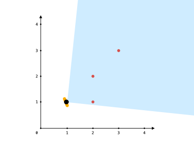

1610. Maximum Number of Visible Points

You are given an array `points`, an integer `angle`, and your `location`, where `location = [posx, posy]` and `points[i] = [xi, yi]` both denote **integral coordinates** on the X-Y plane.

Initially, you are facing directly east from your position. You **cannot move** from your position, but you can **rotate**. In other words, `posx` and `posy` cannot be changed. Your field of view in **degrees** is represented by angle, determining how wide you can see from any given view direction. Let `d` be the amount in degrees that you rotate counterclockwise. Then, your field of view is the **inclusive** range of angles `[d - angle/2, d + angle/2]`.


You can **see** some set of points if, for each point, the **angle** formed by the point, your position, and the immediate east direction from your position is **in your field of view**.

There can be multiple points at one coordinate. There may be points at your location, and you can always see these points regardless of your rotation. Points do not obstruct your vision to other points.

Return the maximum number of points you can see.

 

**Example 1:**


```
Input: points = [[2,1],[2,2],[3,3]], angle = 90, location = [1,1]
Output: 3
Explanation: The shaded region represents your field of view. All points can be made visible in your field of view, including [3,3] even though [2,2] is in front and in the same line of sight.
```

**Example 2:**

```
Input: points = [[2,1],[2,2],[3,4],[1,1]], angle = 90, location = [1,1]
Output: 4
Explanation: All points can be made visible in your field of view, including the one at your location.
```

**Example 3:**


```
Input: points = [[1,0],[2,1]], angle = 13, location = [1,1]
Output: 1
Explanation: You can only see one of the two points, as shown above.
```

**Constraints:**

* `1 <= points.length <= 105`
* `points[i].length == 2`
* `location.length == 2`
* `0 <= angle < 360`
* `0 <= posx, posy, xi, yi <= 109`

# Submissions
---
**Solution 1: (Geometry, Sliding Window)**

**Idea**

Here are the steps:

* convert all coordinates to radians
* sort the array
* use sliding window to find the longest window that satisfies arr[r] - arr[l] <= angle.

Note that we need to go around the circle, so we duplicate the array and offset the second half by 2*pi.

**Complexity**

* Time complexity: O(NlogN)
* Space complexity: O(N)

```
Runtime: 1820 ms
Memory Usage: 59.3 MB
```
```python
class Solution:
    def visiblePoints(self, points: List[List[int]], angle: int, location: List[int]) -> int:
        arr, extra = [], 0
        xx, yy = location
        
        for x, y in points:
            if x == xx and y == yy:
                extra += 1
                continue
            arr.append(math.atan2(y - yy, x - xx))
        
        arr.sort()
        arr = arr + [x + 2.0 * math.pi for x in arr]
        angle = math.pi * angle / 180
        
        l = ans = 0
        for r in range(len(arr)):
            while arr[r] - arr[l] > angle:
                l += 1
            ans = max(ans, r - l + 1)
            
        return ans + extra
```