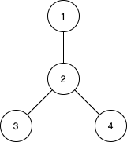

1617. Count Subtrees With Max Distance Between Cities

There are `n` cities numbered from `1` to `n`. You are given an array `edges` of size `n-1`, where `edges[i] = [ui, vi]` represents a bidirectional edge between cities `ui` and `vi`. There exists a unique path between each pair of cities. In other words, the cities form a **tree**.

A **subtree** is a subset of cities where every city is reachable from every other city in the subset, where the path between each pair passes through only the cities from the subset. Two subtrees are different if there is a city in one subtree that is not present in the other.

For each `d` from `1` to `n-1`, find the number of subtrees in which the **maximum distance** between any two cities in the subtree is equal to `d`.

Return an array of size `n-1` where the `d`th element (**1-indexed**) is the number of subtrees in which the **maximum distance** between any two cities is equal to `d`.

**Notice** that the **distance** between the two cities is the number of edges in the path between them.

 

**Example 1:**


```
Input: n = 4, edges = [[1,2],[2,3],[2,4]]
Output: [3,4,0]
Explanation:
The subtrees with subsets {1,2}, {2,3} and {2,4} have a max distance of 1.
The subtrees with subsets {1,2,3}, {1,2,4}, {2,3,4} and {1,2,3,4} have a max distance of 2.
No subtree has two nodes where the max distance between them is 3.
```

**Example 2:**
```
Input: n = 2, edges = [[1,2]]
Output: [1]
```

**Example 3:**
```
Input: n = 3, edges = [[1,2],[2,3]]
Output: [2,1]
```

**Constraints:**

* `2 <= n <= 15`
* `edges.length == n-1`
* `edges[i].length == 2`
* `1 <= ui, vi <= n`
* **All pairs** `(ui, vi)` are distinct.

# Submissions
---
**Solution 1: (Brute Force, Bit Manipulation, BFS)**

**Idea**

* Since n <= 15, there is a maximum 2^15 subset of cities numbered from 1 to n in the tree.
* For each of subset of cities, we calculate the maximum distance between any two cities in our subset.
    * For each city in our subset:
        * Using bfs() or dsf() to calculate distance between city to other cities in subset.
        * Return distance of 2 cities with maxium distance.

**Complexity**

* Time: O(2^n * n^2)
* Space: O(n^2)

```
Runtime: 2604 ms
Memory Usage: 14.1 MB
```
```python
class Solution:
    def countSubgraphsForEachDiameter(self, n: int, edges: List[List[int]]) -> List[int]:
        def bfs(src, graph):  # return: dist is the distance between src and other nodes
            dist = [DIST_INF] * n
            dist[src] = 0
            q = deque([src])
            while len(q) > 0:
                u = q.popleft()
                for v in graph[u]:
                    if dist[v] > dist[u] + 1:
                        q.append(v)
                        dist[v] = dist[u] + 1
            return dist

        def maxDistance(state):  # return: maximum distance between any two cities in our subset.
            cities = set()
            for i in range(n):
                if (state >> i) & 1 == 1:
                    cities.add(i)
            graph = defaultdict(list)
            for u, v in edges:
                u, v = u - 1, v - 1
                if u in cities and v in cities:
                    graph[u].append(v)
                    graph[v].append(u)
            ans = 0
            for i in cities:
                dist = bfs(i, graph)
                for j in cities:
                    if dist[j] == DIST_INF:  # Citi `i` can't reach to city `j` -> Invalid subset of cities
                        return 0
                    ans = max(ans, dist[j])
            return ans

        DIST_INF = n
        ans = [0] * (n - 1)
        for state in range(1, 2 ** n):
            d = maxDistance(state)
            if d > 0: ans[d - 1] += 1
        return ans
```