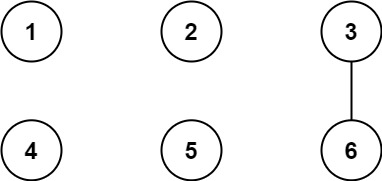
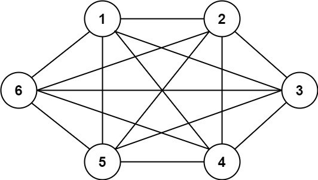
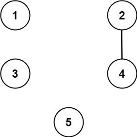

1627. Graph Connectivity With Threshold

We have `n` cities labeled from `1` to `n`. Two different cities with labels `x` and `y` are directly connected by a bidirectional road if and only if `x` and `y` share a common divisor **strictly greater** than some `threshold`. More formally, cities with labels `x` and `y` have a road between them if there exists an integer `z` such that all of the following are true:

* `x % z == 0`,
* `y % z == 0`, and
* `z > threshold`.

Given the two integers, `n` and `threshold`, and an array of `queries`, you must determine for each `queries[i] = [ai, bi]` if cities `ai` and `bi` are connected (i.e. there is some path between them).

Return an array `answer`, where `answer.length == queries.length` and `answer[i]` is true if for the `i`th query, there is a path between `ai` and `bi`, or `answer[i]` is false if there is no path.

 

**Example 1:**


```
Input: n = 6, threshold = 2, queries = [[1,4],[2,5],[3,6]]
Output: [false,false,true]
Explanation: The divisors for each number:
1:   1
2:   1, 2
3:   1, 3
4:   1, 2, 4
5:   1, 5
6:   1, 2, 3, 6
Using the underlined divisors above the threshold, only cities 3 and 6 share a common divisor, so they are the
only ones directly connected. The result of each query:
[1,4]   1 is not connected to 4
[2,5]   2 is not connected to 5
[3,6]   3 is connected to 6 through path 3--6
```

**Example 2:**


```
Input: n = 6, threshold = 0, queries = [[4,5],[3,4],[3,2],[2,6],[1,3]]
Output: [true,true,true,true,true]
Explanation: The divisors for each number are the same as the previous example. However, since the threshold is 0,
all divisors can be used. Since all numbers share 1 as a divisor, all cities are connected.
```

**Example 3:**


```
Input: n = 5, threshold = 1, queries = [[4,5],[4,5],[3,2],[2,3],[3,4]]
Output: [false,false,false,false,false]
Explanation: Only cities 2 and 4 share a common divisor 2 which is strictly greater than the threshold 1, so they are the only ones directly connected.
Please notice that there can be multiple queries for the same pair of nodes [x, y], and that the query [x, y] is equivalent to the query [y, x].
```

**Constraints:**

* `2 <= n <= 104`
* `0 <= threshold <= n`
* `1 <= queries.length <= 105`
* `queries[i].length == 2`
* `1 <= ai, bi <= cities`
* `ai != bi`

---
**Solution 1: (Union-Find)**
```
Runtime: 1072 ms
Memory Usage: 52.4 MB
```
```python
class UnionFind:
    def __init__(self, n):
        self.parent = [i for i in range(n)]
        self.size = [0] * n
    def find(self, x):
        if x != self.parent[x]:
            self.parent[x] = self.find(self.parent[x]) # Path compression
        return self.parent[x]
    def union(self, u, v):
        pu = self.find(u)
        pv = self.find(v)
        if self.size[pu] > self.size[pv]: # Union by larger size
            self.size[pu] += self.size[pv]
            self.parent[pv] = pu
        else:
            self.size[pv] += self.size[pu]
            self.parent[pu] = pv

class Solution:
    def areConnected(self, n: int, threshold: int, queries: List[List[int]]) -> List[bool]:
        uf = UnionFind(n+1)
        for i in range(1, n+1):
            for j in range(i*2, n+1, i): # step by i
                if i > threshold:
                    uf.union(i, j)
        ans = []
        for q in queries:
            pa = uf.find(q[0])
            pb = uf.find(q[1])
            ans.append(pa == pb)
        return ans
```