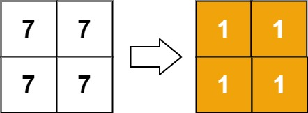

1632. Rank Transform of a Matrix

Given an `m x n` matrix, return a new matrix `answer` where `answer[row][col]` is the rank of `matrix[row][col]`.

The **rank** is an **integer** that represents how large an element is compared to other elements. It is calculated using the following rules:

* If an element is the smallest element in its row and column, then its **rank** is **1**.
* If two elements `p` and `q` are in the **same row or column**, then:
    * If `p < q` then `rank(p) < rank(q)`
    * If `p == q` then `rank(p) == rank(q)`
    * If `p > q` then `rank(p) > rank(q)`
* The **rank** should be as **small** as possible.

It is guaranteed that `answer` is unique under the given rules.

 

**Example 1:**


```
Input: matrix = [[1,2],[3,4]]
Output: [[1,2],[2,3]]
Explanation:
The rank of matrix[0][0] is 1 because it is the smallest integer in its row and column.
The rank of matrix[0][1] is 2 because matrix[0][1] > matrix[0][0] and matrix[0][0] is rank 1.
The rank of matrix[1][0] is 2 because matrix[1][0] > matrix[0][0] and matrix[0][0] is rank 1.
The rank of matrix[1][1] is 3 because matrix[1][1] > matrix[0][1], matrix[1][1] > matrix[1][0], and both matrix[0][1] and matrix[1][0] are rank 2.
```

**Example 2:**


```
Input: matrix = [[7,7],[7,7]]
Output: [[1,1],[1,1]]
```

**Example 3:**


```
Input: matrix = [[20,-21,14],[-19,4,19],[22,-47,24],[-19,4,19]]
Output: [[4,2,3],[1,3,4],[5,1,6],[1,3,4]]
```

**Example 4:**


```
Input: matrix = [[7,3,6],[1,4,5],[9,8,2]]
Output: [[5,1,4],[1,2,3],[6,3,1]]
```

**Constraints:**

* `m == matrix.length`
* `n == matrix[i].length`
* `1 <= m, n <= 500`
* `-109 <= matrix[row][col] <= 109`

**Hint 1:**

Sort the cells by value and process them in increasing order.

**Hint2:**

The rank of a cell is the maximum rank in its row and column plus one.

**Hint 3:**

Handle the equal cells by treating them as components using a union-find data structure.

# Submissions
---
**Solution 1: (Union-Find)**
```
Runtime: 1160 ms
Memory Usage: 47.5 MB
```
```python
class Solution:
    def matrixRankTransform(self, matrix: List[List[int]]) -> List[List[int]]:
        n, m = len(matrix), len(matrix[0])
        rank = [0] * (m + n)
        d = collections.defaultdict(list)
        for i in range(n):
            for j in range(m):
                d[matrix[i][j]].append([i, j])

        def find(i):
            if p[i] != i:
                p[i] = find(p[i])
            return p[i]

        for a in sorted(d):
            p = list(range(m + n))
            rank2 = rank[:]
            for i, j in d[a]:
                i, j = find(i), find(j + n)
                p[i] = j
                rank2[j] = max(rank2[i], rank2[j])
            for i, j in d[a]:
                rank[i] = rank[j + n] = matrix[i][j] = rank2[find(i)] + 1
        return matrix
```
