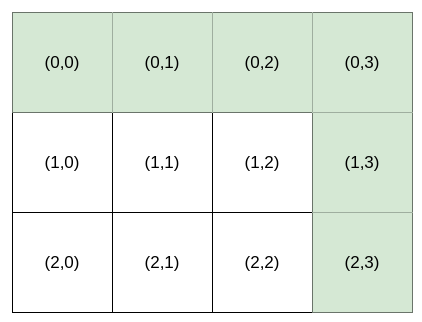
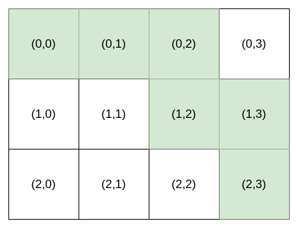
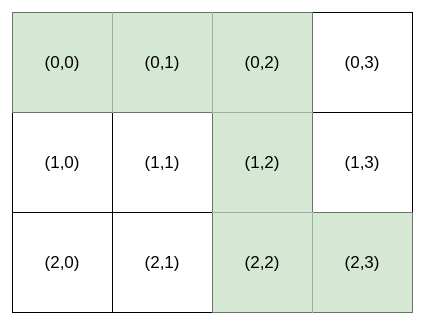

1643. Kth Smallest Instructions

Bob is standing at cell `(0, 0)`, and he wants to reach destination: `(row, column)`. He can only travel **right** and **down**. You are going to help Bob by providing **instructions** for him to reach destination.

The **instructions** are represented as a string, where each character is either:

* `'H'`, meaning move horizontally (go **right**), or
* `'V'`, meaning move vertically (go **down**).

Multiple **instructions** will lead Bob to destination. For example, if destination is `(2, 3)`, both `"HHHVV"` and `"HVHVH"` are valid **instructions**.

However, Bob is very picky. Bob has a lucky number `k`, and he wants the `k`th **lexicographically smallest instructions** that will lead him to destination. `k` is `1`-indexed.

Given an integer array `destination` and an integer `k`, return the `k`th **lexicographically smallest instructions** that will take Bob to `destination`.

 

**Example 1:**


```
Input: destination = [2,3], k = 1
Output: "HHHVV"
Explanation: All the instructions that reach (2, 3) in lexicographic order are as follows:
["HHHVV", "HHVHV", "HHVVH", "HVHHV", "HVHVH", "HVVHH", "VHHHV", "VHHVH", "VHVHH", "VVHHH"].
```

**Example 2:**


```
Input: destination = [2,3], k = 2
Output: "HHVHV"
```

**Example 3:**


```
Input: destination = [2,3], k = 3
Output: "HHVVH"
```

**Constraints:**

* `destination.length == 2`
* `1 <= row, column <= 15`
* `1 <= k <= nCr(row + column, row)`, where `nCr(a, b)` denotes `a` choose `b`.

# Submissions
---
**Solution 1: (Greedy, Math, Conbination)**
```
Runtime: 28 ms
Memory Usage: 14.2 MB
```
```python
class Solution:
    def kthSmallestPath(self, destination: List[int], k: int) -> str:
        m, n, ans = destination[0], destination[1], ""
        for i in range(m+n):
            if k == 1:  #no options left
                ans += "H"*n + "V"*m
                break

            if k <= math.comb(m+n-1, m):
                n -= 1
                ans += "H"
            else:
                ans += "V"
                k -= math.comb(m+n-1, m)
                m -= 1
                
        return ans
```