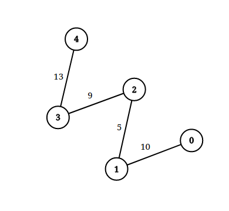

1697. Checking Existence of Edge Length Limited Paths

An undirected graph of `n` nodes is defined by `edgeList`, where `edgeList[i] = [ui, vi, disi]` denotes an edge between nodes `ui` and `vi` with distance `disi`. Note that there may be **multiple** edges between two nodes.

Given an array `queries`, where `queries[j] = [pj, qj, limitj]`, your task is to determine for each `queries[j]` whether there is a path between `pj` and `qj` such that each edge on the path has a distance strictly less than `limitj` .

Return a boolean array `answer`, where `answer.length == queries.length` and the `j`th value of `answer` is `true` if there is a path for `queries[j]` is `true`, and `false` otherwise.

 

**Example 1:**


```
Input: n = 3, edgeList = [[0,1,2],[1,2,4],[2,0,8],[1,0,16]], queries = [[0,1,2],[0,2,5]]
Output: [false,true]
Explanation: The above figure shows the given graph. Note that there are two overlapping edges between 0 and 1 with distances 2 and 16.
For the first query, between 0 and 1 there is no path where each distance is less than 2, thus we return false for this query.
For the second query, there is a path (0 -> 1 -> 2) of two edges with distances less than 5, thus we return true for this query.
```

**Example 2:**


```
Input: n = 5, edgeList = [[0,1,10],[1,2,5],[2,3,9],[3,4,13]], queries = [[0,4,14],[1,4,13]]
Output: [true,false]
Exaplanation: The above figure shows the given graph.
```

**Constraints:**

* `2 <= n <= 105`
* `1 <= edgeList.length, queries.length <= 105`
* `edgeList[i].length == 3`
* `queries[j].length == 3`
* `0 <= ui, vi, pj, qj <= n - 1`
* `ui != vi`
* `pj != qj`
* `1 <= disi, limitj <= 109`
* There may be **multiple** edges between two nodes.

# Submissions
---
**Solution 1: (Union Find)**
```
Runtime: 1996 ms
Memory Usage: 60.2 MB
```
```python
class UnionFind:
    def __init__(self, N: int):
        self.parent = list(range(N))
        self.rank = [1] * N

    def find(self, p: int, halving: bool=True) -> int:
        if p != self.parent[p]:
            self.parent[p] = self.find(self.parent[p])
        return self.parent[p]

    def union(self, p: int, q: int, ranking: bool=True) -> bool:
        prt, qrt = self.find(p), self.find(q)
        if prt == qrt: return False 
        if ranking and self.rank[prt] > self.rank[qrt]: 
            prt, qrt = qrt, prt 
        self.parent[prt] = qrt 
        self.rank[qrt] += self.rank[prt] 
        return True 

class Solution:
    def distanceLimitedPathsExist(self, n: int, edgeList: List[List[int]], queries: List[List[int]]) -> List[bool]:
        queries = sorted((w, p, q, i) for i, (p, q, w) in enumerate(queries))
        edgeList = sorted((w, u, v) for u, v, w in edgeList)
        
        uf = UnionFind(n)
        
        ans = [None] * len(queries)
        ii = 0
        for w, p, q, i in queries: 
            while ii < len(edgeList) and edgeList[ii][0] < w: 
                _, u, v = edgeList[ii]
                uf.union(u, v)
                ii += 1
            ans[i] = uf.find(p) == uf.find(q)
        return ans 
```

**Solution 2: (Union Find)**
```
Runtime: 650 ms
Memory: 110.1 MB
```
```c++
// Standard Disjoint-set data structure implementation.
static class DSU {
    vector<int> Parent, Rank;
public:
    DSU(int n) {
        Parent.resize(n);
        Rank.resize(n, 0);
        for (int i = 0; i < n; i++) {
            Parent[i] = i;
        }
    }
    int Find(int x) {
        return Parent[x] = Parent[x] == x ? x : Find(Parent[x]);
    }
    bool Union(int x, int y) {
        int xset = Find(x), yset = Find(y);
        if (xset != yset) {
            Rank[xset] < Rank[yset] ? Parent[xset] = yset : Parent[yset] = xset;
            Rank[xset] += Rank[xset] == Rank[yset];
            return true;
        }
        return false;
    }
};

class Solution {
public:
    vector<bool> distanceLimitedPathsExist(int n, vector<vector<int>>& edgeList, vector<vector<int>>& queries) {
        DSU dsu(n);
		
		//Add query indices to help with organizing/ordering results.
        for(int i=0; i < queries.size(); i ++) {
            queries[i].push_back(i);
        }
		
		//Sort inputs
        sort(queries.begin(), queries.end(), [](auto &l, auto &r) { return l[2] < r[2]; });
        sort(edgeList.begin(), edgeList.end(), [](auto &l, auto &r) { return l.back() < r.back(); });
		
        int i = 0;
        vector<bool> result(queries.size());
        for (vector<int> &q: queries) 
        {
			// Two pointer approach. Join the edges till their weight is less than the current query.
            while (i < edgeList.size()&&edgeList[i][2] < q[2]) { 
                dsu.Union(edgeList[i][0],edgeList[i][1]);
                i ++;
            }
			
			//If parents are same we know that their is a path.
            result[q.back()] = dsu.Find(q[0]) == dsu.Find(q[1]);
        }
        return result;
    }
};
```

**Solution 3: (Union Find, sort by query distance and group by largest till now)**
```
Runtime: 64 ms, Beats 68.24%
Memory: 114.89 MB, Beats 81.26%
```
```c++
class Solution {
    vector<int> par, r;
    int find(int x) {
        if (par[x] != x) {
            par[x] = find(par[x]);
        }
        return par[x];
    }
    void uni(int x, int y) {
        int xr = find(x), yr = find(y);
        if (xr != yr) {
            if (r[xr] > r[yr]) {
                par[yr] = xr;
            } else if (r[xr] < r[yr]) {
                par[xr] = yr;
            } else {
                par[xr] = yr;
                r[yr] += 1;
            }
        }
    }
public:
    vector<bool> distanceLimitedPathsExist(int n, vector<vector<int>>& edgeList, vector<vector<int>>& queries) {
        int m = queries.size(), i, p, q, limit, idx, u, v;
        par.resize(n);
        r.resize(n);
        for (i = 0; i < n; i ++) {
            par[i] = i;
            r[i] = 1;
        }
        for (i = 0; i < m; i ++) {
            queries[i].push_back(i);
        }
        sort(queries.begin(), queries.end(), [](auto &qa, auto &qb){
            return qa[2] < qb[2]; 
        });
        sort(edgeList.begin(), edgeList.end(), [](auto &ea, auto &eb){
            return ea[2] < eb[2];
        });
        i = 0;
        vector<bool> ans(m);
        for (auto &query: queries) {
            p = query[0];
            q = query[1];
            limit = query[2];
            idx = query[3];
            while (i < edgeList.size() && edgeList[i][2] < limit) {
                u = edgeList[i][0];
                v = edgeList[i][1];
                uni(u, v);
                i += 1;
            }
            if (find(p) == find(q)) {
                ans[idx] = true;
            } else {
                ans[idx] = false;
            }
        }
        return ans;
    }
};
```
