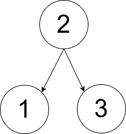

1719. Number Of Ways To Reconstruct A Tree

You are given an array `pairs`, where `pairs[i] = [xi, yi]`, and:

* There are no duplicates.
* `xi < yi`

Let `ways` be the number of rooted trees that satisfy the following conditions:

* The tree consists of nodes whose values appeared in `pairs`.
* A pair `[xi, yi]` exists in `pairs` if and only if `xi` is an ancestor of `yi` or `yi` is an ancestor of `xi`.
* Note: the tree does not have to be a binary tree.

Two ways are considered to be different if there is at least one node that has different parents in both ways.

Return:

* `0 if ways == 0`
* `1 if ways == 1`
* `2 if ways > 1`

A rooted tree is a tree that has a single root node, and all edges are oriented to be outgoing from the root.

An ancestor of a node is any node on the path from the root to that node (excluding the node itself). The root has no ancestors.

 

**Example 1:**


```
Input: pairs = [[1,2],[2,3]]
Output: 1
Explanation: There is exactly one valid rooted tree, which is shown in the above figure.
```

**Example 2:**


```
Input: pairs = [[1,2],[2,3],[1,3]]
Output: 2
Explanation: There are multiple valid rooted trees. Three of them are shown in the above figures.
```

**Example 3:**
```
Input: pairs = [[1,2],[2,3],[2,4],[1,5]]
Output: 0
Explanation: There are no valid rooted trees.
```

**Constraints:**

* `1 <= pairs.length <= 105`
* `1 <= xi < yi <= 500`
* The elements in pairs are unique.

# Submissions
---
**Solution 1: (Reconstruct adj_list from leaves)**
```
Runtime: 2204 ms
Memory Usage: 44.6 MB
```
```python
class Solution:
    def checkWays(self, pairs: List[List[int]]) -> int:
        adj = defaultdict(set)
        for i,j in pairs:
            adj[i].add(j)
            adj[j].add(i)
        n = len(adj)
        roots = []
        multi = 0
        for i in adj:
            adj[i].add(i)
            if len(adj[i]) == n:
                roots.append(i)
        ### First, check if there is at least one root (connecting to all nodes).
        if len(roots) == 0:
            return 0
        if len(roots) == n:
            return 2

        adj_check = defaultdict(set) # the reconstructed adj_list 
        visited = defaultdict(int)
        nodes = sorted(adj.keys() , key = lambda x : len(adj[x])) # sort all nodes by len of adj[adj]
        for leaf in nodes:
            if visited[leaf]: #it's visited if it's not a leaf => skip it
                continue
            for ancestor in adj[leaf]: #iterate along the path
                visited[ancestor] = 1
                adj_check[ancestor] |= adj[leaf] #adj[leaf] should be included in all adj_check[ancestors] 
            if not multi: # check if any nodes have same len(adj) along this path,if so , we can swap them and constuct another legal tree. 
                seen = set()
                for node in adj[leaf]:
                    if len(adj[node]) not in seen:
                        seen.add(len(adj[node]))
                    else:
                        multi = 1
                        break

        return 1 + multi if adj == adj_check else 0
```