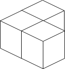
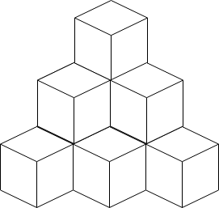

1739. Building Boxes

You have a cubic storeroom where the width, length, and height of the room are all equal to n units. You are asked to place n boxes in this room where each box is a cube of unit side length. There are however some rules to placing the boxes:

* You can place the boxes anywhere on the floor.
* If box `x` is placed on top of the box `y`, then each side of the four vertical sides of the box `y` must either be adjacent to another box or to a wall.

Given an integer n, return the minimum possible number of boxes touching the floor.

 

**Example 1:**


```
Input: n = 3
Output: 3
Explanation: The figure above is for the placement of the three boxes.
These boxes are placed in the corner of the room, where the corner is on the left side.
```

**Example 2:**


```
Input: n = 4
Output: 3
Explanation: The figure above is for the placement of the four boxes.
These boxes are placed in the corner of the room, where the corner is on the left side.
```

**Example 3:**


```
Input: n = 10
Output: 6
Explanation: The figure above is for the placement of the ten boxes.
These boxes are placed in the corner of the room, where the corner is on the back side.
```

**Constraints:**

* `1 <= n <= 10^9`

# Submissions
---
**Solution 1: (Brute Force)**

First, we try some examples:

1 box -> 1

4 boxes -> 1 + (1 + 2)

10 boxes -> 1 + (1 + 2) + (1 + 2 + 3)

...

n boxes -> 1 + (1 + 2) + (1 + 2 + 3) + (1 + 2 + 3 + 4) + ... + ?

If n could write in such form:

cur = 1 + (1 + 2) + ... + (1 + 2 + ... + j)

then, it is clear that the minimum possible number of boxes touching the floor is (1 + 2 + ... + j)

So, let's try to find the maximum j that cur < n:

```
int cur = 0, i = 0, j = 0;
while(cur < n) {
    ++j;
    i += j;
    cur += i;
}
```

If cur equals n, then just return i.

Then we try to build boxes like this:


cur = 1 + 3 + 6 ... + i + (1 + 2 + 3 + ... + j)

We now try to find min j that cur >= n.

```
while(cur < n) {
    ++j;
    cur += j;
}
```

For example:

if n = 14

we first find that 10 = 1 + (1 + 2) + (1 + 2 + 3)

Then we try to find min j that 1 + (1 + 2) + (1 + 2 + 3) + (1 + 2 + ... + j) >= n, like the way we build in picture above.

In this case, 1 + (1 + 2) + (1 + 2 + 3) + (1 + 2 + 3) == 16 >= 14 = n, so j is 3

then the final result is i+j

```
Runtime: 36 ms
Memory Usage: 14.2 MB
```
```python
class Solution:
    def minimumBoxes(self, n: int) -> int:
        cur = i = j = 0
        while cur < n:
            j += 1
            i += j
            cur += i
        if cur == n: return i
        
        cur -= i
        i -= j
        j = 0
        while cur < n:
            j += 1
            cur += j
        return i+j
```