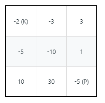

174. Dungeon Game

The demons had captured the princess (**P**) and imprisoned her in the bottom-right corner of a dungeon. The dungeon consists of M x N rooms laid out in a 2D grid. Our valiant knight (**K**) was initially positioned in the top-left room and must fight his way through the dungeon to rescue the princess.

The knight has an initial health point represented by a positive integer. If at any point his health point drops to 0 or below, he dies immediately.

Some of the rooms are guarded by demons, so the knight loses health (negative integers) upon entering these rooms; other rooms are either empty (0's) or contain magic orbs that increase the knight's health (positive integers).

In order to reach the princess as quickly as possible, the knight decides to move only rightward or downward in each step.

 

**Write a function to determine the knight's minimum initial health so that he is able to rescue the princess.**

For example, given the dungeon below, the initial health of the knight must be at least **7** if he follows the optimal path `RIGHT-> RIGHT -> DOWN -> DOWN`.

 

**Note:**

* The knight's health has no upper bound.
* Any room can contain threats or power-ups, even the first room the knight enters and the bottom-right room where the princess is imprisoned.

# Submissions
---
**Solution 1: (DP Bottom-Up)**
```
Runtime: 76 ms
Memory Usage: 13.8 MB
```
```python
class Solution:
    def calculateMinimumHP(self, dungeon: List[List[int]]) -> int:
        if not dungeon or not dungeon[0]: return 0
        M, N = len(dungeon), len(dungeon[0])
        dp = [[0]*N for _ in range(M)]
        for i in range(M-1,-1,-1):
            for j in range(N-1,-1,-1):
                if i == M-1 and j == N-1:
                    dp[i][j] = max(1, 1 - dungeon[i][j])
                elif i == M-1:
                    dp[i][j] = max(1, dp[i][j+1] - dungeon[i][j])
                elif j == N-1:
                    dp[i][j] = max(1, dp[i+1][j] - dungeon[i][j])                
                else:
                    dp[i][j] = max(1, min(dp[i][j + 1],dp[i + 1][j]) - dungeon[i][j])
                    
        return dp[0][0]
```

**Solution 2: (DP Top-Down)**
```
Runtime: 88 ms
Memory Usage: 15.7 MB
```
```python
class Solution:
    def calculateMinimumHP(self, dungeon: List[List[int]]) -> int:
        m, n = len(dungeon), len(dungeon[0])
        # returns minimum possible amount of health required at position (i, j)
        def calculate(i, j):
            if i == m or j == n:
                return float('inf')
            elif i == m-1 and j == n-1:
                return max(1,  1 - dungeon[i][j])
            elif (i, j) in memory:
                return memory[i, j]
            down = calculate(i+1, j) # min health required to go down and survive
            right = calculate(i, j+1) # min health required to go right and survive
            cur = min(max(down - dungeon[i][j], 1), max(right - dungeon[i][j], 1))
            memory[i, j] = cur
            return cur
        memory = {}
        return calculate(0, 0)
```