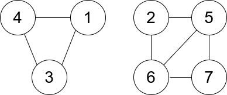

1761. Minimum Degree of a Connected Trio in a Graph

You are given an undirected graph. You are given an integer `n` which is the number of nodes in the graph and an array `edges`, where each `edges[i] = [ui, vi]` indicates that there is an undirected edge between `ui` and `vi`.

A connected trio is a set of three nodes where there is an edge between every pair of them.

The degree of a connected trio is the number of edges where one endpoint is in the trio, and the other is not.

Return the minimum degree of a connected trio in the graph, or `-1` if the graph has no connected trios.

 

**Example 1:**


```
Input: n = 6, edges = [[1,2],[1,3],[3,2],[4,1],[5,2],[3,6]]
Output: 3
Explanation: There is exactly one trio, which is [1,2,3]. The edges that form its degree are bolded in the figure above.
```

**Example 2:**


```
Input: n = 7, edges = [[1,3],[4,1],[4,3],[2,5],[5,6],[6,7],[7,5],[2,6]]
Output: 0
Explanation: There are exactly three trios:
1) [1,4,3] with degree 0.
2) [2,5,6] with degree 2.
3) [5,6,7] with degree 2.
```

**Constraints:**

* `2 <= n <= 400`
* `edges[i].length == 2`
* `1 <= edges.length <= n * (n-1) / 2`
* `1 <= ui, vi <= n`
* `ui != vi`
* There are no repeated `edges`.

# Submissions
---
**Solution 1: (Graph, Brute Force)**
```
Runtime: 8148 ms
Memory Usage: 39.4 MB
```
```python
class Solution:
    def minTrioDegree(self, n: int, edges: List[List[int]]) -> int:
        g = collections.defaultdict(lambda: set())
        res = float("inf")
        for u, v in edges:
            g[u].add(v)
            g[v].add(u)
        for i in range(1, n+1):
            for j in range(i+1, n+1):
                for k in range(j+1, n+1):
                    if j in g[i] and k in g[i] and k in g[j]: # this line judge if (i, j, k) is a trio
                        d = len(g[i]) + len(g[j]) + len(g[k]) - 6
                        res = min(res, d)
        return res if res!=float("inf") else -1
                    
        
```