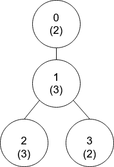
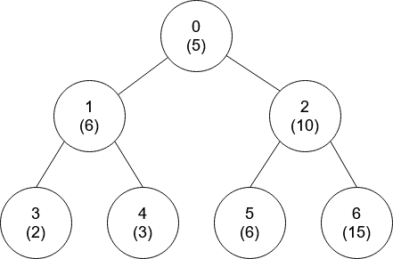

1766. Tree of Coprimes

There is a tree (i.e., a connected, undirected graph that has no cycles) consisting of n nodes numbered from `0` to `n - 1` and exactly `n - 1` edges. Each node has a value associated with it, and the root of the tree is node `0`.

To represent this tree, you are given an integer array `nums` and a 2D array `edges`. Each `nums[i]` represents the `i`th node's value, and each `edges[j] = [uj, vj]` represents an edge between nodes `uj` and `vj` in the tree.

Two values `x` and `y` are **coprime** if `gcd(x, y) == 1` where `gcd(x, y)` is the **greatest common divisor** of `x` and `y`.

An ancestor of a node `i` is any other node on the shortest path from node i to the root. A node is not considered an ancestor of itself.

Return an array ans of size `n`, where `ans[i]` is the closest ancestor to node `i` such that `nums[i]` and `nums[ans[i]]` are **coprime**, or `-1` if there is no such ancestor.

 

**Example 1:**


```
Input: nums = [2,3,3,2], edges = [[0,1],[1,2],[1,3]]
Output: [-1,0,0,1]
Explanation: In the above figure, each node's value is in parentheses.
- Node 0 has no coprime ancestors.
- Node 1 has only one ancestor, node 0. Their values are coprime (gcd(2,3) == 1).
- Node 2 has two ancestors, nodes 1 and 0. Node 1's value is not coprime (gcd(3,3) == 3), but node 0's
  value is (gcd(2,3) == 1), so node 0 is the closest valid ancestor.
- Node 3 has two ancestors, nodes 1 and 0. It is coprime with node 1 (gcd(3,2) == 1), so node 1 is its
  closest valid ancestor.
```

**Example 2:**


```
Input: nums = [5,6,10,2,3,6,15], edges = [[0,1],[0,2],[1,3],[1,4],[2,5],[2,6]]
Output: [-1,0,-1,0,0,0,-1]
```

**Constraints:**

* `nums.length == n`
* `1 <= nums[i] <= 50`
* `1 <= n <= 105`
* `edges.length == n - 1`
* `edges[j].length == 2`
* `0 <= uj, vj < n`
* `uj != vj`

# Submissions
---
**Solution 1: (DFS)**
```
Runtime: 3136 ms
Memory: 116.2 MB
```
```python
class Solution:
    def getCoprimes(self, nums: List[int], edges: List[List[int]]) -> List[int]:
        N = len(nums)
        g = collections.defaultdict(list)
        for u, v in edges:
            g[u] += [v]
            g[v] += [u]
        d = collections.defaultdict(list)
        ans = [-1]*N
        def dfs(v, pre, depth):
            prev_depth = -1
            for val in d:
                if gcd(val, nums[v]) == 1:
                    if d[val] and d[val][-1][1] > prev_depth:
                        ans[v] = d[val][-1][0]
                        prev_depth = d[val][-1][1]
            d[nums[v]] += [[v, depth]]
            for nv in g[v]:
                if nv != pre:
                    dfs(nv, v, depth+1)
            d[nums[v]].pop()
        dfs(0, -1, 0)
        return ans
```
