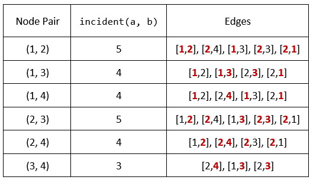

1782. Count Pairs Of Nodes

You are given an undirected graph defined by an integer `n`, the number of nodes, and a 2D integer array `edges`, the edges in the graph, where `edges[i] = [ui, vi]` indicates that there is an undirected edge between `ui` and `vi`. You are also given an integer array `queries`.

Let `incident(a, b)` be defined as the **number of edges** that are connected to either node `a` or `b`.

The answer to the `j`th query is the number of pairs of nodes `(a, b)` that satisfy both of the following conditions:

* `a < b`
* `incident(a, b) > queries[j]`

Return an array `answers` such that `answers.length == queries.length` and `answers[j]` is the answer of the `j`th query.

Note that there can be **multiple edges** between the same two nodes.

 

**Example 1:**


```
Input: n = 4, edges = [[1,2],[2,4],[1,3],[2,3],[2,1]], queries = [2,3]
Output: [6,5]
Explanation: The calculations for incident(a, b) are shown in the table above.
The answers for each of the queries are as follows:
- answers[0] = 6. All the pairs have an incident(a, b) value greater than 2.
- answers[1] = 5. All the pairs except (3, 4) have an incident(a, b) value greater than 3.
```

**Example 2:**
```
Input: n = 5, edges = [[1,5],[1,5],[3,4],[2,5],[1,3],[5,1],[2,3],[2,5]], queries = [1,2,3,4,5]
Output: [10,10,9,8,6]
```

**Constraints:**

* `2 <= n <= 2 * 10^4`
* `1 <= edges.length <= 10^5`
* `1 <= ui, vi <= n`
* `ui != vi`
* `1 <= queries.length <= 20`
* `0 <= queries[j] < edges.length`

# Submissions
---
**Solution 1: (Two Problems O(q * (n + e)))**

I somehow got derailed by the a < b constraint. In reality, it only means that we should not double-count the nodes.

OK, It helps to solve two problems independently.

cnt[i] is the count of edges for node i.
shared[i][j] is the count of shared edges between nodes i and j (if exists), where i < j.

How many node pairs i and j are there, so that cnt[i] + cnt[j] is greater than q?
We can solve it in O(n) by sorting counts (sorted_cnt) and usign two-pointer approach.
How many connected node pairs are there, so that cnt[i] + cnt[j] is greater than q, but cnt[i] + cnt[j] - shared[i][j] is not?
We can solve it in O(e) as there are no more than e connected node pairs.
The result is [1] - [2]. Pairs in [2] were incldued in [1] but they should not.

```
Runtime: 551 ms
Memory: 187.5 MB
```
```c++
class Solution {
public:
    vector<int> countPairs(int n, vector<vector<int>>& edges, vector<int>& queries) {
        vector<int> cnt(n + 1), sorted_cnt(n + 1), res;
        vector<unordered_map<int, int>> shared(n + 1);
        for (auto &e : edges) {
            sorted_cnt[e[0]] = cnt[e[0]] = cnt[e[0]] + 1;
            sorted_cnt[e[1]] = cnt[e[1]] = cnt[e[1]] + 1;
            ++shared[min(e[0], e[1])][max(e[0], e[1])];
        }
        sort(begin(sorted_cnt), end(sorted_cnt));
        for (auto &q : queries) {
            res.push_back(0);
            for (int i = 1, j = n; i < j; )
                if (q < sorted_cnt[i] + sorted_cnt[j])
                    res.back() += (j--) - i;
                else
                    ++i;
            for (auto i = 1; i <= n; ++i)
                for (auto [j, sh_cnt]: shared[i])
                    if (q < cnt[i] + cnt[j] && q + sh_cnt >= cnt[i] + cnt[j])
                        --res.back();
        }
        return res;
    }
};
```
