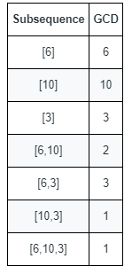

1819. Number of Different Subsequences GCDs

You are given an array `nums` that consists of positive integers.

The **GCD** of a sequence of numbers is defined as the greatest integer that divides all the numbers in the sequence evenly.

* For example, the GCD of the sequence `[4,6,16]` is `2`.
A **subsequence** of an array is a sequence that can be formed by removing some elements (possibly none) of the array.

* For example, `[2,5,10]` is a subsequence of `[1,2,1,2,4,1,5,10]`.
Return the **number** of **different** GCDs among all **non-empty** subsequences of `nums`.

 

**Example 1:**


```
Input: nums = [6,10,3]
Output: 5
Explanation: The figure shows all the non-empty subsequences and their GCDs.
The different GCDs are 6, 10, 3, 2, and 1.
```

**Example 2:**
```
Input: nums = [5,15,40,5,6]
Output: 7
```

**Constraints:**

* `1 <= nums.length <= 10^5`
* `1 <= nums[i] <= 2 * 10^5`

# Submissions
---
**Solution 1: (Range, O(n * sqrt(n)))**

So, the intuition here is that, instead of forming all sorts of groups, we can check whether each number in range [1...200,000] can be gcd for any numbers in our array.

To do that, for each number i, we check whether a number n * i exists in the array. If gcd of all existing n * i numbers equals i, then we increase our result.

```
Runtime: 410 ms
Memory: 72.3 MB
```
```c++
class Solution {
public:
    int countDifferentSubsequenceGCDs(vector<int>& nums) {
        int max_num = *max_element(begin(nums), end(nums)), res = 0;
        vector<bool> flags(max_num + 1);
        for (auto num : nums)
            flags[num] = true;
        for (auto i = 1; i <= max_num; ++i) {
            int ni_gcd = flags[i] ? i : 0;
            for (auto n = 1; n * i <= max_num && ni_gcd != i; ++n)
                if (flags[n * i])
                    ni_gcd = ni_gcd ? gcd(ni_gcd, n * i) : n * i;
            res += ni_gcd == i;
        }
        return res;
    }
};
```
