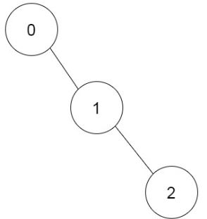
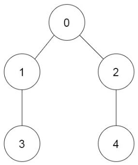

1916. Count Ways to Build Rooms in an Ant Colony

You are an ant tasked with adding `n` new rooms numbered `0` to `n-1` to your colony. You are given the expansion plan as a **0-indexed** integer array of length `n`, prevRoom, where `prevRoom[i]` indicates that you must build room `prevRoom[i]` before building room `i`, and these two rooms must be connected **directly**. Room `0` is already built, so `prevRoom[0] = -1`. The expansion plan is given such that once all the rooms are built, every room will be reachable from room `0`.

You can only build **one room** at a time, and you can travel freely between rooms you have **already built** only if they are **connected**. You can choose to build any room as long as its **previous room** is already built.

Return the **number of different orders** you can build all the rooms in. Since the answer may be large, return it **modulo** `10^9 + 7`.

 

**Example 1:**


```
Input: prevRoom = [-1,0,1]
Output: 1
Explanation: There is only one way to build the additional rooms: 0 → 1 → 2
```

**Example 2:**


```
Input: prevRoom = [-1,0,0,1,2]
Output: 6
Explanation:
The 6 ways are:
0 → 1 → 3 → 2 → 4
0 → 2 → 4 → 1 → 3
0 → 1 → 2 → 3 → 4
0 → 1 → 2 → 4 → 3
0 → 2 → 1 → 3 → 4
0 → 2 → 1 → 4 → 3
```

**Constraints:**

* `n == prevRoom.length`
* `2 <= n <= 10^5`
* `prevRoom[0] == -1`
* `0 <= prevRoom[i] < n for all 1 <= i < n`
* Every room is reachable from room `0` once all the rooms are built.

# Submissions
---
**Solution 1: (DFS)**

**Idea**

We can view the ant colony as a tree. Why tree but not general graph? Because each room can only have one prevRoom. Recursion is our friend in solving tree problems.

Define dfs(cur) as the number of ways to build rooms if we start at node cur. The base case is simply dfs(leaf) = 1, but the recursive step is kind of tricky.

Here are my thoughts when approach this problem:

1. First think of a simple scenairo where a node has two branches and each branch is a chain (dfs(child) = 1). What is dfs(cur)? This is equivalent to count the number of ways to combine two arrays and maintain their original order. Say the lengths of these two arrays are l and r, the answer is math.comb(l+r, l). Another way of thinking this is to put l items into l+r spots and fill the remaining spots with the other r items.

1. Next, what if the branch is not a chain? Say dfs(left_child)=x and dfs(right_child)=y. We just multiply them together. So the solution becomes x * y * math.comb(l+r, l).

1. Finally, what if there are many branches? We can combine them one by one: take the leftmost two branches first, get the merged branch, merge it with the third branch, and so on.

Please see code below fore more details =)

**Edit: Calculate n chooses k without math.comb**

For Python users, math.comb comes in handy. But what if you have to calculate math.comb(n, k) without using the built-in function? One may think of caching fac(n) and calculating it as comb(n, k) = n! / (k! * (n-k)!). But this is not enough - we have to incorporate mod into this whole equation.

To solve this issue, we can use Modular Multiplicative Inverse as a workaround. It's very hard to implement this without knowing the method beforehand and I think it's unfair for non-Python users to implement this during the content. I added a workable C++ solution to this post for reference.

**Disclaimer:** I did not implement the C++ solution by myself. The solution is borrowed from the top voted solutions in leetcode-cn solution section. If you could please go upvote those solutions instead.

```
Runtime: 4296 ms
Memory Usage: 173.1 MB
```
```python
class Solution:
    def waysToBuildRooms(self, prevRoom: List[int]) -> int:
        MOD = 10**9 + 7
        g = collections.defaultdict(list)
        for cur, pre in enumerate(prevRoom):
            g[pre].append(cur)
            
        def dfs(cur):
            if not g[cur]:
                return 1, 1
            ans, l = 1, 0
            for nxt in g[cur]:
                tmp, r = dfs(nxt)
                ans = (ans * tmp * math.comb(l+r, r)) % MOD
                l += r
            return ans, l + 1
            
        return dfs(0)[0]
```
