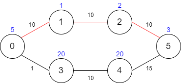
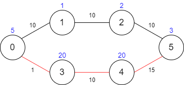

1928. Minimum Cost to Reach Destination in Time

There is a country of `n` cities numbered from `0` to `n - 1` where **all the cities are connected** by bi-directional roads. The roads are represented as a 2D integer array **edges** where `edges[i] = [xi, yi, timei]` denotes a road between cities `xi` and `yi` that takes `timei` minutes to travel. There may be multiple roads of differing travel times connecting the same two cities, but no road connects a city to itself.

Each time you pass through a city, you must pay a passing fee. This is represented as a **0-indexed** integer array `passingFees` of length `n` where `passingFees[j]` is the amount of dollars you must pay when you pass through city j.

In the beginning, you are at city `0` and want to reach city `n - 1` in `maxTime` **minutes or less**. The **cost** of your journey is the **summation of passing fees** for each city that you passed through at some moment of your journey (**including** the source and destination cities).

Given `maxTime`, `edges`, and `passingFees`, return the minimum cost to complete your journey, or `-1` if you cannot complete it within `maxTime` minutes.

 

**Example 1:**


```
Input: maxTime = 30, edges = [[0,1,10],[1,2,10],[2,5,10],[0,3,1],[3,4,10],[4,5,15]], passingFees = [5,1,2,20,20,3]
Output: 11
Explanation: The path to take is 0 -> 1 -> 2 -> 5, which takes 30 minutes and has $11 worth of passing fees.
```

**Example 2:**


```
Input: maxTime = 29, edges = [[0,1,10],[1,2,10],[2,5,10],[0,3,1],[3,4,10],[4,5,15]], passingFees = [5,1,2,20,20,3]
Output: 48
Explanation: The path to take is 0 -> 3 -> 4 -> 5, which takes 26 minutes and has $48 worth of passing fees.
You cannot take path 0 -> 1 -> 2 -> 5 since it would take too long.
```

**Example 3:**
```
Input: maxTime = 25, edges = [[0,1,10],[1,2,10],[2,5,10],[0,3,1],[3,4,10],[4,5,15]], passingFees = [5,1,2,20,20,3]
Output: -1
Explanation: There is no way to reach city 5 from city 0 within 25 minutes.
```

**Constraints:**

* `1 <= maxTime <= 1000`
* `n == passingFees.length`
* `2 <= n <= 1000`
* `n - 1 <= edges.length <= 1000`
* `0 <= xi, yi <= n - 1`
* `1 <= timei <= 1000`
* `1 <= passingFees[j] <= 1000` 
* The graph may contain multiple edges between two nodes.
* The graph does not contain self loops.

# Submissions
---
**Solution 1: Heap, (Dijkstra's)**
```
Runtime: 592 ms
Memory Usage: 15.1 MB
```
```python
class Solution:
    def minCost(self, maxTime: int, edges: List[List[int]], passingFees: List[int]) -> int:
        N = len(passingFees)
        g = collections.defaultdict(list)
        for xi, yi, timei in edges:
            g[xi].append((yi, timei))
            g[yi].append((xi, timei))
        times = {}
        pq = [(passingFees[0], 0, 0)]
        while pq:
            cost, node, time = heapq.heappop(pq)
            if time > maxTime:
                continue
            if node == N-1:
                return cost
            if node not in times or times[node] > time:
                times[node] = time
                for nnode, ntime in g[node]:
                    heapq.heappush(pq, (passingFees[nnode]+cost, nnode, time+ntime))
        return -1
```

**Solution 2: (Heap, Dijkstra, Time: O(ETlog(VT)), optimal state-space search over time-cost)**
```
Runtime: 1198 ms, Beats 13.63%
Memory: 119.76 MB, Beats 33.29%
```
```c++
class Solution {
public:
    int minCost(int maxTime, vector<vector<int>>& edges, vector<int>& passingFees) {
        int n = passingFees.size();
        vector<vector<array<int, 2>>> g(n);
        for (auto &e: edges) {
            auto u = e[0];
            auto v = e[1];
            auto w = e[2];
            g[u].push_back({v, w});
            g[v].push_back({u, w});
        }
        vector<vector<int>> dist(n, vector<int>(maxTime + 1, INT_MAX));
        priority_queue<array<int, 3>, vector<array<int, 3>>, greater<array<int, 3>>> pq;
        dist[0][0] = passingFees[0];
        pq.push({passingFees[0], 0, 0});
        while (!pq.empty()) {
            auto [fee, u, t] = pq.top();
            pq.pop();
            if (u == n - 1)
                return fee;
            if (fee > dist[u][t])
                continue;
            for (auto &[v, w] : g[u]) {
                int nt = t + w;
                if (nt > maxTime)
                    continue;
                int nf = fee + passingFees[v];
                if (nf < dist[v][nt]) {
                    dist[v][nt] = nf;
                    pq.push({nf, v, nt});
                }
            }
        }
        return -1;
    }
};
```
