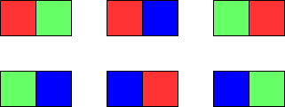

1931. Painting a Grid With Three Different Colors

You are given two integers `m` and `n`. Consider an `m x n` grid where each cell is initially white. You can paint each cell **red**, **green**, or **blue**. All cells **must** be painted.

Return the number of ways to color the grid with **no two adjacent cells having the same color**. Since the answer can be very large, return it **modulo** `10^9 + 7`.

 

**Example 1:**


```
Input: m = 1, n = 1
Output: 3
Explanation: The three possible colorings are shown in the image above.
```

**Example 2:**


```
Input: m = 1, n = 2
Output: 6
Explanation: The six possible colorings are shown in the image above.
```

**Example 3:**
```
Input: m = 5, n = 5
Output: 580986
```

**Constraints:**

* `1 <= m <= 5`
* `1 <= n <= 1000`

# Submissions
---
**Solution 1: (DP, Bottom-Up)**

The idea is to go row by row and check that we do not have conflicts of colors in each row and between rows.

1. C is all candidates for row, that is all rows, such that we do not have conflicts among horizontal adjacent cells.
1. Also create dictionarly d: where for each candidate we collect all possible options for the next line such that we do not have vertical conflicts.
1. Finally, we go level by level and for each c1 among candidates and then for each c2 in d[c1], we update number of options for dp2[c2]. In the end of iteration we update dp = dp2.

**Complexity**

We have O(3^m * m) complexity to generate C. In fact we will have 3 * 2^(m-1) options for each row. Then when we check all pairs we do O(9^2^(2m-2) * m) = O(4^m * m) ways. Then we have O(4^m * m) complexity for each level, so total time complexity is O(4^m * n * m). Space complexity is O(4^m).

```
Runtime: 1312 ms
Memory Usage: 14.1 MB
```
```python
class Solution:
    def colorTheGrid(self, m: int, n: int) -> int:
        C = [c for c in product([0,1,2], repeat = m) if all(x!=y for x,y in zip(c, c[1:]))]

        MOD, dp, d = 10**9 + 7, Counter(C), defaultdict(list)

        for c1, c2 in product(C, C):
            if all(x != y for x, y in zip(c1, c2)):
                d[c1].append(c2)

        for _ in range(n-1):
            dp2 = Counter()
            for c1 in C:
                for c2 in d[c1]:
                    dp2[c2] = (dp2[c2] + dp[c1]) % MOD
            dp = dp2

        return sum(dp.values()) % MOD
```

**Solution 2: (DP Top-Down)**

Using dp. Consider each row to be a state, we can find the valid adjacent state. Becomes number of paths problem.
Time complexity : O(n * 3^m)
 
```
Runtime: 1412 ms
Memory Usage: 33.8 MB
```
```python
class Solution:
    def colorTheGrid(self, m: int, n: int) -> int:
        mod = 10 ** 9 + 7

        def check(pos):
            return all(a != b for a, b in zip(pos, pos[1:]))

        def neighs(pos1, pos2):
            return all(a != b for a, b in zip(pos1, pos2))

        states = {''.join(pos) for pos in product('RGB', repeat=m) if check(pos)}
        adj = {}
        for state in states:
            adj[state] = [next_state for next_state in states if neighs(state, next_state)]

        @cache
        def f(prv_state, N):
            if N == 0:
                return 1
            return sum(f(next_state, N - 1) for next_state in adj[prv_state]) % mod

        return sum(f(state, n - 1) for state in states) % mod
```
