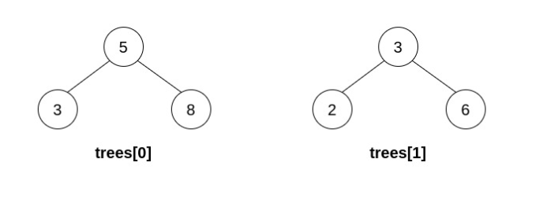
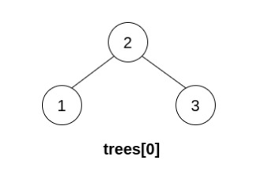

1932. Merge BSTs to Create Single BST

You are given `n` **BST (binary search tree) root nodes** for `n` separate BSTs stored in an array trees (**0-indexed**). Each BST in `trees` has **at most 3 nodes**, and no two roots have the same value. In one operation, you can:

* Select two **distinct** indices `i` and `j` such that the value stored at one of the **leaves** of `trees[i]` is equal to the **root value** of `trees[j]`.
* Replace the leaf node in `trees[i]` with `trees[j]`.
* Remove `trees[j]` from `trees`.

Return the `root` of the resulting BST if it is possible to form a valid BST after performing `n - 1` operations, or `null` if it is impossible to create a valid BST.

A BST (binary search tree) is a binary tree where each node satisfies the following property:

* Every node in the node's left subtree has a value **strictly less** than the node's value.
* Every node in the node's right subtree has a value **strictly greater** than the node's value.
A leaf is a node that has no children.

 

**Example 1:**


```
Input: trees = [[2,1],[3,2,5],[5,4]]
Output: [3,2,5,1,null,4]
Explanation:
In the first operation, pick i=1 and j=0, and merge trees[0] into trees[1].
Delete trees[0], so trees = [[3,2,5,1],[5,4]].
```

```
In the second operation, pick i=0 and j=1, and merge trees[1] into trees[0].
Delete trees[1], so trees = [[3,2,5,1,null,4]].
```

```
The resulting tree, shown above, is a valid BST, so return its root.
```

**Example 2:**


```
Input: trees = [[5,3,8],[3,2,6]]
Output: []
Explanation:
Pick i=0 and j=1 and merge trees[1] into trees[0].
Delete trees[1], so trees = [[5,3,8,2,6]].
```

```
The resulting tree is shown above. This is the only valid operation that can be performed, but the resulting tree is not a valid BST, so return null.
```

**Example 3:**


```
Input: trees = [[5,4],[3]]
Output: []
Explanation: It is impossible to perform any operations.
```

**Example 4:**


```
Input: trees = [[2,1,3]]
Output: [2,1,3]
Explanation: There is only one tree, and it is already a valid BST, so return its root.
```

**Constraints:**

* `n == trees.length`
* `1 <= n <= 5 * 10^4`
* The number of nodes in each tree is in the range `[1, 3]`.
* No two roots of trees have the same value.
* All the trees in the input are **valid BSTs**.
* `1 <= TreeNode.val <= 5 * 10^4`.

# Submissions
---
**Solution 1: (DFS, inorder)**

**Idea**

When asked to validate BST, we naturally think about in-order traversal (98. Validate Binary Search Tree). The question is how to do in-order traversal when we are given many separate trees.

First of all, we want to find a root node to start the traversal from, and we can do so by finding the node without any incoming edge (indeg = 0). If there's zero or more than one roots, we cannot create a single BST.

To traverse through nodes, we need to go from one BST to another. We achieve this with the help of a value-to-node map (nodes).

There are also two edges cases we need to check:

There is no cycle
We traverse through all nodes
Please see code below for more details =)


**Complexity**

* Time complexity: O(N)
* Space complexity: O(N)

```
Runtime: 2444 ms
Memory Usage: 67.4 MB
```
```python
# Definition for a binary tree node.
# class TreeNode:
#     def __init__(self, val=0, left=None, right=None):
#         self.val = val
#         self.left = left
#         self.right = right
class Solution:
    def canMerge(self, trees: List[TreeNode]) -> TreeNode:
        nodes = {}
        indeg = collections.defaultdict(int)
        for t in trees:
            if t.val not in indeg:
                indeg[t.val] = 0
            if t.left:
                indeg[t.left.val] += 1
                if t.left.val not in nodes: nodes[t.left.val] = t.left
            if t.right:
                indeg[t.right.val] += 1
                if t.right.val not in nodes: nodes[t.right.val] = t.right
            nodes[t.val] = t
            
        # check single root
        sources = [k for k, v in indeg.items() if v == 0]
        if len(sources) != 1: return None
        
        self.cur = float('-inf')
        self.is_invalid = False
        seen = set()

        def inorder(val):
            # check cycle
            if val in seen:
                self.is_invalid = True
                return
            seen.add(val)
            node = nodes[val]
            if node.left: node.left = inorder(node.left.val)
            # check inorder increasing
            if val <= self.cur:
                self.is_invalid = True
                return
            self.cur = val
            if node.right: node.right = inorder(node.right.val)
            return node
        
        root = inorder(sources[0])

        # check full traversal
        if len(seen) != len(nodes) or self.is_invalid:
            return None

        return root
```
