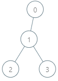
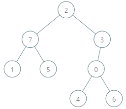

1938. Maximum Genetic Difference Query

There is a rooted tree consisting of `n` nodes numbered `0` to `n - 1`. Each node's number denotes its **unique genetic value** (i.e. the genetic value of node `x` is `x`). The **genetic difference** between two genetic values is defined as the **bitwise-XOR** of their values. You are given the integer array `parents`, where `parents[i]` is the parent for node `i`. If node `x` is the **root** of the tree, then `parents[x] == -1`.

You are also given the array `queries` where `queries[i] = [nodei, vali]`. For each query `i`, find the **maximum genetic difference** between `vali` and `pi`, where `pi` is the genetic value of any node that is on the path between `nodei` and the root (including `nodei` and the root). More formally, you want to maximize `vali XOR pi`.

Return an array ans where `ans[i]` is the answer to the `i`th query.

 

**Example 1:**


```
Input: parents = [-1,0,1,1], queries = [[0,2],[3,2],[2,5]]
Output: [2,3,7]
Explanation: The queries are processed as follows:
- [0,2]: The node with the maximum genetic difference is 0, with a difference of 2 XOR 0 = 2.
- [3,2]: The node with the maximum genetic difference is 1, with a difference of 2 XOR 1 = 3.
- [2,5]: The node with the maximum genetic difference is 2, with a difference of 5 XOR 2 = 7.
```

**Example 2:**


```
Input: parents = [3,7,-1,2,0,7,0,2], queries = [[4,6],[1,15],[0,5]]
Output: [6,14,7]
Explanation: The queries are processed as follows:
- [4,6]: The node with the maximum genetic difference is 0, with a difference of 6 XOR 0 = 6.
- [1,15]: The node with the maximum genetic difference is 1, with a difference of 15 XOR 1 = 14.
- [0,5]: The node with the maximum genetic difference is 2, with a difference of 5 XOR 2 = 7.
```

**Constraints:**

* `2 <= parents.length <= 10^5`
* `0 <= parents[i] <= parents.length - 1` for every node `i` that is **not** the root.
* `parents[root] == -1`
* `1 <= queries.length <= 3 * 10^4`
* `0 <= nodei <= parents.length - 1`
* `0 <= vali <= 2 * 10^5`

# Submissions
---
**Solution 1: (Trie)**
```
Runtime: 9560 ms
Memory Usage: 236.6 MB
```
```python
class TrieNode:
    def __init__(self):
        self.child = {}
        self.go = 0  # Number of elements goes through this node
    def increase(self, number, d):
        cur = self
        for i in range(17, -1, -1):
            bit = (number >> i) & 1
            if bit not in cur.child: cur.child[bit] = TrieNode()
            cur = cur.child[bit]
            cur.go += d
    def findMax(self, number):
        cur, ans = self, 0
        for i in range(17, -1, -1):
            bit = (number >> i) & 1
            if (1-bit) in cur.child and cur.child[1-bit].go > 0:
                cur = cur.child[1 - bit]
                ans |= (1 << i)
            else:
                cur = cur.child[bit]
        return ans

class Solution:
    def maxGeneticDifference(self, parents: List[int], queries: List[List[int]]) -> List[int]:
        n, m, root = len(parents), len(queries), -1
        ans, trieNode = [-1] * m, TrieNode()
        graph, queryByNode = [[] for _ in range(n)], [[] for _ in range(n)]
        for i, p in enumerate(parents):
            if p == -1: root = i
            else: graph[p].append(i)

        for i, q in enumerate(queries):
            queryByNode[q[0]].append((q[1], i))  # node -> list of pairs (val, idx)

        def dfs(u):
            trieNode.increase(u, 1)
            for val, idx in queryByNode[u]:
                ans[idx] = trieNode.findMax(val)
            for v in graph[u]:
                dfs(v)
            trieNode.increase(u, -1)

        dfs(root)
        return ans
```
