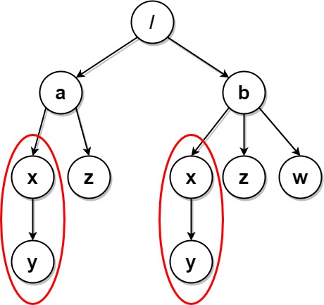

1948. Delete Duplicate Folders in System

Due to a bug, there are many duplicate folders in a file system. You are given a 2D array `paths`, where `paths[i]` is an array representing an absolute path to the ith folder in the file system.

* For example, `["one", "two", "three"]` represents the path `"/one/two/three"`.

Two folders (not necessarily on the same level) are **identical** if they contain the **same non-empty** set of identical subfolders and underlying subfolder structure. The folders **do not** need to be at the root level to be identical. If two or more folders are **identical**, then **mark** the folders as well as all their subfolders.

* For example, folders `"/a"` and `"/b"` in the file structure below are identical. They (as well as their subfolders) should all be marked:
    * `/a`
    * `/a/x`
    * `/a/x/y`
    * `/a/z`
    * `/b`
    * `/b/x`
    * `/b/x/y`
    * `/b/z`

* However, if the file structure also included the path `"/b/w"`, then the folders `"/a"` and `"/b"` would not be identical. Note that `"/a/x"` and `"/b/x"` would still be considered identical even with the added folder.

Once all the identical folders and their subfolders have been marked, the file system will **delete** all of them. The file system only runs the deletion once, so any folders that become identical after the initial deletion are not deleted.

Return the 2D array `ans` containing the paths of the **remaining** folders after deleting all the marked folders. The paths may be returned in **any** order.

 

**Example 1:**


```
Input: paths = [["a"],["c"],["d"],["a","b"],["c","b"],["d","a"]]
Output: [["d"],["d","a"]]
Explanation: The file structure is as shown.
Folders "/a" and "/c" (and their subfolders) are marked for deletion because they both contain an empty
folder named "b".
```

**Example 2:**


```
Input: paths = [["a"],["c"],["a","b"],["c","b"],["a","b","x"],["a","b","x","y"],["w"],["w","y"]]
Output: [["c"],["c","b"],["a"],["a","b"]]
Explanation: The file structure is as shown. 
Folders "/a/b/x" and "/w" (and their subfolders) are marked for deletion because they both contain an empty folder named "y".
Note that folders "/a" and "/c" are identical after the deletion, but they are not deleted because they were not marked beforehand.
```

**Example 3:**


```
Input: paths = [["a","b"],["c","d"],["c"],["a"]]
Output: [["c"],["c","d"],["a"],["a","b"]]
Explanation: All folders are unique in the file system.
Note that the returned array can be in a different order as the order does not matter.
```

**Example 4:**


```
Input: paths = [["a"],["a","x"],["a","x","y"],["a","z"],["b"],["b","x"],["b","x","y"],["b","z"]]
Output: []
Explanation: The file structure is as shown.
Folders "/a/x" and "/b/x" (and their subfolders) are marked for deletion because they both contain an
empty folder named "y".
Folders "/a" and "/b" (and their subfolders) are marked for deletion because they both contain an empty
folder "z" and the folder "x" described above.
```

**Example 5:**


```
Input: paths = [["a"],["a","x"],["a","x","y"],["a","z"],["b"],["b","x"],["b","x","y"],["b","z"],["b","w"]]
Output: [["b"],["b","w"],["b","z"],["a"],["a","z"]]
Explanation: This has the same structure as the previous example, except with the added "/b/w".
Folders "/a/x" and "/b/x" are still marked, but "/a" and "/b" are no longer marked because "/b" has the
empty folder named "w" and "/a" does not.
Note that "/a/z" and "/b/z" are not marked because the set of identical subfolders must be non-empty, but these folders are empty.
```

**Constraints:**

* `1 <= paths.length <= 2 * 10^4`
* `1 <= paths[i].length <= 500`
* `1 <= paths[i][j].length <= 10`
* `1 <= sum(paths[i][j].length) <= 2 * 10^5`
* `path[i][j]` consists of lowercase English letters.
* No two paths lead to the same folder.
* For any folder not at the root level, its parent folder will also be in the input.

# Submissions
---
**Solution 1: (DFS)**
```
Runtime: 2240 ms
Memory Usage: 38 MB
```
```python
class Solution:
    def deleteDuplicateFolder(self, paths: List[List[str]]) -> List[List[str]]:
        tree = {}
        child_hashes = defaultdict(list)

        # build directories tree
        for path in paths:
            node = tree
            for folder in path:
                if folder not in node:
                    node[folder] = {}
                node = node[folder]

        # iterate all children in sorted order and hash them as tuple,
        # then add current node key to hash and return
        def dfs(node, node_key, parent):
            child_tuple = tuple(dfs(node[key], key, node) for key in sorted(node.keys()))
            child_hash = hash(child_tuple)
            if child_tuple:
                child_hashes[child_hash].append((parent, node_key))
            return hash((child_hash, node_key))

        dfs(tree, None, None)

        # find all subtree with the same hash and delete them from the tree
        for duplicates in child_hashes.values():
            if len(duplicates) > 1:
                for parent, node_key in duplicates:
                    del parent[node_key]

        # simple dfs to collect all "root -> ... -> leaf" paths
        def dfs_collect_paths(node, current, res):
            for key in node.keys():
                res.append(current + [key])
                dfs_collect_paths(node[key], current + [key], res)
            return res

        return dfs_collect_paths(tree, [], [])
```

**Solution 2: (Trie)**

    paths = [["a"],["c"],["d"],["a","b"],["c","b"],["d","a"]]

                /
            /   |   \
           v    v    v
           a    c    d
           |    |    |
           v    v    v 
           b    b    a

    -> a,  -> b
       c   -> b
       d   -> a

freq:
    a(b())c(b())d(a()),1
    a(),1
    b(),2


    paths = [["a"],["c"],["d"],["a","b"],["c","b"],["d","a"]]

                    /
                /   |   \
               v    v    v
               a    c    w
               |    |    |
               v    v    v
               b    b    y
               x
               |
               v
               y


rreq:
    b(x(y())),1
    a(b(x(y())))c(b())w(y()),1
    x(y()),1
    b(),1
    y(),2

```
Runtime: 167 ms, Beats 92.96%
Memory: 269.07 MB, Beats 69.01%
```
```c++
struct Trie {
    // current node structure's serialized representation
    string serial;
    // current node's child nodes
    unordered_map<string, Trie*> children;
};

class Solution {
public:
    vector<vector<string>> deleteDuplicateFolder(vector<vector<string>>& paths) {
        // root node
        Trie* root = new Trie();

        for (const vector<string>& path : paths) {
            Trie* cur = root;
            for (const string& node : path) {
                if (!cur->children.count(node)) {
                    cur->children[node] = new Trie();
                }
                cur = cur->children[node];
            }
        }

        // hash table records the occurrence times of each serialized
        // representation
        unordered_map<string, int> freq;
        // post-order traversal based on depth-first search, calculate the
        // serialized representation of each node structure
        function<void(Trie*)> construct = [&](Trie* node) {
            // if it is a leaf node, then the serialization is represented as an
            // empty string, and no operation is required.
            if (node->children.empty()) {
                return;
            }

            vector<string> v;
            // if it is not a leaf node, the serialization representation of the
            // child node structure needs to be calculated first.
            for (const auto& [folder, child] : node->children) {
                construct(child);
                v.push_back(folder + "(" + child->serial + ")");
            }
            // to prevent issues with order, sorting is needed
            sort(v.begin(), v.end());
            for (string& s : v) {
                node->serial += move(s);
            }
            // add to hash table
            ++freq[node->serial];
        };

        construct(root);

        vector<vector<string>> ans;
        // record the path from the root node to the current node.
        vector<string> path;

        function<void(Trie*)> operate = [&](Trie* node) {
            // if the serialization appears more than once in the hash table, it
            // needs to be deleted.
            if (freq[node->serial] > 1) {
                return;
            }
            // otherwise add the path to the answer
            if (!path.empty()) {
                ans.push_back(path);
            }
            for (const auto& [folder, child] : node->children) {
                path.push_back(folder);
                operate(child);
                path.pop_back();
            }
        };

        operate(root);
        return ans;
    }
};
```

**Solution 3: (Trie, DFS, Backtracking, serialize child to compare)**
```
Runtime: 214 ms, Beats 70.42%
Memory: 259.06 MB, Beats 77.46%
```
```c++
class Solution {
    struct TrieNode {
        string str;
        map<string, TrieNode*> child;
    };
    string dfs(TrieNode* node, unordered_map<string,int> &cnt) {
        if (node->child.size() == 0) {
            return "";
        }
        for (auto &[cs, cnode]: node->child) {
            node->str += cs + "," + move(dfs(cnode, cnt)) + ",";
        }
        cnt[node->str] += 1;
        return node->str;
    }
    void bt(TrieNode *node, unordered_map<string,int> &cnt, vector<string> &p, vector<vector<string>> &ans) {
        if (cnt[node->str] > 1) {
            return;
        }
        if (p.size()) {
            ans.push_back(p);
        }
        for (auto &[cs, cnode]: node->child) {
            p.push_back(cs);
            bt(cnode, cnt, p, ans);
            p.pop_back();
        }
    }
public:
    vector<vector<string>> deleteDuplicateFolder(vector<vector<string>>& paths) {
        TrieNode *root = new TrieNode(), *node;
        unordered_map<string,int> cnt;
        vector<string> p;
        vector<vector<string>> ans;
        for (auto &path: paths) {
            node = root;
            for (auto &f: path) {
                if (!node->child.count(f)) {
                    node->child[f] = new TrieNode();
                }
                node = node->child[f];
            }
        }
        dfs(root, cnt);
        bt(root, cnt, p, ans);
        return ans;
    }
};
```
