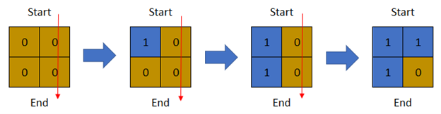
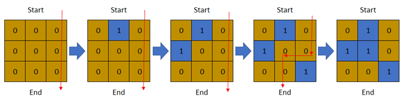

1970. Last Day Where You Can Still Cross

There is a **1-based** binary matrix where `0` represents land and `1` represents water. You are given integers `row` and `col` representing the number of rows and columns in the matrix, respectively.

Initially on day `0`, the **entire** matrix is **land**. However, each day a new cell becomes flooded with **water**. You are given a **1-based** 2D array `cells`, where `cells[i] = [ri, ci]` represents that on the $i^{th}$ day, the cell on the $r_i^{th}$ row and $c_i^{th}$ column (**1-based** coordinates) will be covered with **water** (i.e., changed to `1`).

You want to find the **last** day that it is possible to walk from the **top** to the **bottom** by only walking on land cells. You can start from **any** cell in the top row and end at **any** cell in the bottom row. You can only travel in the **four** cardinal directions (left, right, up, and down).

Return the **last** day where it is possible to walk from the **top** to the **bottom** by only walking on land cells.

 

**Example 1:**


```
Input: row = 2, col = 2, cells = [[1,1],[2,1],[1,2],[2,2]]
Output: 2
Explanation: The above image depicts how the matrix changes each day starting from day 0.
The last day where it is possible to cross from top to bottom is on day 2.
```

**Example 2:**


```
Input: row = 2, col = 2, cells = [[1,1],[1,2],[2,1],[2,2]]
Output: 1
Explanation: The above image depicts how the matrix changes each day starting from day 0.
The last day where it is possible to cross from top to bottom is on day 1.
```

**Example 3:**


```
Input: row = 3, col = 3, cells = [[1,2],[2,1],[3,3],[2,2],[1,1],[1,3],[2,3],[3,2],[3,1]]
Output: 3
Explanation: The above image depicts how the matrix changes each day starting from day 0.
The last day where it is possible to cross from top to bottom is on day 3.
```

**Constraints:**

* `2 <= row, col <= 2 * 10^4`
* `4 <= row * col <= 2 * 10^4`
* `cells.length == row * col`
* `1 <= ri <= row`
* `1 <= ci <= col`
* All the values of cells are **unique**.

# Submissions
---
**Solution 1: (Binary Search, BFS)**
```
Runtime: 3352 ms
Memory Usage: 23 MB
```
```python
class Solution:
    def latestDayToCross(self, row: int, col: int, cells: List[List[int]]) -> int:
        DIR = [0, 1, 0, -1, 0]

        def canWalkFromTopToBottom(dayAt):
            grid = [[0] * col for _ in range(row)]  # Create grid in the `dayAt` th date
            for i in range(dayAt):
                r, c = cells[i]
                grid[r - 1][c - 1] = 1  # Mark as water

            bfs = deque([])
            for c in range(col):
                if grid[0][c] == 0:  # Add all valid start cells in the top row
                    bfs.append((0, c))
                    grid[0][c] = 1  # Mark as visited

            while bfs:
                r, c = bfs.popleft()
                if r == row - 1: return True  # Reach to bottom -> Return Valid
                for i in range(4):
                    nr, nc = r + DIR[i], c + DIR[i + 1]
                    if nr < 0 or nr == row or nc < 0 or nc == col or grid[nr][nc] == 1: continue
                    grid[nr][nc] = 1  # Mark as visited
                    bfs.append((nr, nc))
            return False

        left, right = 1, len(cells)
        ans = 0
        while left <= right:
            mid = (left + right) // 2
            if canWalkFromTopToBottom(mid):
                ans = mid  # Update current answer so far
                left = mid + 1  # Try to find a larger day
            else:
                right = mid - 1  # Try to find a smaller day
        return ans
```

**Solution 2: (Binary Search, BFS)**
```
Runtime: 802 ms
Memory: 188.3 MB
```
```c++
class Solution {
    int DIR[5] = {0, 1, 0, -1, 0};
    bool canWalk(vector<vector<int>>& cells, int row, int col, int dayAt) {
        vector<vector<bool>> grid(row, vector<bool>(col, 0)); // Create grid in the `dayAt` th date
        for (int i = 0; i < dayAt; ++i) grid[cells[i][0]-1][cells[i][1]-1] = 1;
        queue<pair<int, int>> bfs;
        for (int c = 0; c < col; ++c) {
            if (grid[0][c] == 0) { // Add all valid start cells in the top row
                bfs.push({0, c});
                grid[0][c] = 1; // Mark as visited
            }
        }
        while (!bfs.empty()) {
            auto [r, c] = bfs.front(); bfs.pop();
            if (r == row - 1) return true; // Reach to bottom -> Return Valid
            for (int i = 0; i < 4; ++i) {
                int nr = r + DIR[i], nc = c + DIR[i+1];
                if (nr < 0 || nr == row || nc < 0 || nc == col || grid[nr][nc] == 1) continue;
                grid[nr][nc] = 1; // Mark as visited
                bfs.push({nr, nc});
            }
        }
        return false;
    }
public:
    int latestDayToCross(int row, int col, vector<vector<int>>& cells) {
        int left = 1, right = cells.size(), ans = 0;
        while (left <= right) {
            int mid = left + (right - left) / 2;
            if (canWalk(cells, row, col, mid)) {
                ans = mid; // Update current answer so far
                left = mid + 1; // Try to find a larger day
            } else right = mid - 1; // Try to find a smaller day
        }
        return ans;
    }
};
```

**Solution 3: (Union Find)**
```
Runtime: 700 ms
Memory: 115.4 MB
```
```c++
class Solution {
    map<int, int> arr;
    int hash(int i, int j) {
        return i * 30000 + j;
    }
    int find(int h) {
        int f = arr[h];
        if(f == h) return h;
        if(f == 0) return arr[h] = h;
        return arr[h] = find(arr[h]);
    }
    bool combine(int a, int b) {
        a = find(a); b = find(b);
        if(a != b) {
            arr[a] = b;
            return true;
        }
        return false;
    }
public:
    int latestDayToCross(int row, int col, vector<vector<int>>& cells) {
        for(int i = 1; i <= row; i++) {
            combine(hash(i - 1, 0), hash(i, 0));   //build left border
            combine(hash(i - 1, col + 1), hash(i, col + 1));  //build right border
        }
        int dx[8] = {0, 0, 1, -1, 1, -1, 1, -1};
        int dy[8] = {1, -1, 0, 0, 1, -1, -1, 1};
        int k = 0;
        for(auto &cell : cells) {
            int x = cell[0], y = cell[1];
            int h = hash(x, y);
            find(h);
            for(int i = 0; i < 8; i++) {
                int nx = x + dx[i];
                int ny = y + dy[i];
                int h1 = hash(nx, ny);
                if(arr.count(h1)) {
                    combine(h1, h);
                }
            }
            if(find(hash(1, 0)) == find(hash(1, col + 1))) return k;
            k++;
        }
        return cells.size();
    }
};
```

**Solution 4: (BFS, Binary Search, upper bound)**
```
Runtime: 95 ms, Beats 75.92%
Memory: 125.10 MB, Beats 76.96%
```
```c++
class Solution {
    int dd[5] = {0, 1, 0, -1, 0};
    bool check(int mid, int row, int col, vector<vector<int>> &cells) {
        int i, r, c;
        vector<bool> visited(row * col);
        for (i = 0; i < mid; i ++) {
            r = cells[i][0] - 1;
            c = cells[i][1] - 1;
            visited[r * col + c] = true;
        }
        queue<array<int, 2>> q;
        for (c = 0; c < col; c ++) {
            if (!visited[c]) {
                q.push({0, c});
                visited[c] = true;
            }
        }
        while (q.size()) {
            auto [cr, cc] = q.front();
            q.pop();
            if (cr == row - 1) {
                return true;
            }
            for (i = 0; i < 4; i ++) {
                r = cr + dd[i];
                c = cc + dd[i + 1];
                if (0 <= r && r < row && 0 <= c && c < col && !visited[r * col + c]) {
                    q.push({r, c});
                    visited[r * col + c] = true;
                }
            }
        }
        return false;
    }
public:
    int latestDayToCross(int row, int col, vector<vector<int>>& cells) {
        int left = 1, right = cells.size(), mid, ans = 0;
        while (left <= right) {
            mid = left + (right - left) / 2;
            if (!check(mid, row, col, cells)) {
                right = mid - 1;
            } else {
                ans = mid;
                left = mid + 1;
            }
        }
        return ans;
    }
};
```
