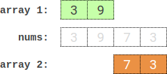

2035. Partition Array Into Two Arrays to Minimize Sum Difference

You are given an integer array `nums` of `2 * n` integers. You need to partition `nums` into two arrays of length `n` to **minimize the absolute difference** of the **sums** of the arrays. To partition `nums`, put each element of nums into **one** of the two arrays.

Return the minimum possible absolute difference.

 

**Example 1:**


```
Input: nums = [3,9,7,3]
Output: 2
Explanation: One optimal partition is: [3,9] and [7,3].
The absolute difference between the sums of the arrays is abs((3 + 9) - (7 + 3)) = 2.
```

**Example 2:**

```
Input: nums = [-36,36]
Output: 72
Explanation: One optimal partition is: [-36] and [36].
The absolute difference between the sums of the arrays is abs((-36) - (36)) = 72.

**Example 3:**


```
Input: nums = [2,-1,0,4,-2,-9]
Output: 0
Explanation: One optimal partition is: [2,4,-9] and [-1,0,-2].
The absolute difference between the sums of the arrays is abs((2 + 4 + -9) - (-1 + 0 + -2)) = 0.
```

**Constraints:**

* `1 <= n <= 15`
* `nums.length == 2 * n`
* `-10^7 <= nums[i] <= 10^7`

# Submissions
---
**Solution 1: (Meet in the Middle)**

NOTE - This is question was very easy, if you had done this https://leetcode.com/problems/closest-subsequence-sum/. So Please first go and try that.

Let's say,
left_ans is required the N elements required for first group, and right_ans is the other N elements for second group.

The main and only intuition which is required here is,
nums = [1,3,6,5,4,2]
So, let's divide into 2 parts
left_part = [1,3,6]
right_part = [5,4,2]
N = len(nums) // 2, ie no. of elements in each group. here 3.
So here, to make left_ans either we can take all 3 from left_part and 0 from right_part, or 1 from left_part and 2(N-1) from right_part, 2 from left_part and 3(N-2) from right_part.

And why this works is, because we are generating all possible sums using only k elements, where k is from 1 to N. Which is in total 2**k, and as max value of k is 15, so 2**15 is 32,000. Which is easy to work with. While if you try to make all subset sums, it becomes 2**30 is 1,073,741,824 which will give TLE.

The get_sums function generate all possible sums using k elements from nums.
nums = [1,3,6]
get_sums(nums) will give,
{1: [1, 3, 6], # using only 1
2: [4, 7, 9], # using only 2
3: [10]} # using all 3

So how this works is, if we take 1 from left_part, so this means we have taken one group of element, so its sum is taken from l_sum = left_sums[1], now to make is closer to half = total // 2, we need to add req_sum = half - l_sum, so we will binary search the value of it in right_sums. So now lest_ans_sum will become l_sum + r_sum(the binary search sum we got closest go req_sum).
Note - Above we are just finding the best possible sum of left_ans, as right_ans sum will then be total - left_ans_sum.

```
Runtime: 3264 ms
Memory Usage: 16.6 MB
```
```python
class Solution:
    def minimumDifference(self, nums: List[int]) -> int:
        N = len(nums) // 2 # Note this is N/2, ie no. of elements required in each.
        
        def get_sums(nums): # generate all combinations sum of k elements
            ans = {}
            N = len(nums)
            for k in range(1, N+1): # takes k element for nums
                sums = []
                for comb in combinations(nums, k):
                    s = sum(comb)
                    sums.append(s)
                ans[k] = sums
            return ans
        
        left_part, right_part = nums[:N], nums[N:]
        left_sums, right_sums = get_sums(left_part), get_sums(right_part)
        ans = abs(sum(left_part) - sum(right_part)) # the case when taking all N from left_part for left_ans, and vice versa
        total = sum(nums) 
        half = total // 2 # the best sum required for each, we have to find sum nearest to this
        for k in range(1, N):
            left = left_sums[k] # if taking k no. from left_sums
            right = right_sums[N-k] # then we have to take remaining N-k from right_sums.
            right.sort()
            for x in left:
                r = half - x # required, how much we need to add in x to bring it closer to half.
                p = bisect.bisect_left(right, r) # we are finding index of value closest to r, present in right, using binary search
                for q in [p, p-1]:
                    if 0 <= q < len(right):
                        left_ans_sum = x + right[q]
                        right_ans_sum = total - left_ans_sum
                        diff = abs(left_ans_sum - right_ans_sum)
                        ans = min(ans, diff) 
        return ans
```

**Solution 2: (Binary Search, split to half then sort and binary search all possibility)**
```
Runtime: 435 ms, Beats 45.02%
Memory: 73.50 MB, Beats 52.44%
```
```c++
class Solution {
    void gen_subset(int i, int j, vector<int> &nums, vector<vector<int>> &rst) {
        int k, c;
        for (auto a = 0; a < (1 << (j - i + 1)); a ++) {
            k = 0, c = 0;
            for (auto b = 0; (1 << b) <= a; b ++) {
                if ((1 << b) & a) {
                    k += 1;
                    c += nums[i + b];
                }
            }
            rst[k].push_back(c);
        }
    }
public:
    int minimumDifference(vector<int>& nums) {
        int n = nums.size() / 2, total = accumulate(nums.begin(), nums.end(), 0), i, ans = INT_MAX;
        vector<vector<int>> left(n + 1), right(n + 1);
        gen_subset(0, n - 1, nums, left);
        gen_subset(n, 2 * n - 1, nums, right);
        for (i = 0; i <= n; i ++) {
            sort(right[i].begin(), right[i].end());
        }
        for (i = 0; i <= n / 2; i ++) {
            for (auto a: left[i]) {
                auto it = lower_bound(right[n - i].begin(), right[n - i].end(), (total - 2 * a) / 2);
                if (it != right[n - i].end()) {
                    ans = min(ans, abs(a + (*it) - (total - a - *it)));
                }
                if (it != right[n - i].begin()) {
                    ans = min(ans, abs(a + *prev(it) - (total - a - *prev(it))));
                }
            }
        }
        return ans;
    }
};
```
