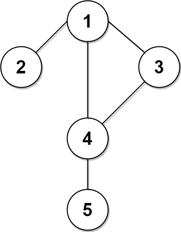

2045. Second Minimum Time to Reach Destination

A city is represented as a **bi-directional connected** graph with n vertices where each vertex is labeled from `1` to `n` (inclusive). The edges in the graph are represented as a 2D integer array `edges`, where each `edges[i] = [ui, vi]` denotes a bi-directional edge between vertex `ui` and vertex `vi`. Every vertex pair is connected by **at most one** edge, and no vertex has an edge to itself. The time taken to traverse any edge is `time` minutes.

Each vertex has a traffic signal which changes its color from **green** to **red** and vice versa every change minutes. All signals change **at the same time**. You can enter a vertex **at any time**, but can leave a vertex **only when the signal is green**. You **cannot wait** at a vertex if the signal is **green**.

The **second minimum value** is defined as the smallest value **strictly larger** than the minimum value.

* For example the second minimum value of `[2, 3, 4]` is `3`, and the second minimum value of `[2, 2, 4]` is `4`.

Given `n`, `edges`, `time`, and `change`, return the **second minimum time** it will take to go from vertex `1` to vertex `n`.

**Notes:**

* You can go through any vertex **any** number of times, including `1` and `n`.
* You can assume that when the journey **starts**, all signals have just turned **green**.
 

**Example 1:**


```
Input: n = 5, edges = [[1,2],[1,3],[1,4],[3,4],[4,5]], time = 3, change = 5
Output: 13
Explanation:
The figure on the left shows the given graph.
The blue path in the figure on the right is the minimum time path.
The time taken is:
- Start at 1, time elapsed=0
- 1 -> 4: 3 minutes, time elapsed=3
- 4 -> 5: 3 minutes, time elapsed=6
Hence the minimum time needed is 6 minutes.

The red path shows the path to get the second minimum time.
- Start at 1, time elapsed=0
- 1 -> 3: 3 minutes, time elapsed=3
- 3 -> 4: 3 minutes, time elapsed=6
- Wait at 4 for 4 minutes, time elapsed=10
- 4 -> 5: 3 minutes, time elapsed=13
Hence the second minimum time is 13 minutes.      
```

**Example 2:**


```
Input: n = 2, edges = [[1,2]], time = 3, change = 2
Output: 11
Explanation:
The minimum time path is 1 -> 2 with time = 3 minutes.
The second minimum time path is 1 -> 2 -> 1 -> 2 with time = 11 minutes.
```

**Constraints:**

* `2 <= n <= 10^4`
* `n - 1 <= edges.length <= min(2 * 104, n * (n - 1) / 2)`
* `edges[i].length == 2`
* `1 <= ui, vi <= n`
* `ui != vi`
* There are no duplicate edges.
* Each vertex can be reached directly or indirectly from every other vertex.
* `1 <= time, change <= 10^3`

# Submissions
---
**Solution 1: ()Dijkstra**
```
Runtime: 2744 ms
Memory Usage: 24.3 MB
```
```python
class Solution:
    def secondMinimum(self, n: int, edges: List[List[int]], time: int, change: int) -> int:
        D = [[] for _ in range(n + 1)]
        D[1] = [0]
        G, heap = defaultdict(list), [(0, 1)]
        
        for a, b in edges:
            G[a] += [b]
            G[b] += [a]

        while heap:
            min_dist, idx = heappop(heap)
            if idx == n and len(D[n]) == 2: return max(D[n])

            for neib in G[idx]:
                if (min_dist // change) % 2 == 0:
                    cand = min_dist + time
                else:
                    cand = ceil(min_dist/(2*change)) * (2*change) + time

                if not D[neib] or (len(D[neib]) == 1 and D[neib] != [cand]):
                    D[neib] += [cand]
                    heappush(heap, (cand, neib))
```

**Solution 2: (BFS)**
```
Runtime: 652 ms
Memory Usage: 211.7 MB
```
```c++
class Solution {
public:
    vector<vector<int> > adj;
    int secondMinimum(int n, vector<vector<int>>& edges, int time, int change) {
        adj.resize(n + 1);
        int mx = INT_MAX;
        for(auto &e : edges) {
            adj[e[0]].push_back(e[1]);
            adj[e[1]].push_back(e[0]);
        }
        queue< vector<int> > q;
        q.push({1, 0});
        vector<int> visTime(n + 1, INT_MAX);
        vector<int> visCount(n + 1, 0);
        while(q.size()) {
            auto p = q.front(); q.pop();
            int node = p[0], t = p[1];
            for(int next : adj[node]) {
                int t2 = t;
                bool isRed = (t2 / change) % 2;
                if(isRed) t2 += change - t2 % change;
                t2 += time;
                if(next == n && mx == INT_MAX) mx = t2;
                if(next == n && t2 > mx) return t2;
                if(visTime[next] != t2 && visCount[next] <= 1) { //at most revisit one time.
                    visTime[next] = t2;
                    visCount[next]++;
                    q.push({next, t2});
                }
            }
        }
        return -1;
    }
};
```
